# Vibe-Palace: Product Requirements Document

**Version:** 0.2.0
**Date:** 2026-04-06 (split 2026-08-15)
**Authors:** John Suykerbuyk, Claude Opus 4.6
**Status:** Phases 1–10, 12–18 Implemented | Phase 11 Planned

> **🔴 THIS DOCUMENT SPECIFIES, IT DOES NOT NARRATE (split 2026-08-15).** It grew
> to 4,355 lines / 188 KB by fusing a specification with an implementation
> journal, and at that size nobody re-read it — which is how the drift recorded
> in ADR-006/008/009 went unnoticed for three weeks. The implementation record of
> the seventeen COMPLETE/IMPLEMENTED phases, and Appendix C.2–C.8, were **cut,
> not relocated**: git holds them, and a second copy is a fifth home for state
> this project already struggles to keep in one place. Recover any of it with
> `git log -p -- doc/PRD-vibe-palace.md`.
>
> What remains is what a reader must know to *change* the system: principles,
> architecture, state machines, data lifecycle, the tool surface, storage schema,
> precedence, the one PLANNED phase, and the decisions register. **Nothing that
> only records what was already built belongs back in here.**

> **Implementation notes** are marked with blockquotes throughout. HNSW
> references in diagrams, directory trees, and `go.mod` snippets reflect the
> design intent and remain authoritative as *deferred* design — they are not
> stale. Actual shipped search uses brute-force cosine similarity
> (`internal/search/vector_index.go`). The three
> upstream `coder/hnsw` recall bugs were fixed in our fork and merged into
> `coder/hnsw@main` (2026-06-22), then validated against the in-repo recall
> harness (recall@10 0.96). HNSW adoption remains **deferred (Phase 11)** behind
> the brute-force index boundary, parked for a future scale trigger.

---

## Executive Summary

Vibe-Palace is a compiled Go binary that unifies the proven concepts of VibeVault
(session capture, workflow orchestration, project context management across 686+
sessions and 32+ projects) with MemPalace (semantic search achieving 96.6% R@5 on
LongMemEval, temporal knowledge graphs, structural metadata filtering).

**The core architectural principle:** The MCP interface is the product. File system
conventions, symlinks, and markdown file management are implementation details that
should be invisible to both the AI consumer and the human developer. Context
injection, behavioral calibration, session capture, semantic search, and knowledge
graph operations all flow through a standard MCP (or HTTP) interface, decoupled
from any specific AI provider's file system expectations.

**What this replaces:**
- VibeVault's dependency on Claude Code's JSON-RPC protocol and `.claude/` directory
  conventions
- MemPalace's dependency on Python, ChromaDB, and pip-based distribution
- The symlink/dual-git complexity of maintaining vault project context alongside source code
- The CLAUDE.md sprawl problem across multiple AI providers and IDEs

**What this preserves:**
- VibeVault's 686+ sessions of captured knowledge (full migration path)
- MemPalace's 96.6% retrieval accuracy (embedded HNSW + same embedding model)
- VibeVault's workflow orchestration and pair programming paradigm
- MemPalace's temporal knowledge graph with validity windows
- Both systems' local-first, zero-cloud-dependency architecture

---

## Table of Contents

1. [Design Principles](#1-design-principles)
2. [Architecture Overview](#2-architecture-overview)
3. [State Machines](#3-state-machines)
4. [Data Lifecycle](#4-data-lifecycle)
5. [Session Lifecycle Flowchart](#5-session-lifecycle-flowchart)
6. [MCP Tool Surface](#6-mcp-tool-surface)
7. [Storage Schema](#7-storage-schema)
8. [Precedence System](#8-precedence-system)
9. [Phase 11: Pluggable Embedding Backends](#phase-11-pluggable-embedding-backends) — *the only unbuilt phase*
10. [Cross-Cutting Concerns](#cross-cutting-concerns)
11. [Validation Framework](#validation-framework)
12. [Appendix A: Glossary](#appendix-a-glossary)
13. [Appendix B: File Inventory](#appendix-b-file-inventory)
14. [Appendix C: Decisions Register](#appendix-c-decisions-register)

*Phases 1–10 and 12–18 are built; their task breakdowns were cut in the
2026-08-15 split and live in git history.*

---

## 1. Design Principles

### 1.1 MCP-First, File-System-Last

The MCP interface is the canonical way to interact with Vibe-Palace. Every
capability — context injection, session capture, search, task management,
knowledge graph queries — is available via MCP tools. File system artifacts
(session markdown files, task files, iteration narratives) are *generated outputs*
of the MCP server, not inputs to it.

**The project-local footprint is exactly one file:** `.vibe-palace.toml` at the
project root. This file contains only the project identity (name, domain, tags).
Everything else — workflow rules, behavioral calibration, commands, skills,
templates — is delivered through the MCP interface on demand.

No symlinks. No dual-git management. **Nothing host-specific is ever committed**
— a host may keep its own untracked shims (a `.claude/` directory, a `CLAUDE.md`)
so long as they only call MCP tools and the repo does not track them.

**Write/wrap surface (complete).** The session *wrap* — updating `resume.md`,
ingesting the commit message, recording the iteration, and committing/pushing
the vault — is fully completable through MCP: generic vault file CRUD (§6.8),
commit ingest (§6.9), wrap-state tools (§6.11), and `vp_vault_sync` with
explicit-path commit-then-push. An agent never needs to shell out to the
filesystem to finish a session.

> **Corrected 2026-08-15.** This paragraph previously cited "surgical resume
> editors (§6.10)" as evidence the surface was complete. §6.10 is titled
> *REMOVED*. A document that cites its own removed section as proof of
> completeness is the `honest-instruments` failure applied to the spec.

### 1.2 Out-of-Band Context Storage

The vault directory is completely separate from any source code tree. Context data
(sessions, tasks, iterations, knowledge graph, embeddings) lives in the vault.
Source code lives in the project repository. The MCP server bridges them.

The vault is git-managed for multi-machine sync and history. The source code
repository has no knowledge of the vault's existence beyond the single
`.vibe-palace.toml` identity file.

### 1.3 Precedence Hierarchy

Context injection follows a strict precedence chain:

```
Project-local overrides  (highest — in vault, not source tree)
        ↓
Vault templates          (user-customized defaults)
        ↓
Embedded defaults        (compiled into binary — lowest)
```

This ensures:
- New projects work immediately with sensible defaults (embedded)
- Users can customize defaults for all future projects (vault templates)
- Individual projects can override anything (project-local in vault)
- Nothing touches the source code tree

### 1.4 Project-Scoped by Default, Cross-Project Read Access Available

All write operations (session capture, task management, knowledge graph mutations)
are scoped to the current project. Search and read operations can optionally span
all projects, enabling cross-project knowledge discovery.

### 1.5 Model-Agnostic

The MCP server makes no assumptions about which AI model or IDE is calling it.
Tools accept plain text and return plain text or structured JSON. No
Claude-specific, GPT-specific, or IDE-specific behaviors. The same binary works
with Claude Code, Cursor, Windsurf, Cline, Zed, Ollama, or any future MCP client.

### 1.6 Single Binary, Zero Dependencies

The compiled Go binary contains:
- The MCP server (stdio transport, plus an optional bearer-authenticated, read-only-by-default Streamable-HTTP transport via `vp mcp serve`)
- A CLI for human interaction
- An embedded ONNX runtime for text embeddings
- An embedded HNSW index for vector search
- Embedded default templates for project initialization

No Python. No Docker. No pip. No node_modules. Download, run, done.

### 1.7 Language-Agnostic Classification

All content classification — room detection, filename pattern matching, entity
extraction, friction analysis — must be language-agnostic. No single programming
language, framework, or build system receives preferential treatment in default
keyword lists or pattern tables. Specifically:

- **Filename rules** cover test file conventions across Go, Python, TypeScript,
  JavaScript, Java, Rust, Ruby, Elixir, and Dart (suffix, prefix, and contains
  patterns).
- **Content keywords** use only terms that are universal across development
  contexts (e.g., "test", "assert", "coverage") — not language-specific tokens
  (e.g., `_test.go`, `panic`).
- **Entity extraction** skips dependency manifests and lock files from all major
  ecosystems (Go, Node, Python, Rust, Ruby, Java, PHP, .NET, Dart, Elixir, Swift).
- **Error/friction detection** uses cross-language error indicators (e.g., "error",
  "exception", "fatal", "segfault") — not language-specific ones (e.g., `panic`).
- **Custom keywords** (per-project `[palace.rooms]` config) allow users to extend
  classification for domain-specific or language-specific needs without polluting
  the defaults.

While vibe-palace itself is written in Go, it serves developers working in any
language. The defaults must reflect that.

### 1.8 The Network Test — the acceptance criterion for §1.1

§1.1 states the principle; this states how to *check* it, because "MCP-first" has
been asserted in this document since 2026-04-06 while host-local filesystem reads
shipped anyway.

> **Would this feature still work if the MCP server were reached over the network,
> at an offsite provider, with the vault mounted beside the SERVER and not beside
> the agent?**

If the answer is no, the design is wrong. The vault does not need to be local to
the machine the agent runs on — it needs to be readable by the MCP server. Any
step that reads a host's filesystem, computes a vault path, or depends on a
host's on-disk layout fails this test.

**The 2026-08-15 failures, and what became of each** (disposition recorded
2026-08-27). Two were deleted; the rest are salvage, exempted here in writing:

| Host-local read | Where | Disposition |
|---|---|---|
| Sweeping a host-local plan/scratch directory | `restart` command, Step 3 | **DELETED.** The step no longer walks a directory: plans are vault tasks, listed with `vp_list_tasks` and written with `vp_manage_task`. |
| "Read your host's persisted copy of the tool result" as a truncation remedy | `restart` command, Step 2 | **DELETED.** A cut INDEX is answered by re-calling `vp_bootstrap_context`; the documents are fetched by URI and end with `eof`. |
| Sweeping the same directory late in a session | `wrap` command, Step 6b; `review-plan` command | **EXEMPT — Claude-colocated salvage.** |
| Reporting on that directory over MCP | `vp_scan_plans` | **EXEMPT — Claude-colocated salvage.** |
| Draining host-local memory into the vault | SessionEnd harvest, `internal/memory/harvest.go`; `vp_memory_harvest` | **EXEMPT — Claude-colocated salvage.** |
| Reading host-local transcripts | `vp hook` | **EXEMPT — Claude-colocated salvage.** |

**What the exemption means, since it must be written down rather than inferred
from the fact that the code exists.** Every exempt row reads a Claude Code
layout that only exists on a machine where Claude Code ran, and each one is
*recovering* context that host already wrote somewhere else — it is not the
route by which context arrives. Each has a network-clean counterpart that is the
real path, and the salvage runs beside it, never instead of it:

- memory is written by `vp_memory_*`, and the harvest only drains what a host
  wrote before that rule reached the agent;
- a transcript reaches the vault as inline bytes on `vp_capture_session`, and
  `vp hook`'s `os.ReadFile` only serves the host that has one on disk;
- a plan reaches the vault as a task through `vp_manage_task`, and the scan only
  reports scratch files that never made it.

So an exempt path is allowed to find nothing. Reached over the network the
directory is absent, empty, or belongs to the wrong machine, and every one of
these degrades to a no-op rather than to a wrong answer — which is the property
that makes the exemption safe. **A feature whose only route is one of these rows
is not exempt; it fails §1.8.**

### 1.9 Context Is Retrieved, Not Delivered

**The vault's purpose is to restore operational context for the work ahead —
fast.** Not to archive everything, and not to hand an agent everything it might
conceivably need.

- **Session start returns an INDEX plus what is relevant to what comes next.**
  Bulk bodies are reachable by URI and fetched on demand, never pushed.
- **"What comes next" is DERIVED from the active task graph** — head-of-queue and
  its dependencies — and everything else is ranked against it. It is not asked
  for, and it is not guessed from recency. (ADR-006 §1: the server can see the
  task graph, so the server computes it.)
- **Eviction is relevance-ordered, not size-ordered.** Where context must be
  dropped, the least relevant to the work ahead goes first.
- **The server parses; the agent asks.** Deterministic, algorithmic text
  parsing — iteration bodies, section boundaries, summaries, ranges — is
  server-side work. An agent must never compose a parser on the fly, and must
  never be handed raw text to parse when a typed query would do.
- **An orchestrating agent must be able to mine history on demand.** It dispatches
  a subagent that queries the MCP for prior iterations, their work products, and
  the decisions made. **vp provides the queries; it never models agents or
  dispatch** — that keeps §1.5 intact and passes §1.8 unchanged.

`iterations.md` stays **one perpetual append-only document back to the genesis
commit**. It is the project's narrative, and splitting it into per-iteration files
would trade a readable history for a directory listing. All structure over it is
derived server-side.

> **The failure this corrects.** `iterations.md` was written as a diary of every
> major decision. It became an archive nobody references, because no tool could
> query it — so the project's own history was re-summarized by hand into
> `resume.md` instead, where it rotted. The remedy is a reader, not a librarian.

### 1.10 A Budget Measures the Work Unit, Not the Payload

**There is no numeric ceiling on a session-start payload.** A payload is small
because it is an index (§1.9), not because a number forced it to be.

The token budget is retained, and its subject changes: it measures **one
iteration**. An iteration that runs over budget is a signal that **too much
happened between one `/vpc-capture` and the next `/vpc-wrap`** — a workflow
warning addressed to the human, not a gate that discards information.

An iteration's *summary* must carry enough for an agent, or its delegated
subagent, to decide whether mining the full body is warranted.

> **Withdrawn 2026-08-15, both of them.** ADR-009 §3 ("the budget stays binding;
> the remedy is a smaller core, never a bigger budget") and the iteration-261
> ruling ("the contract sets the budget, not the reverse") were direct
> contradictions of each other, both live, and the epic `inline-delivery` was
> built on the later one. Neither survives: with no payload budget there is
> nothing for either to be right about. Losing information to satisfy an
> arbitrary size rule is the wrong trade in every case this project has met.

### 1.11 Enforcement Lives in the Server; Prose Is the Absence of Enforcement

ADR-006 states this as a decision procedure. It is repeated here as a product
requirement because the drift it warns about happened anyway.

**A rule that matters becomes a gate in the tool it governs.** Prose is reserved
for what genuinely cannot be enforced — and prose is not free: every rule shipped
as a paragraph is a rule an agent may skim, and a byte every session pays for.

The measurable form of this requirement: **the project-specific instruction
surface shrinks because rules moved into `check.Producers` and tool guards — never
because they were un-marked, excerpted, or dropped to fit.** A rule enforced in
code must have its paragraph **deleted**, not left as a receipt.

**Derived facts are properties the server reports, never arithmetic an agent
performs.** If an agent is counting bytes, measuring a document, or re-deriving a
count that the server could return, that is a missing field on a tool result.

---

## 2. Architecture Overview

```
┌──────────────────────────────────────────────────────────────────┐
│                        vibe-palace binary                        │
│                                                                  │
│  ┌────────────┐  ┌────────────┐  ┌────────────┐                │
│  │ MCP Server │  │ HTTP Server│  │    CLI     │                │
│  │  (stdio)   │  │ (REST API) │  │            │                │
│  └─────┬──────┘  └─────┬──────┘  └─────┬──────┘                │
│        │               │               │                        │
│        └───────────────┬┘               │                        │
│                        ▼               ▼                        │
│              ┌─────────────────────────────┐                    │
│              │       Service Layer         │                    │
│              │                             │                    │
│              │  ┌───────┐ ┌────────────┐  │                    │
│              │  │Context│ │  Session    │  │                    │
│              │  │Engine │ │  Capture    │  │                    │
│              │  └───────┘ └────────────┘  │                    │
│              │  ┌───────┐ ┌────────────┐  │                    │
│              │  │Search │ │  Task      │  │                    │
│              │  │Engine │ │  Manager   │  │                    │
│              │  └───────┘ └────────────┘  │                    │
│              │  ┌───────┐ ┌────────────┐  │                    │
│              │  │Palace │ │ Knowledge  │  │                    │
│              │  │Graph  │ │ Graph      │  │                    │
│              │  └───────┘ └────────────┘  │                    │
│              │  ┌───────────────────────┐  │                    │
│              │  │  Precedence Resolver  │  │                    │
│              │  └───────────────────────┘  │                    │
│              └──────────────┬──────────────┘                    │
│                             │                                    │
│              ┌──────────────┴──────────────┐                    │
│              │       Storage Layer         │                    │
│              │                             │                    │
│              │  ┌───────────┐ ┌─────────┐ │                    │
│              │  │Filesystem │ │  HNSW   │ │                    │
│              │  │(JSONL+JSON│ │ (vector │ │                    │
│              │  │ + markdown│ │  index) │ │                    │
│              │  └───────────┘ └─────────┘ │                    │
│              │  ┌───────────────────────┐  │                    │
│              │  │  ONNX Embedder       │  │                    │
│              │  │ (all-MiniLM-L6-v2)   │  │                    │
│              │  └───────────────────────┘  │                    │
│              └────────────────────────────┘                     │
│                                                                  │
│              ┌────────────────────────────┐                     │
│              │    Vault (git-managed)     │                     │
│              │  Sessions, tasks, iters    │                     │
│              │  Templates, knowledge.md   │                     │
│              └────────────────────────────┘                     │
└──────────────────────────────────────────────────────────────────┘
```

### Component Responsibilities

| Component | Responsibility |
|-----------|---------------|
| **MCP Server** | JSON-RPC 2.0 over stdio; tool registration and dispatch |
| **HTTP Server** | REST API on localhost; same service layer, different transport |
| **CLI** | Human-facing commands (init, search, status, vault sync) |
| **Context Engine** | Precedence-aware context assembly; workflow/resume/template merging |
| **Session Capture** | Model-agnostic session recording; metadata extraction; auto-indexing |
| **Search Engine** | Hybrid semantic + structural search; HNSW queries + metadata filters |
| **Task Manager** | Task CRUD; lifecycle management; retirement on explicit human approval |
| **Palace Graph** | Wing/hall/room navigation; tunnel discovery; structural filtering |
| **Knowledge Graph** | Temporal entity-relationship triples; time-travel queries |
| **Precedence Resolver** | Merge embedded defaults + vault templates + project overrides |
| **Filesystem Store** | All structured data as JSONL/JSON/markdown in git-tracked vault |
| **HNSW Index** | In-memory vector index for semantic search; rebuilt from drawer files |
| **ONNX Embedder** | `all-MiniLM-L6-v2` inference; 384-dim embeddings; ~80MB model |
| **Vault** | Git-managed directory tree; markdown artifacts; multi-machine sync |

---

## 3. State Machines

### 3.1 Project Lifecycle

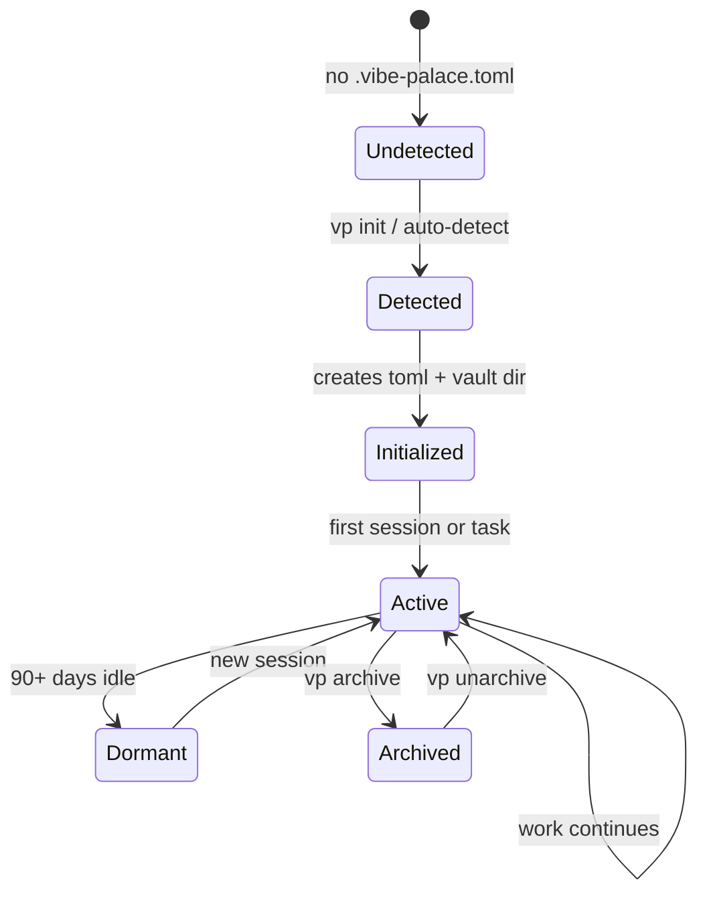

**State notes:**
- **Detected:** Only `.vibe-palace.toml` exists in source tree. Everything else in vault.
- **Active:** Semantic index live, KG updating, sessions captured.
- **Archived:** Sessions compressed, embeddings retained, KG frozen (read-only).

### 3.2 Session Lifecycle

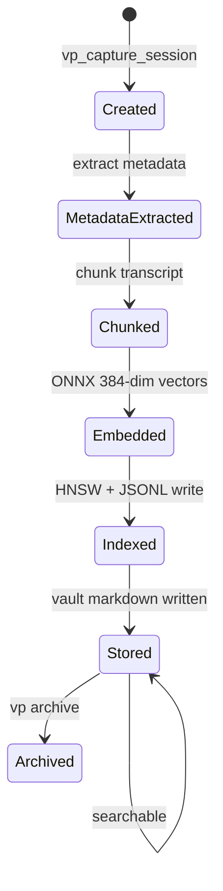

**State notes:**
- **Created:** Model-agnostic input — summary, decisions, files, open threads. No Claude dependency.
- **Indexed:** Content is semantically searchable. "What did we decide about auth?" works.
- **Archived:** Session file compressed, embeddings retained for search.

### 3.3 Task Lifecycle

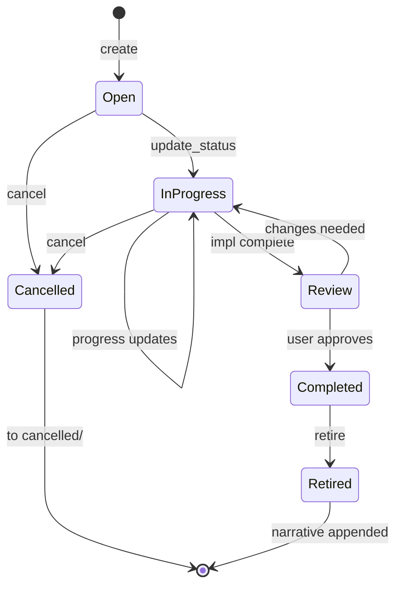

**State notes:**
- **Review:** Validation task spawned — 80% test coverage, integration test pass, code quality review.
- **Retired:** Task moved to `done/`, `vp_append_iteration` called with completion narrative.

### 3.4 Knowledge Graph Triple Lifecycle

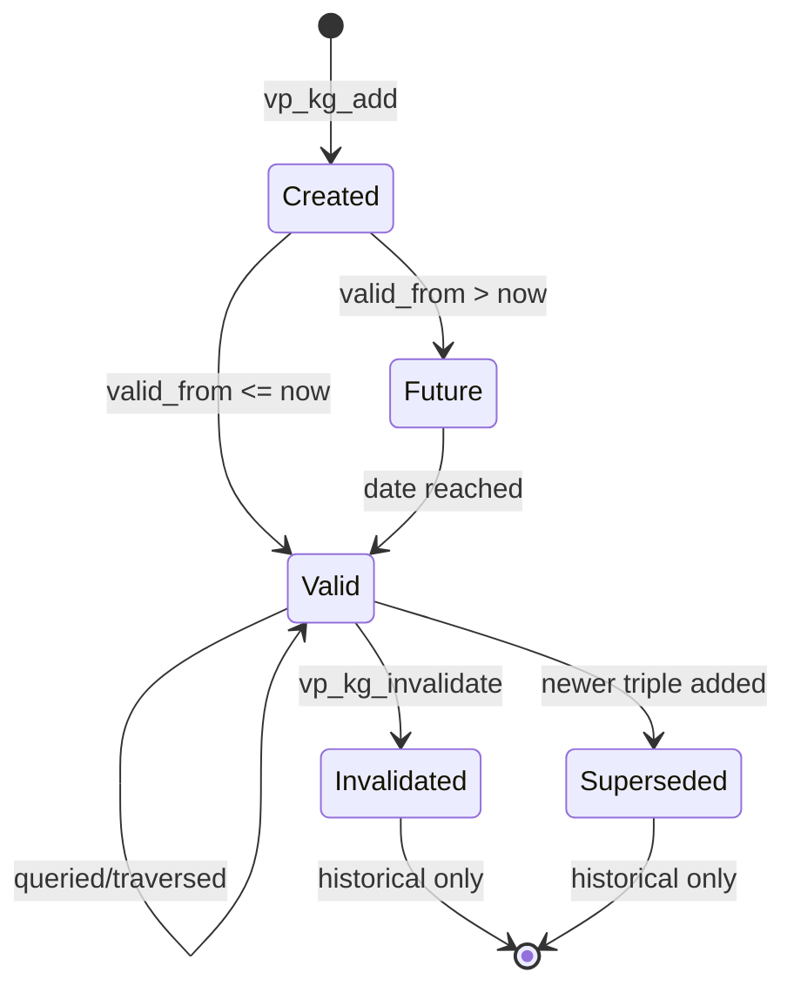

**State notes:**
- **Valid:** e.g. "Kai works_on Orion", valid_from=2025-06-01, valid_to=NULL.
- **Invalidated:** valid_to set (e.g. 2026-03-01). Still queryable via `as_of` parameter.
- **Superseded:** Auto-invalidated when a new triple replaces the same subject+predicate.

### 3.5 Context Template Lifecycle

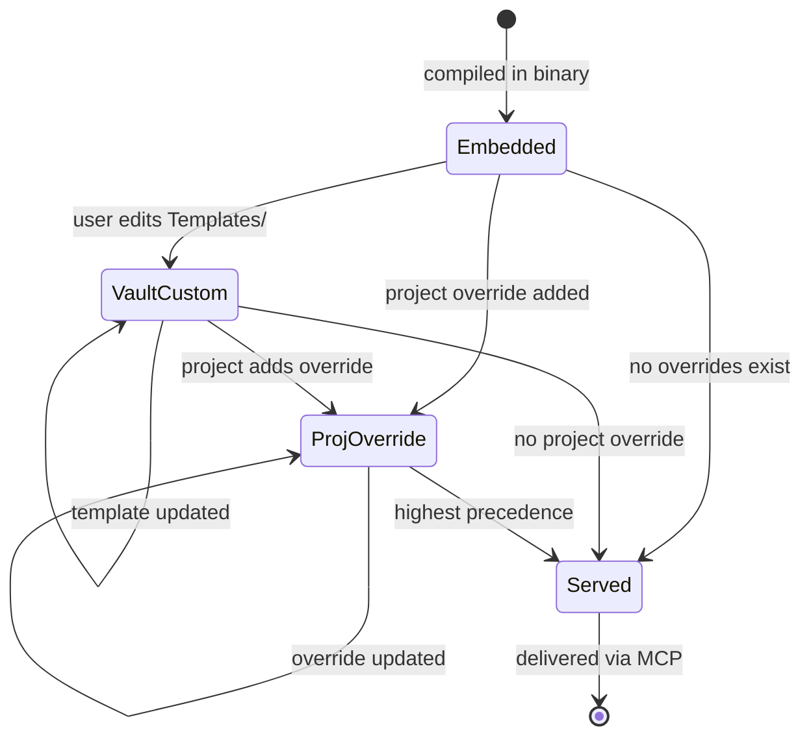

**State notes:**
- **Embedded:** Default workflow.md, resume template, commands. Updated only on binary upgrade.
- **VaultCustom:** User's preferred defaults for all future projects. Git-managed in vault.
- **ProjOverride:** This project's specific rules. In vault, NOT in source tree.

---

## 4. Data Lifecycle

### 4.1 Context Injection Data Flow

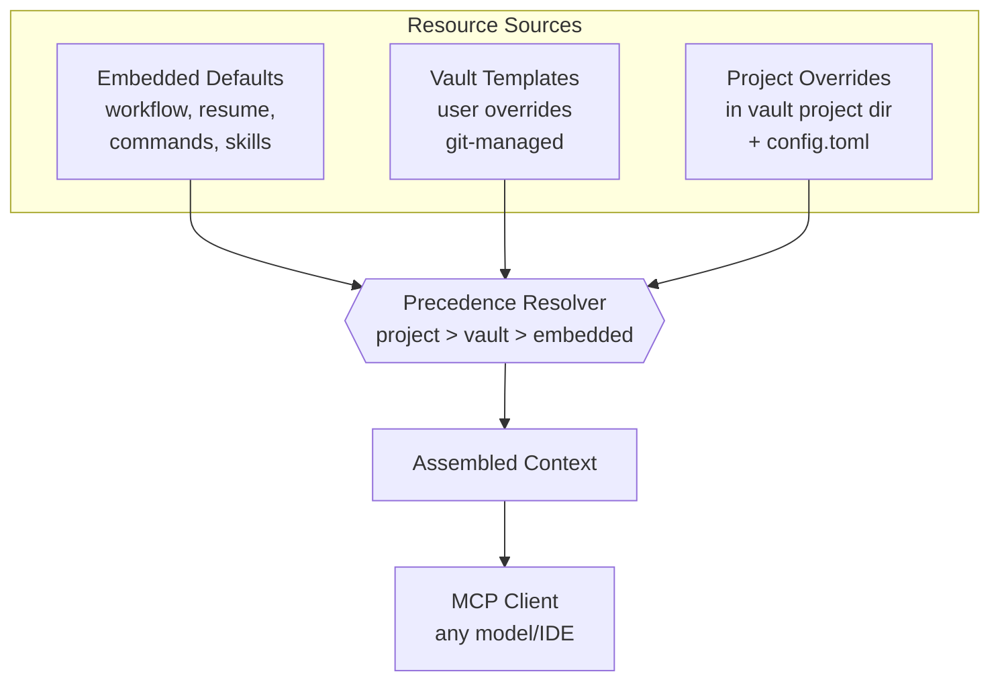

For each resource type (workflow, resume, commands, skills, config),
the resolver checks project override first, then vault template,
then embedded default. First match wins.

### 4.2 Session Data Lifecycle

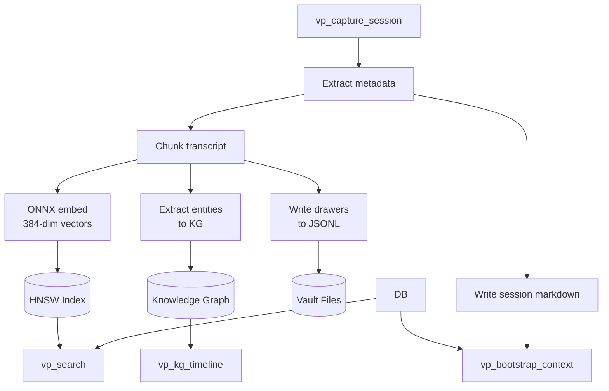

### 4.3 Search Data Flow

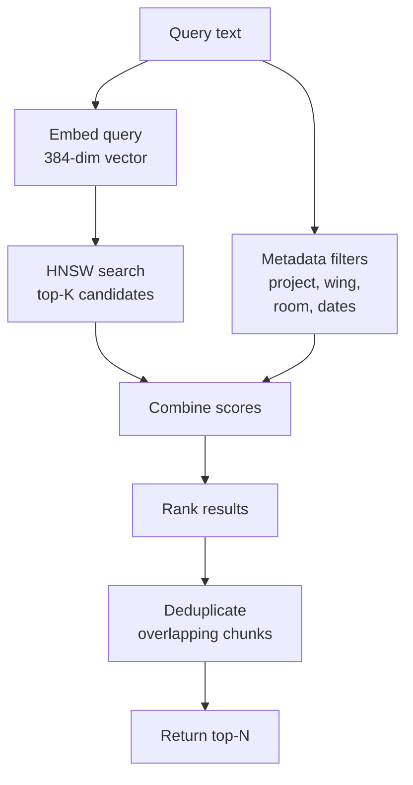

**Structural boost values (proposed, to be tuned):** wing +12%, wing+hall +24%, wing+room +34%. These are initial proposals, not empirically derived — must be validated against MemPalace benchmark scores before production use.
Results include verbatim text, source, wing/room/hall, date, score.

---

## 5. Session Lifecycle Flowchart

### 5.1 Full Session Flow


### 5.2 Context Bootstrap Subflow

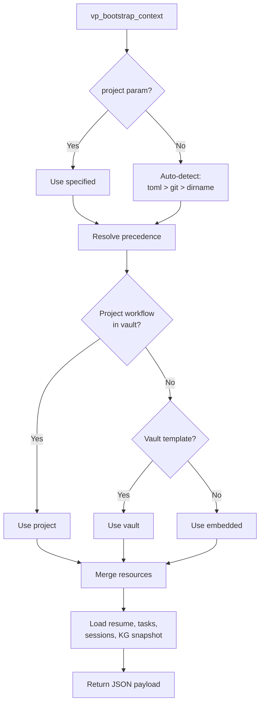

### 5.3 Semantic Search Subflow

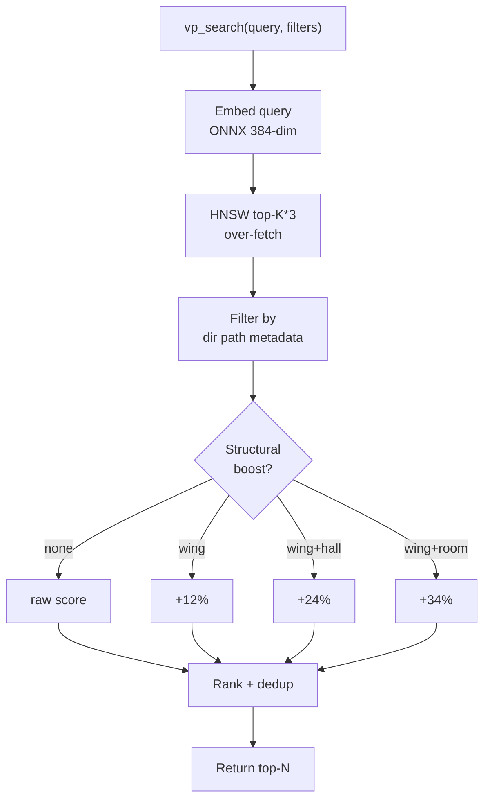

### 5.4 Task Management Subflow

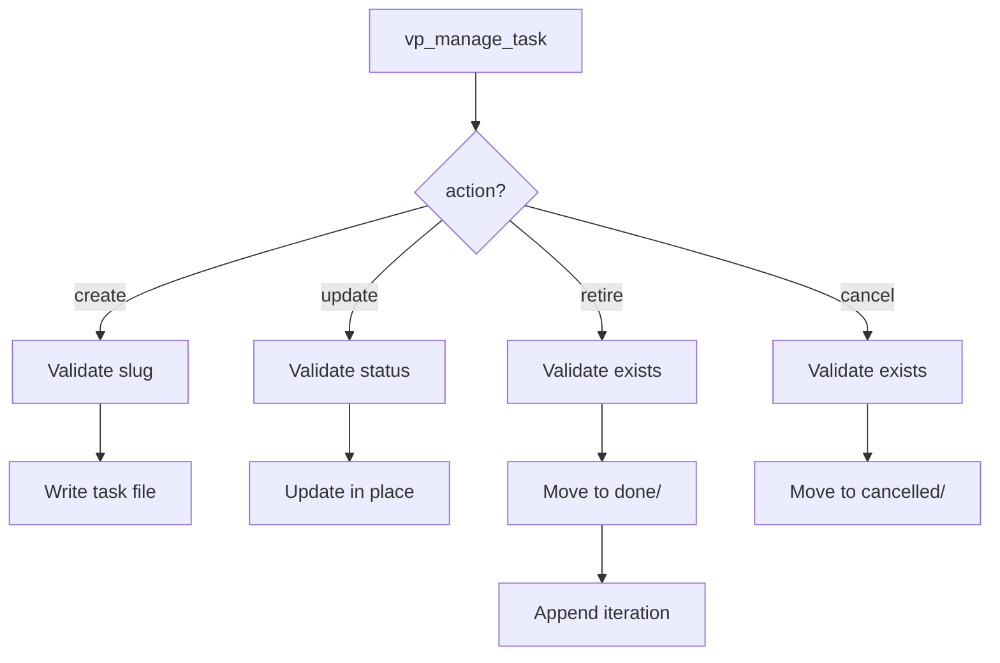

---

## 6. MCP Tool Surface

**The groupings below are the design. The surface itself is DERIVED — this
document does not enumerate it.**

```sh
jq -r '.tools[].name' internal/mcp/tool_surface.golden.json   # the surface
vp_manual                                                     # per-tool detail
```

The golden is generated from the live registry and `internal/tools/register_test.go`
enforces the pair, so it cannot drift from what ships. A table here can, and did:
when this section was measured at the 2026-08-15 split it named 59 tools against
a shipped 69, and the enumerations were kept anyway. The counters went with the
tables. **This is §1.11 applied to this document** — the registry enforces
itself, so the prose that restated it was not a second control, only a second
answer.

Read the subsections for what each GROUP is for and why the boundaries fall
where they do. That is the part a generated file cannot tell you.

### 6.1 Context Tools (from VibeVault, enhanced)

Session-start restoration and precedence-resolved reads: what is true for this
project right now. **Precedence is the group's boundary** — every read here
resolves through the §1.3 hierarchy (project > vault > embedded), so a caller
never has to know which tier answered. §1.9 governs the shape: session start
returns an INDEX plus what is relevant to the work ahead, and bulk bodies are
fetched by URI on demand rather than pushed.

### 6.2 Session Tools (from VibeVault, model-agnostic)

Recording and querying the session history — captures, iteration narratives,
per-project rollups, and the friction and effectiveness instruments derived from
them. Carried over from VibeVault and generalized so that any MCP host can
record a session, not only the one whose hook format the capture path grew up
in; that generalization is what §1.5 asks for, and host parity is measured
against it rather than assumed.

### 6.3 Search Tools (from MemPalace, new)

Retrieval across stored content, semantic and structural. Cross-project read
access (§1.4) lives here — it is the one place the project scope is
deliberately widened, and it is read-only.

### 6.4 Task Tools (from VibeVault)

The task graph: the vault's record of planned, active, and retired work, and the
source `head_of_queue` is derived from. **Mutation is one tool with an action
enum, not a family of verbs**, because each header field has exactly one writer;
where two actions can write one field, a reader and a writer eventually disagree
about which value is real. The doctrine's Task Management section owns that
table and the rules that go with it.

### 6.5 Knowledge Graph Tools (from MemPalace, new)

Temporal triples — subject/predicate/object facts carrying validity intervals,
so a fact can end without being erased. Separate from search because a KG answer
is derived from explicit assertions and their timestamps, never from similarity:
the two groups answer different questions and must not be reconciled into one.

### 6.6 Palace Navigation Tools (from MemPalace, new)

The spatial metaphor over stored content — wings, rooms, drawers, and the
tunnels between them. Read-only structural traversal. The boundary against
search is that **navigation follows declared structure while search ranks**; a
traversal returns what is actually connected, not what is merely similar.

### 6.7 System Tools

The binary and the vault as artifacts rather than as content: initialization,
git sync and status, health, diagnostics, index maintenance, and the surface
compatibility preflight. These are the tools a command template runs before it
trusts anything else.

### 6.8 Vault File CRUD Tools (write/wrap surface)

Generic, schema-agnostic file access over vault-relative paths. This group
exists to close the MCP-First gap (§1.1): an agent completes an entire wrap
without shelling out to a filesystem, on a host that has no shell at all. Paths
are always vault-relative and the server resolves them — a caller never computes
one.

Raw write bypasses schema validation, so it is the fallback and never the
default: typed writers first (tasks, iteration narratives, commit ingest,
memory), raw write only for files that have no typed writer. Task paths are
refused outright at the `vaultfs` layer rather than in the MCP tool, so the CLI
is covered by the same guard — a guard only an agent can trip is not a guard.

### 6.9 Commit Lifecycle Tools

Moving a commit message out of the project repo and into the vault's permanent
history. A group of one, kept separate because it is the only surface that
**crosses the boundary between the project's git repo and the vault** — the two
have different lifetimes, different remotes, and can be written by different
identities.

### 6.10 Resume Surgical-Edit Tools — REMOVED

> **Withdrawn.**

Six typed editors for `resume.md`'s `## Open Threads` and `### Carried forward`
sections (`vp_thread_insert`/`_replace`/`_remove`,
`vp_carried_add`/`_remove`/`_promote_to_task`) were implemented and have since
been **deleted**. No command template ever named them, so no agent could reach
them; and `vp_thread_insert` with `position: "top"` against a bullet-shaped
`## Open Threads` silently reparented the whole section body under a new
`### slug` block, which a later `vp_thread_remove` would then delete wholesale —
a two-call silent data-loss path. Structure-aware resume editing, if it returns,
needs a design that cannot corrupt a section it failed to parse.

Edit `resume.md` through `vp_update_resume` (compare-and-set on
`expected_sha256`) or `vp_vault_edit`.

### 6.11 Wrap-State Tools

Wrap readiness and bookkeeping driven from anchors under `.vibe-palace/` (see
ADR 002 and its 2026-08-29 amendment): which iteration this is, what changed
since the last anchor, and whether the preconditions for a wrap hold. The group
exists so that a wrap's readiness is **derived from a recorded stamp rather than
recalled by the agent running it**.

The anchors are **host-local and never committed** — `.vibe-palace/` is
gitignored, shared with the capture sentinels and the ADR-005 enrichment queue.
The reference point is the `anchor_sha` the stamp records, not a commit that
touched a tracked file.

### 6.12 Learnings Tools (cross-project, read-only)

Vault-wide cross-project "learnings" — curated lessons stored as
flat-frontmatter markdown under `Knowledge/learnings/`, shared across every
project rather than project-scoped. Ported from VibeVault, and **read-only by
design**: learnings are authored out-of-band, so there is no create path here.

---

## 7. Storage Schema

### 7.1 Design Philosophy: Filesystem-Native, Git-Mergeable

Vibe-Palace stores all persistent data as human-readable files organized by
project-first directory structure. There is no database. The filesystem layout
**is** the schema — directory paths encode the relationships that a database
would express with tables and indexes.

**Why not SQLite:**
- SQLite is a binary blob that git cannot diff, blame, or three-way merge
- Multi-machine sync requires conflict-free replication or last-write-wins —
  neither is acceptable for knowledge data
- Half the proposed tables would duplicate data that already exists as files
  (sessions, tasks, config)
- The actual query workload (metadata filtering on small datasets, semantic
  search — brute-force cosine today, HNSW deferred) does not require a database
  engine
- Human readability matters — `cat`, `grep`, `jq` should work on all stored data

**What git taught us:** Git manages billions of objects across millions of
repositories using nothing but POSIX filesystem semantics and hash references.
No key-value store, no database, no binary index files in the critical path.
The data volumes in Vibe-Palace are trivially small by comparison.

**The only binary artifact** is the vector index (deferred design: the HNSW
index; today brute-force rebuilds the index in-memory and the only persisted
binary cache is the embeddings cache), which is:
- **Derived** — rebuilt deterministically from drawer content + ONNX model
- **Ephemeral** — gitignored, machine-local
- **Deterministic** — same input text + same model = same embeddings, every time

This is the same pattern as compiled code: you don't check in binaries, you
rebuild from source. Drawer JSONL files are the "source code" of your knowledge.
The vector index is the "compiled binary" (deferred design; today brute-force
rebuilds in-memory, the embeddings cache is the only binary artifact).

### 7.2 Vault Directory Layout

```
vault/
├── palace/
│   ├── {project}/                     ← project-first for human navigation
│   │   ├── drawers/
│   │   │   └── {wing}/
│   │   │       └── {room}/
│   │   │           └── drawers.jsonl  ← one line per drawer
│   │   │
│   │   ├── kg/
│   │   │   ├── entities.jsonl         ← one line per entity
│   │   │   └── triples/
│   │   │       └── {subj}--{pred}--{obj}.json
│   │   │
│   │   └── .local/                    ← gitignored, machine-local
│   │       ├── hnsw.idx              ← rebuilt from drawers
│   │       └── embed-cache/          ← speeds up rebuild
│   │           └── {drawer-id}.vec
│   │
│   └── .local/                        ← vault-wide, gitignored
│       └── cross-project.idx          ← cross-project search index
│
├── Projects/                          ← unchanged from VibeVault
│   └── {project}/
│       ├── resume.md
│       ├── workflow.md                (project override, optional)
│       ├── iterations.md
│       ├── config.toml                (project config override)
│       ├── tasks/
│       │   ├── {slug}.md
│       │   ├── done/
│       │   └── cancelled/
│       ├── commands/                  (project-level commands)
│       │   ├── {name}.md             (project scope)
│       │   └── {wing}/
│       │       ├── .wing/{name}.md   (wing scope)
│       │       └── {room}/{name}.md  (room scope)
│       ├── skills/                    (project-level skills)
│       │   └── (same layout as commands/)
│       ├── sessions/
│       │   └── YYYY-MM-DD-NN.md
│       └── knowledge.md
│
├── Templates/                         (vault-level template overrides)
│   ├── workflow.md
│   ├── resume.md
│   ├── commands/
│   └── skills/
│
└── .git/                              (vault git repo)
```

**Key design decisions:**

- **Project-first under `palace/`:** `ls palace/` shows all projects. `rm -rf
  palace/recmeet/` cleanly removes one project's palace data with no orphans
  across sibling directories.

- **`palace/` is separate from `Projects/`:** Palace data (drawers, KG) is
  structured for machine consumption. Project context (sessions, tasks,
  iterations) is structured for human + AI consumption. They coexist in the
  same git-managed vault but serve different purposes.

- **No `.claude/` directory, no symlinks, no command/skill files in source tree.**
  Commands and skills are served via MCP tools (canonical: `vp_cmd`, `vp_skill`;
  read-only siblings: `vp_get_command`, `vp_get_skill`) and never touch the
  project repository.

### 7.3 Drawer Storage

**Path:** `palace/{project}/drawers/{wing}/{room}/drawers.jsonl`

One JSONL file per room. Each line is an independent drawer record. Appending a
drawer is appending a line. Git merges JSONL cleanly — append-only files with
independent lines are the best case for three-way merge.

**Drawer record schema:**

```json
{
  "id": "a1b2c3d4",
  "hall": "facts",
  "content": "We decided to cap the audio buffer at 120 minutes...",
  "source_type": "session",
  "source_ref": "2026-03-15-02",
  "chunk_index": 0,
  "filed_at": "2026-03-15T14:23:00Z",
  "added_by": "system"
}
```

| Field | Type | Required | Description |
|-------|------|----------|-------------|
| `id` | string | yes | Deterministic: first 8 chars of md5(wing+room+content) |
| `hall` | string | yes | Memory type: facts, events, discoveries, preferences, advice |
| `content` | string | yes | Verbatim text chunk (never summarized) |
| `source_type` | string | yes | Origin: session, file, conversation, manual |
| `source_ref` | string | no | Session date-iteration, file path, etc. |
| `chunk_index` | int | no | Position within source document (0-based) |
| `filed_at` | string | yes | ISO 8601 timestamp |
| `added_by` | string | no | Agent name or "user" (default: "system") |

**Why JSONL per room (not per drawer):**

- Per-drawer files would create thousands of tiny files — git overhead, filesystem
  noise, `ls` unusable
- Per-wing files would be too coarse — a single wing might have 10K drawers,
  making the file large and merge-prone
- Per-room is the sweet spot: typically 10-500 drawers per room, manageable file
  size (10-500KB), meaningful grouping, and git diffs show exactly which room
  gained content

**Indexing via directory structure:**

The filesystem layout replaces SQL indexes:

| SQL equivalent | Filesystem equivalent |
|----------------|----------------------|
| `WHERE project = 'recmeet'` | `palace/recmeet/drawers/` |
| `AND wing = 'wing_recmeet'` | `palace/recmeet/drawers/wing_recmeet/` |
| `AND room = 'audio-pipeline'` | `palace/recmeet/drawers/wing_recmeet/audio-pipeline/` |
| Full scan | `palace/*/drawers/**/*.jsonl` |

### 7.4 Knowledge Graph Storage

**Entities path:** `palace/{project}/kg/entities.jsonl`

One JSONL file per project containing all entities. Typically small (tens to low
hundreds of entities per project).

```json
{
  "id": "kai",
  "name": "Kai",
  "type": "person",
  "properties": {"role": "backend engineer", "tenure_start": "2023-04-01"},
  "created_at": "2026-01-15T10:00:00Z"
}
```

**Triples path:** `palace/{project}/kg/triples/{subject}--{predicate}--{object}.json`

One file per triple. The relationship is encoded in the filename for O(1) lookup.

```json
{
  "valid_from": "2025-06-01",
  "valid_to": null,
  "confidence": 1.0,
  "source_session": "2026-01-15-03",
  "extracted_at": "2026-01-15T14:30:00Z"
}
```

| Query | Filesystem operation |
|-------|---------------------|
| All triples for entity "kai" | `glob("palace/*/kg/triples/kai--*")` + `glob("palace/*/kg/triples/*--*--kai.json")` |
| Specific relationship | `read("palace/recmeet/kg/triples/kai--works_on--orion.json")` |
| All relationships of type | `glob("palace/*/kg/triples/*--works_on--*.json")` |
| Invalidate a fact | Update the file: set `valid_to` |
| History of a fact | `git log palace/recmeet/kg/triples/kai--works_on--orion.json` |

**Why one file per triple:**

- Triples are updated individually (invalidation sets `valid_to`)
- Git tracks history per file — you get full audit trail of when facts were
  created, modified, and invalidated
- Glob patterns provide all the query capability needed
- File count stays manageable: typical project has tens to low hundreds of triples

**Filename encoding rules:**

- Subject, predicate, and object are lowercased, spaces replaced with `_`
- Delimiter is `--` (double hyphen, unambiguous in entity names)
- Example: `kai--works_on--orion.json`, `auth0--replaced_by--clerk.json`

### 7.5 Session Storage

Sessions continue to be stored as markdown files with YAML frontmatter, exactly
as VibeVault does today:

**Path:** `Projects/{project}/sessions/YYYY-MM-DD-NN.md`

No change from current VibeVault format. The session markdown files are
human-readable, git-tracked, and already proven across 686+ sessions.

The session frontmatter serves as the "session index" — to list or filter
sessions, parse the YAML frontmatter from matching files. For performance, a
machine-local cache can be built on startup (gitignored, in `.local/`).

### 7.6 Task Storage

Tasks continue to be stored as markdown files:

**Path:** `Projects/{project}/tasks/{slug}.md`
**Done:** `Projects/{project}/tasks/done/{slug}.md`
**Cancelled:** `Projects/{project}/tasks/cancelled/{slug}.md`

No change from current VibeVault format.

### 7.7 Configuration Storage

Configuration continues to use TOML files in the existing precedence chain:

- **Embedded defaults:** compiled into the binary
- **Vault-level:** `~/.config/vibe-palace/config.toml`
- **Project-level:** `Projects/{project}/config.toml`

No database table needed.

### 7.8 HNSW Index (Machine-Local, Derived)

> **Deferred design (Phase 11).** This section describes the intended HNSW
> persistence. Today there is no persisted HNSW index: the brute-force
> `VectorIndex` rebuilds in-memory and the only binary artifact is the
> embeddings cache. HNSW fixes were merged upstream (`coder/hnsw@main`,
> 2026-06-22) and validated, but adoption is parked behind the index boundary.

The HNSW vector index is the only binary artifact in the system. It is:

- **Stored at:** `palace/{project}/.local/hnsw.idx` (gitignored)
- **Built from:** drawer JSONL files + ONNX embedder
- **Rebuilt on:** startup if missing, or incrementally updated on new drawers
- **Parameters:** ef_construction=200, M=16, ef_search=100
- **Distance metric:** L2 (Euclidean), matching ChromaDB default
- **Capacity:** Tested to 1M+ vectors with sub-millisecond search

**Embedding cache:** `palace/{project}/.local/embed-cache/{drawer-id}.vec`

Optional binary cache of pre-computed embeddings (gitignored). Speeds up HNSW
rebuild — only re-embed drawers whose IDs are not in the cache. Since embeddings
are deterministic (same text + same model = same vector), the cache is a pure
performance optimization, never authoritative.

**Startup rebuild strategy:**

1. Scan `palace/{project}/drawers/**/*.jsonl` for all drawer IDs
2. For each drawer ID, check embed-cache for existing vector
3. For cache misses, embed via ONNX and write to cache
4. Build HNSW index from all vectors
5. Ready to serve search queries

For 10K drawers with warm cache: <2 seconds. Cold cache (first run on new
machine): 30-60 seconds (dominated by ONNX inference).

**Cross-project index:** `palace/.local/cross-project.idx` (gitignored)

Optional combined HNSW index spanning all projects, built for
`vp_search_cross_project`. Rebuilt by merging per-project indexes.

### 7.9 The .local Convention

Every directory under `palace/` may contain a `.local/` subdirectory for
machine-specific derived artifacts. All `.local/` directories are gitignored
via a single rule in the vault's `.gitignore`:

```
palace/**/.local/
```

This convention means:
- `git status` never shows derived artifacts
- `git pull` never conflicts on binary files
- Each machine rebuilds its own indexes from the shared source files
- Deleting `.local/` and restarting is always safe (full rebuild)

### 7.10 Git Mergeability Analysis

| Data type | Format | Git merge behavior |
|-----------|--------|-------------------|
| Drawer JSONL | Append-only lines | Clean merge — independent lines never conflict |
| KG entity JSONL | Append-only lines | Clean merge — new entities append cleanly |
| KG triple JSON | One file per triple | Clean merge — different triples are different files |
| Session markdown | One file per session | Clean merge — different sessions are different files |
| Task markdown | One file per task | Possible conflict if two machines edit same task |
| Config TOML | Key-value pairs | Possible conflict if two machines edit same key |
| HNSW index | Binary (gitignored) | No conflict — never tracked |
| Embed cache | Binary (gitignored) | No conflict — never tracked |

**Conflict scenarios and resolution:**

- **Same task edited on two machines:** Standard git three-way merge on markdown.
  Usually resolves automatically (different sections edited). Manual resolution
  if same lines changed — acceptable, since task edits are rare concurrent events.

- **Same triple invalidated on two machines:** Both set `valid_to` — if to
  different dates, git shows a conflict on one JSON file. Trivial to resolve
  (pick the earlier date).

- **Drawers appended on two machines:** JSONL append-only means both machines'
  new lines are concatenated. No conflict. Possible duplicate drawer IDs if both
  machines indexed the same content — deduplicated on HNSW rebuild (same ID =
  same content = same embedding, skip duplicate).

### 7.11 Comparison: Filesystem vs. Database

| Capability | Database (SQLite) | Filesystem (this design) |
|-----------|-------------------|--------------------------|
| Complex JOINs | Yes | No — not needed |
| Atomic transactions | Yes | No — acceptable for this workload |
| COUNT/SUM aggregation | Yes | glob + count — slightly slower |
| Arbitrary SQL queries | Yes | No — our queries are simple |
| Git mergeability | No (binary blob) | Yes (text files) |
| Human readability | No (requires tooling) | Yes (cat, grep, jq) |
| Multi-machine sync | Problematic | Native git three-way merge |
| History / blame | None | Full git history per file |
| Debugging | Requires sqlite3 CLI | cat, less, jq |
| Backup | Copy binary file | Already in git |
| Branch / experiment | Not possible | Branch knowledge, merge back |
| Delete a project | Multi-table DELETE | `rm -rf palace/{project}/` |

---

## 8. Precedence System

### 8.1 Resolution Algorithm

```go
func (r *PrecedenceResolver) Resolve(resource string, project string) string {
    // 1. Check project-level override
    if content, ok := r.projectOverride(project, resource); ok {
        return content
    }
    // 2. Check vault template
    if content, ok := r.vaultTemplate(resource); ok {
        return content
    }
    // 3. Return embedded default
    return r.embeddedDefault(resource)
}
```

### 8.2 Resources Subject to Precedence

| Resource | Embedded Default | Vault Override | Project Override |
|----------|-----------------|----------------|------------------|
| workflow.md | Yes (compiled in) | Templates/workflow.md | Projects/{p}/workflow.md |
| resume.md template | Yes | Templates/resume.md | Projects/{p}/resume.md |
| commands/* | Yes | Templates/commands/* | Projects/{p}/commands/* |
| skills/* | Yes | Templates/skills/* | Projects/{p}/skills/* |
| config values | Yes (code defaults) | Global config.toml | Projects/{p}/config.toml |

### 8.3 Precedence for First-Time Projects

When a project is initialized for the first time:

1. `.vibe-palace.toml` is created in the source tree (only file that touches it)
2. `Projects/{project}/` directory is created in the vault
3. `resume.md` is expanded from the highest-precedence template (embedded or vault)
4. `iterations.md` is initialized with metadata frontmatter
5. No workflow.md, commands/, or skills/ are written — they will be resolved at
   runtime via precedence (embedded defaults serve until overridden)

This means a new project has **zero vault template files by default**. Everything
comes from embedded defaults until the user explicitly overrides something.

### 8.4 Command and Skill Graduation Lifecycle

Commands **and skills** are first-class resources under the precedence
system and follow the same natural promotion path through the tiers:

1. **Project-local** (`source: "project"`): Created in
   `{vault}/Projects/{proj}/commands/{name}.md` or
   `{vault}/Projects/{proj}/skills/{name}/SKILL.md`. Only available for
   that project. This is where new commands and skills are born —
   developed, tested, and iterated in the context of a single project.

2. **Vault template** (`source: "vault"`): Promoted to
   `{vault}/Templates/commands/{name}.md` or
   `{vault}/Templates/skills/{name}/SKILL.md`. Available to all
   projects (unless overridden at project level). Resources graduate
   here when they prove useful across multiple projects.

3. **Embedded default** (`source: "embedded"`): Compiled into the
   binary in `internal/templates/templates/commands/{name}.md` or
   `internal/templates/templates/skills/{name}/`. Ships with every
   vibe-palace installation. Resources graduate here when they are
   universally useful.

The `source` field in `vp_cmd` / `vp_skill` discovery mode and in the
`vp_bootstrap_context` response makes the lifecycle visible for both
surfaces. Users can see which project-local commands *and* skills are
candidates for graduation. Promotion is manual: copy the file (or
directory, for skills) from the project tier to the vault Templates
directory, or submit a PR to add it to embedded defaults.

Skills have an additional wrinkle: the resolution unit is per-file
within the skill directory. A project may shadow a skill's `SKILL.md`
(the persona entry point) while inheriting every `references/*.md`
from the vault or embedded tier. That makes partial promotion natural —
a project can iterate on persona language without forking the
reference corpus.

### 8.5 Portable Command Execution

Commands and skills must be executable from any MCP client, not just Claude
Code's slash command convention. The `vp_cmd` and `vp_skill` tools provide
LLM-agnostic execution framing that works with any model:

- **`vp_cmd`** returns command content wrapped in explicit execution framing
  (`=== EXECUTE COMMAND: {name} ===`) with instructions to follow each step.
  The framing uses universally-recognized delimiters and explicit "perform,
  don't summarize" phrasing that works across Claude, GPT, Gemini, Llama, etc.

- **`vp_skill`** returns skill content with behavioral framing
  (`=== ACTIVATE SKILL: {name} ===`) instructing the AI to internalize and
  apply the guidelines during the session.

- Both tools support **discovery mode**: called with no name, they return a
  formatted list of available commands/skills with sources and brief
  descriptions. This replaces IDE-specific autocomplete with protocol-level
  discoverability.

- **`vp_get_command`** and **`vp_get_skill`** remain as read-only inspection
  tools (returning JSON with name, content, source metadata). `vp_cmd` and
  `vp_skill` are the execution-oriented counterparts.

---

## Phase 11: Pluggable Embedding Backends

> **Status: PLANNED**

**Goal:** Allow users to swap the default pure-Go ONNX embedder for
higher-quality models served by external backends (Ollama, llama.cpp, or
future providers) while preserving the zero-dependency default. The `Embedder`
interface already abstracts the embedding contract (`internal/search` — the code
is the contract) — this phase adds concrete alternative implementations and the
configuration to select them.

**Motivation:** The default `all-MiniLM-L6-v2` (384-dim, MTEB ~49) is adequate
for high-intent personal queries, but models like EmbeddingGemma (768-dim,
MTEB ~70) and nomic-embed-text-v1.5 (768-dim, MTEB ~62) offer meaningfully
better retrieval quality. These larger models cannot run in the pure-Go ONNX
backend but are readily available through Ollama. Users who already run Ollama
(or a compatible server) should be able to opt in without recompiling.

**Design constraints:**
- The default must remain zero-dependency: `hugot` pure-Go ONNX, no external
  services required, single binary
- Alternative backends are opt-in via configuration, never required
- Switching backends triggers a full re-index (different dimensions/model =
  incompatible vectors); `vp check` must detect and warn about mismatches
- The `Embedder` interface contract (Embed, EmbedBatch, Dimensions, Close)
  does not change — backends implement it
- HNSW index, hybrid search, and MCP tools are backend-agnostic by design
  (they depend on the interface, not the implementation)

### Task 11.1: Ollama Embedding Backend

**Deliverable:** `internal/embedder/ollama.go`

- Implements the `Embedder` interface using Ollama's `/api/embed` REST endpoint
- Configuration via `[embedder]` section in TOML:
  ```toml
  [embedder]
  backend = "ollama"           # "onnx" (default) | "ollama"
  model = "embeddinggemma"     # any Ollama-supported embedding model
  ollama_url = "http://localhost:11434"  # default Ollama endpoint
  ```
- Auto-detects Ollama availability at startup; falls back to ONNX with a
  warning if configured backend is unreachable
- Queries model metadata (`/api/show`) to determine embedding dimensions
  dynamically — no hardcoded dimension assumptions
- Batch embedding via concurrent requests (Ollama's embed endpoint handles
  one text at a time as of 2026-Q2; batch by parallelism)

**Acceptance criteria:**
- Ollama backend produces valid embeddings that work with HNSW index
- `vp check` validates backend availability and model compatibility
- Graceful degradation: if Ollama is down, error messages guide the user
- Switching `backend` in config and running `vp reindex` rebuilds cleanly
- 80%+ test coverage (mock HTTP server for Ollama API)

### Task 11.2: Backend Selection & Re-index Safety

**Deliverable:** Changes to `internal/embedder/`, `internal/storage/config.go`,
`cmd/vp/`

- Factory function: `NewEmbedder(cfg Config) (Embedder, error)` dispatches to
  ONNX or Ollama based on `cfg.EmbedderBackend`
- Index metadata file records which backend+model produced the current index
- On startup, compare current config against index metadata; if mismatched,
  refuse to search and prompt for `vp reindex`
- `vp reindex` command: drops existing HNSW index and rebuilds from drawer
  files using the configured backend
- `vp check` reports: backend type, model name, dimensions, index
  backend/model, and whether they match

**Acceptance criteria:**
- Switching backends without re-indexing produces a clear error, not wrong results
- `vp reindex` rebuilds the index end-to-end with the configured backend
- Index metadata survives restarts and is gitignored (machine-local)

### Task 11.3: Additional Backend Support (Future)

**Not scheduled.** Placeholder for potential future backends:
- **llama.cpp server** — similar REST pattern to Ollama, different API shape
- **Remote API** — OpenAI-compatible `/v1/embeddings` endpoint for hosted
  models (requires network, opt-in only)
- **Custom ONNX models** — user-supplied ONNX files loaded by hugot (larger
  models that the user has converted themselves)

These would follow the same pattern: implement `Embedder`, add a config
variant, ensure re-index safety.

---

## Cross-Cutting Concerns

### Error Handling

All errors are structured with:
- Error code (for programmatic handling)
- Human-readable message
- Source context (which operation failed)

MCP errors use JSON-RPC error codes. HTTP errors use standard status codes.
CLI errors print to stderr and exit with appropriate code.

### Logging

- Structured JSON logging to configurable output (stderr default)
- Log levels: debug, info, warn, error
- Request/response logging for MCP and HTTP (debug level)
- Performance timing for search queries and embedding operations

### Configuration

Global config at `~/.config/vibe-palace/config.toml`:

```toml
vault_path = "~/obsidian/VibePalace"
http_port = 7423
log_level = "info"

[domains]
work = "~/work"
personal = "~/personal"
opensource = "~/opensource"

[embedder]
model = "all-MiniLM-L6-v2"
max_sequence_length = 256
batch_size = 32

[search]
default_limit = 10
# Boost values are initial proposals, not empirically derived.
# Must be tuned against MemPalace benchmark scores before production use.
structural_boost_wing = 0.12
structural_boost_hall = 0.24
structural_boost_room = 0.34

[archive]
compress = true
dormant_days = 90
# Transcript-ledger format and provenance reasoning: see doc/adr/001-transcript-archive.md
# sign_mode = ""          # "", "gpg", or "ssh"
# sign_key = ""
# sign_namespace = "vibe-palace-archive"
# allowed_signers = ""
# signer_identity = ""

# Room classification scoring overrides (Phase 12):
# [palace.scoring]
# min_score = 0.5
# [palace.scoring.rooms.testing]
# high = ["integration test", "e2e test"]
# medium = ["spec"]
# low = ["check"]

# LLM endpoint for offline classification tuning (Phase 12):
# [palace.llm]
# endpoint = "https://api.x.ai/v1"
# model = "grok-3-mini"
# api_key_env = "XAI_API_KEY"
# max_tokens = 4096
```

### Security

- All file access validated against vault path (no path traversal)
- HTTP server binds to localhost only (no network exposure)
- No secrets stored in vault files (API keys via environment variables only)
- Session transcripts may contain sensitive content — vault directory should
  have appropriate file permissions

### Concurrency

- JSONL append with flock for concurrent write safety
- HNSW index protected by RWMutex (concurrent reads, exclusive writes)
- ONNX embedder thread-safe (uses ONNX Runtime's built-in thread pool)
- Session capture is asynchronous — MCP returns immediately, indexing runs in background

---

## Validation Framework

### Per-Task Validation

After each task is implemented, a validation task is spawned that checks:

1. **Test Coverage:** Run `go test -coverprofile=coverage.out ./...` and verify
   that the package under test has >= 80% coverage. Report exact percentage.

2. **Code Quality:**
   - `go vet ./...` — no warnings
   - `golangci-lint run` — no errors (with standard config)
   - No `TODO` or `FIXME` in committed code without a linked task
   - No hardcoded paths or credentials
   - Error returns are always checked

3. **Interface Compliance:** For MCP tools, verify:
   - Tool schema matches specification in this document
   - Required parameters are enforced
   - Optional parameters have documented defaults
   - Return format matches specification

4. **Integration Testing:** Where applicable:
   - Storage tasks: round-trip test (insert → query → verify)
   - MCP tasks: full request/response cycle over mock stdio
   - Search tasks: insert known content → search → verify ranking
   - Session tasks: capture → index → search for captured content

### Phase Gate Validation

Before moving to the next phase, verify:

1. All tasks in current phase pass validation
2. Integration tests pass between current phase's components
3. No regressions in previously-completed phases (`go test ./...` all green)
4. Binary builds successfully for at least one platform

### Benchmark Validation (Phase 4+)

Once semantic search is operational:

1. Import MemPalace's LongMemEval test data
2. Run retrieval accuracy benchmark
3. Verify R@5 >= 95% (allowing margin for embedding model differences)
4. If below threshold, investigate and document before proceeding

---

## Appendix A: Glossary

| Term | Definition |
|------|-----------|
| **Drawer** | A verbatim text chunk stored in the palace, the atomic unit of memory |
| **Wing** | Top-level organizational scope — typically a person or project |
| **Hall** | Memory type classification: facts, events, discoveries, preferences, advice |
| **Room** | Topic-level grouping within a wing (e.g., "auth-migration", "ci-pipeline") |
| **Tunnel** | A room that appears in two or more wings, creating cross-domain connections |
| **AAAK** | Autonomous Adaptive Associative Knowledge — a lossy structured compression format. **PARKED: implemented but not wired into any production path; no code produces or consumes an AAAK digest today.** |
| **Triple** | A subject-predicate-object fact in the knowledge graph, with temporal validity |
| **Session** | A captured work unit with metadata, transcript, and semantic index |
| **Precedence** | The resolution order: project override > vault template > embedded default |
| **Vault** | The git-managed directory containing all persistent context data |

## Appendix B: File Inventory

### Source Tree (what Vibe-Palace creates in a project repo)

```
project-root/
└── .vibe-palace.toml          # Project identity (only file)
```

That's it. One file. Everything else is served via MCP.

### Vault Tree (managed by Vibe-Palace)

```
vault/
├── Projects/
│   └── {project}/
│       ├── resume.md              # Project state (editable)
│       ├── workflow.md            # Project-specific override (optional)
│       ├── iterations.md          # Append-only archive
│       ├── config.toml            # Project config override (optional)
│       ├── commands/              # Project-specific commands (optional)
│       │   ├── {name}.md         # Project scope
│       │   └── {wing}/
│       │       ├── .wing/{name}.md   # Wing scope
│       │       └── {room}/{name}.md  # Room scope
│       ├── skills/                # Project-specific skills (optional)
│       │   └── (same layout as commands/)
│       ├── tasks/
│       │   ├── {slug}.md
│       │   ├── done/
│       │   └── cancelled/
│       ├── sessions/
│       │   └── YYYY-MM-DD-NN.md
│       └── knowledge.md
├── Templates/                     # Vault-level overrides
│   ├── workflow.md
│   ├── resume.md
│   ├── commands/
│   └── skills/
├── palace/
│   └── {project}/                 # Drawers (JSONL), KG (JSON), .local/ (gitignored)
│   └── model/                     # ONNX model files (if not embedded)
│       └── all-MiniLM-L6-v2.onnx
└── .git/
```

### Binary Contents (compiled in)

```
embedded/
├── templates/
│   ├── workflow.md
│   ├── resume.md
│   └── commands/
│       ├── restart.md
│       ├── wrap.md
│       ├── review-plan.md
│       └── cancel-plan.md
└── tokenizer/
    └── vocab.txt                  # WordPiece vocabulary for tokenizer
```

Note: The ONNX model is **not** embedded in the binary. It is downloaded on
first run and cached in the vault (see Decisions Register, Section C.1).

---

## Appendix C: Decisions Register

The dependency and platform choices below are **final and still binding** — they
are why the binary is shaped the way it is, and they are the one part of the
former Implementation Supplement that specifies rather than narrates.

> **Split 2026-08-15.** C.2 (Project Skeleton), C.3 (Interface Contracts), C.4
> (Task Dependency DAG), C.5 (Integration Test Contracts), C.6 (Test Fixtures),
> C.7 (Inline Template Content) and C.8 (MCP Protocol Reference) were cut. Each
> had been superseded by the thing it described: the code is the interface
> contract, `doc/TESTING.md` is the test inventory, `mcp-go` owns the protocol,
> and **C.7's template copy was actively wrong** — it still carried the doctrine
> that ADR-008 moved into the binary, making it a third copy of content with one
> source of truth. Recover any of it from git history.

---

### C.1 Decisions Register

Every deferred choice is resolved here. Subagents MUST NOT revisit these
decisions — they are final.

| # | Decision | Options Considered | Choice | Rationale |
|---|----------|-------------------|--------|-----------|
| D1 | Go module path | `github.com/suykerbuyk/vibe-palace` | `github.com/suykerbuyk/vibe-palace` | Matches GitHub account and project name |
| D2 | Minimum Go version | 1.21, 1.23, 1.25 | **1.25.0** | Required by `mark3labs/mcp-go` (our MCP library). The minimum is set by our dependencies, not by the developer's machine. `go.mod` declares `go 1.25.0`. |
| D3 | ONNX model delivery | Embed in binary (~80MB) vs download on first run | **Download on first run** | Keeps binary under 20MB. Model cached at `{vault}/palace/.local/model/all-MiniLM-L6-v2.onnx`. Downloaded from HuggingFace. SHA256 verified. `vp check` validates cache integrity. |
| D4 | Embedding library | hugot pure-Go backend, hugot+ORT, ollama sidecar | **hugot with pure Go backend** (`knights-analytics/hugot`) | **Validated via spike** (`doc/spike-hugot-pure-go-embedding.md`, 2026-04-07): single embed 66ms, batch-32 290ms (9ms/item amortized), 17MB stripped binary, no CGO. 10K-drawer reindex projected at ~90s. Pure-Go backend produces correct 384-dim L2-normalized embeddings. All go thresholds passed. License: Apache-2.0. |
| D5 | HNSW library | `coder/hnsw`, `fogfish/hnsw`, brute-force with vek | **`coder/hnsw`** | Pure Go, no CGO. Uses `viterin/vek` for SIMD-accelerated L2 distance. CC0 license. 214 stars, actively maintained by Coder. Supports incremental insertion, deletion, export/import persistence. Min Go: 1.21. **Update:** our fork's three recall-bug fixes (Heap.Max/PopLast) were merged upstream into `coder/hnsw@main` (2026-06-22) and validated against the in-repo recall harness (recall@10 0.96); adoption is deferred (brute-force is the shipped index). |
| D6 | MCP library | `mark3labs/mcp-go`, `modelcontextprotocol/go-sdk`, hand-rolled | **`mark3labs/mcp-go`** | MIT license. 8,500 stars. Handles full JSON-RPC protocol, stdio transport, tool registration with fluent JSON Schema builders. Go 1.23. The official `go-sdk` requires Go 1.25. |
| D7 | MCP protocol version | 2024-11-05, 2025-03-26 | **2025-03-26** | Latest stable spec. `mcp-go` supports it. Matches VibeVault's upper protocol bound. |
| D8 | HTTP framework | stdlib `net/http`, chi, echo, gin | **stdlib `net/http`** | Zero additional dependencies. Sufficient for localhost-only REST API. Routing via `http.NewServeMux` (Go 1.22+ pattern matching). |
| D9 | File locking strategy | flock (POSIX), lockfile (create/delete) | **flock (POSIX advisory locks)** | Atomic, no stale lockfiles on crash. Go's `syscall.Flock()`. Cross-platform: works on Linux and macOS. On Windows, use `LockFileEx` via `golang.org/x/sys/windows`. |
| D10 | TOML library | `BurntSushi/toml`, `pelletier/go-toml` | **`BurntSushi/toml`** | De facto standard. MIT license. Zero dependencies. Stable. |
| D11 | YAML frontmatter parsing | `go-yaml/yaml`, custom parser | **`go-yaml/yaml` v3** | Session markdown files use YAML frontmatter. yaml.v3 is the standard choice. MIT license. |
| D12 | CLI framework | cobra, urfave/cli, stdlib `flag` | **stdlib `flag`** with subcommand dispatch | Zero dependencies. Vibe-Palace has ~15 commands — `flag` with a manual subcommand switch is sufficient. Avoids cobra's 5+ transitive deps. |
| D13 | Man page generation | Hand-written roff, cobra doc generation, build-time codegen from help structs | **Build-time codegen from help structs** | Man pages generated by `cmd/gen-man/main.go` from the same structured help metadata used by `--help`. Single source of truth — no manual authoring, no drift. Follows VibeVault's proven pattern (`cmd/gen-man` + `help.FormatRoff()`). Zero new dependencies. |

**Dependency summary (8 external modules):**

```
require (
    github.com/coder/hnsw         v0.x.x   // HNSW vector index (CC0)
    github.com/viterin/vek         v0.x.x   // SIMD vector ops (MIT, transitive via hnsw)
    github.com/mark3labs/mcp-go    v0.x.x   // MCP server (MIT)
    github.com/knights-analytics/hugot v0.x.x // Embeddings (Apache-2.0)
    github.com/BurntSushi/toml     v1.x.x   // TOML parsing (MIT)
    gopkg.in/yaml.v3               v3.x.x   // YAML frontmatter (MIT)
    golang.org/x/sys               v0.x.x   // Windows flock (BSD)
)
```

---
