# Vibe-Palace: Product Requirements Document

**Version:** 0.1.0-draft
**Date:** 2026-04-06
**Authors:** John Suykerbuyk, Claude Opus 4.6
**Status:** Design Review

---

## Executive Summary

Vibe-Palace is a compiled Go binary that unifies the proven concepts of VibeVault
(session capture, workflow orchestration, project context management across 686+
sessions and 32+ projects) with MemPalace (semantic search achieving 96.6% R@5 on
LongMemEval, temporal knowledge graphs, structural metadata filtering).

**The core architectural principle:** The MCP interface is the product. File system
conventions, symlinks, and markdown file management are implementation details that
should be invisible to both the AI consumer and the human developer. Context
injection, behavioral calibration, session capture, semantic search, and knowledge
graph operations all flow through a standard MCP (or HTTP) interface, decoupled
from any specific AI provider's file system expectations.

**What this replaces:**
- VibeVault's dependency on Claude Code's JSON-RPC protocol and `.claude/` directory
  conventions
- MemPalace's dependency on Python, ChromaDB, and pip-based distribution
- The symlink/dual-git complexity of maintaining vault agentctx alongside source code
- The CLAUDE.md sprawl problem across multiple AI providers and IDEs

**What this preserves:**
- VibeVault's 686+ sessions of captured knowledge (full migration path)
- MemPalace's 96.6% retrieval accuracy (embedded HNSW + same embedding model)
- VibeVault's workflow orchestration and pair programming paradigm
- MemPalace's temporal knowledge graph with validity windows
- Both systems' local-first, zero-cloud-dependency architecture

---

## Table of Contents

1. [Design Principles](#1-design-principles)
2. [Architecture Overview](#2-architecture-overview)
3. [State Machines](#3-state-machines)
4. [Data Lifecycle](#4-data-lifecycle)
5. [Session Lifecycle Flowchart](#5-session-lifecycle-flowchart)
6. [MCP Tool Surface](#6-mcp-tool-surface)
7. [Storage Schema](#7-storage-schema)
8. [Precedence System](#8-precedence-system)
9. [Phase 1: Storage Engine](#phase-1-storage-engine)
10. [Phase 2: MCP Server Core](#phase-2-mcp-server-core)
11. [Phase 3: Context Injection Engine](#phase-3-context-injection-engine)
12. [Phase 4: Semantic Search](#phase-4-semantic-search)
13. [Phase 5: Session Capture](#phase-5-session-capture)
14. [Phase 6: Palace Architecture](#phase-6-palace-architecture)
15. [Phase 7: Knowledge Graph](#phase-7-knowledge-graph)
16. [Phase 8: Migration & Import](#phase-8-migration--import)
17. [Phase 9: CLI & Distribution](#phase-9-cli--distribution)
18. [Phase 10: Documentation & Human Interface](#phase-10-documentation--human-interface)
19. [Cross-Cutting Concerns](#cross-cutting-concerns)
20. [Validation Framework](#validation-framework)
21. [Appendix A: Glossary](#appendix-a-glossary)
22. [Appendix B: File Inventory](#appendix-b-file-inventory)
23. [Appendix C: Implementation Supplement](#appendix-c-implementation-supplement)
    - [C.1 Decisions Register](#c1-decisions-register)
    - [C.2 Project Skeleton](#c2-project-skeleton)
    - [C.3 Interface Contracts](#c3-interface-contracts)
    - [C.4 Task Dependency DAG](#c4-task-dependency-dag)
    - [C.5 Integration Test Contracts](#c5-integration-test-contracts)
    - [C.6 Test Fixtures](#c6-test-fixtures)
    - [C.7 Inline Template Content](#c7-inline-template-content)
    - [C.8 MCP Protocol Reference](#c8-mcp-protocol-reference)

---

## 1. Design Principles

### 1.1 MCP-First, File-System-Last

The MCP interface is the canonical way to interact with Vibe-Palace. Every
capability — context injection, session capture, search, task management,
knowledge graph queries — is available via MCP tools. File system artifacts
(session markdown files, task files, iteration narratives) are *generated outputs*
of the MCP server, not inputs to it.

**The project-local footprint is exactly one file:** `.vibe-palace.toml` at the
project root. This file contains only the project identity (name, domain, tags).
Everything else — workflow rules, behavioral calibration, commands, skills,
templates — is delivered through the MCP interface on demand.

No symlinks. No `.claude/` directory. No dual-git management. No CLAUDE.md.

### 1.2 Out-of-Band Context Storage

The vault directory is completely separate from any source code tree. Context data
(sessions, tasks, iterations, knowledge graph, embeddings) lives in the vault.
Source code lives in the project repository. The MCP server bridges them.

The vault is git-managed for multi-machine sync and history. The source code
repository has no knowledge of the vault's existence beyond the single
`.vibe-palace.toml` identity file.

### 1.3 Precedence Hierarchy

Context injection follows a strict precedence chain:

```
Project-local overrides  (highest — in vault, not source tree)
        ↓
Vault templates          (user-customized defaults)
        ↓
Embedded defaults        (compiled into binary — lowest)
```

This ensures:
- New projects work immediately with sensible defaults (embedded)
- Users can customize defaults for all future projects (vault templates)
- Individual projects can override anything (project-local in vault)
- Nothing touches the source code tree

### 1.4 Project-Scoped by Default, Cross-Project Read Access Available

All write operations (session capture, task management, knowledge graph mutations)
are scoped to the current project. Search and read operations can optionally span
all projects, enabling cross-project knowledge discovery.

### 1.5 Model-Agnostic

The MCP server makes no assumptions about which AI model or IDE is calling it.
Tools accept plain text and return plain text or structured JSON. No
Claude-specific, GPT-specific, or IDE-specific behaviors. The same binary works
with Claude Code, Cursor, Windsurf, Cline, Zed, Ollama, or any future MCP client.

### 1.6 Single Binary, Zero Dependencies

The compiled Go binary contains:
- The MCP server (stdio transport)
- An HTTP REST server (same backend, HTTP transport)
- A CLI for human interaction
- An embedded ONNX runtime for text embeddings
- An embedded HNSW index for vector search
- Embedded default templates for project initialization

No Python. No Docker. No pip. No node_modules. Download, run, done.

---

## 2. Architecture Overview

```
┌──────────────────────────────────────────────────────────────────┐
│                        vibe-palace binary                        │
│                                                                  │
│  ┌────────────┐  ┌────────────┐  ┌────────────┐                │
│  │ MCP Server │  │ HTTP Server│  │    CLI     │                │
│  │  (stdio)   │  │ (REST API) │  │            │                │
│  └─────┬──────┘  └─────┬──────┘  └─────┬──────┘                │
│        │               │               │                        │
│        └───────────────┬┘               │                        │
│                        ▼               ▼                        │
│              ┌─────────────────────────────┐                    │
│              │       Service Layer         │                    │
│              │                             │                    │
│              │  ┌───────┐ ┌────────────┐  │                    │
│              │  │Context│ │  Session    │  │                    │
│              │  │Engine │ │  Capture    │  │                    │
│              │  └───────┘ └────────────┘  │                    │
│              │  ┌───────┐ ┌────────────┐  │                    │
│              │  │Search │ │  Task      │  │                    │
│              │  │Engine │ │  Manager   │  │                    │
│              │  └───────┘ └────────────┘  │                    │
│              │  ┌───────┐ ┌────────────┐  │                    │
│              │  │Palace │ │ Knowledge  │  │                    │
│              │  │Graph  │ │ Graph      │  │                    │
│              │  └───────┘ └────────────┘  │                    │
│              │  ┌───────────────────────┐  │                    │
│              │  │  Precedence Resolver  │  │                    │
│              │  └───────────────────────┘  │                    │
│              └──────────────┬──────────────┘                    │
│                             │                                    │
│              ┌──────────────┴──────────────┐                    │
│              │       Storage Layer         │                    │
│              │                             │                    │
│              │  ┌───────────┐ ┌─────────┐ │                    │
│              │  │Filesystem │ │  HNSW   │ │                    │
│              │  │(JSONL+JSON│ │ (vector │ │                    │
│              │  │ + markdown│ │  index) │ │                    │
│              │  └───────────┘ └─────────┘ │                    │
│              │  ┌───────────────────────┐  │                    │
│              │  │  ONNX Embedder       │  │                    │
│              │  │ (all-MiniLM-L6-v2)   │  │                    │
│              │  └───────────────────────┘  │                    │
│              └────────────────────────────┘                     │
│                                                                  │
│              ┌────────────────────────────┐                     │
│              │    Vault (git-managed)     │                     │
│              │  Sessions, tasks, iters    │                     │
│              │  Templates, knowledge.md   │                     │
│              └────────────────────────────┘                     │
└──────────────────────────────────────────────────────────────────┘
```

### Component Responsibilities

| Component | Responsibility |
|-----------|---------------|
| **MCP Server** | JSON-RPC 2.0 over stdio; tool registration and dispatch |
| **HTTP Server** | REST API on localhost; same service layer, different transport |
| **CLI** | Human-facing commands (init, search, status, vault sync) |
| **Context Engine** | Precedence-aware context assembly; workflow/resume/template merging |
| **Session Capture** | Model-agnostic session recording; metadata extraction; auto-indexing |
| **Search Engine** | Hybrid semantic + structural search; HNSW queries + metadata filters |
| **Task Manager** | Task CRUD; lifecycle management; auto-retirement heuristics |
| **Palace Graph** | Wing/hall/room navigation; tunnel discovery; structural filtering |
| **Knowledge Graph** | Temporal entity-relationship triples; time-travel queries |
| **Precedence Resolver** | Merge embedded defaults + vault templates + project overrides |
| **Filesystem Store** | All structured data as JSONL/JSON/markdown in git-tracked vault |
| **HNSW Index** | In-memory vector index for semantic search; rebuilt from drawer files |
| **ONNX Embedder** | `all-MiniLM-L6-v2` inference; 384-dim embeddings; ~80MB model |
| **Vault** | Git-managed directory tree; markdown artifacts; multi-machine sync |

---

## 3. State Machines

### 3.1 Project Lifecycle

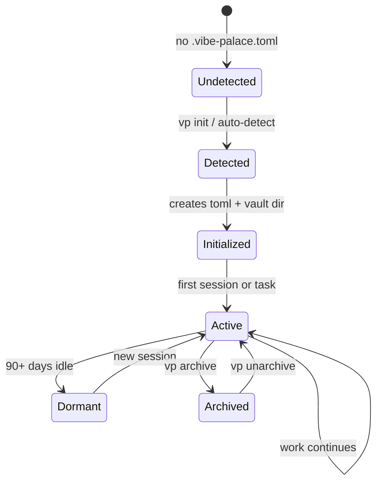

**State notes:**
- **Detected:** Only `.vibe-palace.toml` exists in source tree. Everything else in vault.
- **Active:** Semantic index live, KG updating, sessions captured.
- **Archived:** Sessions compressed, embeddings retained, KG frozen (read-only).

### 3.2 Session Lifecycle

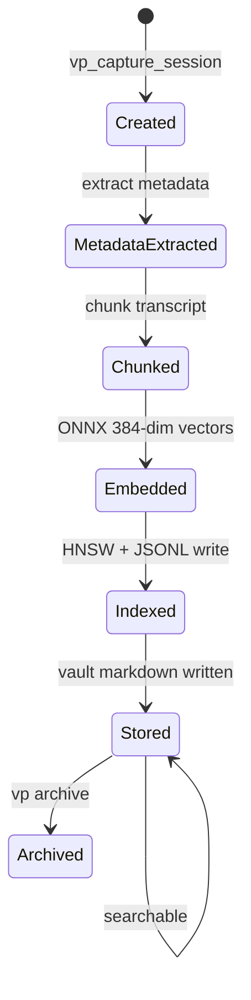

**State notes:**
- **Created:** Model-agnostic input — summary, decisions, files, open threads. No Claude dependency.
- **Indexed:** Content is semantically searchable. "What did we decide about auth?" works.
- **Archived:** Session file compressed, embeddings retained for search.

### 3.3 Task Lifecycle

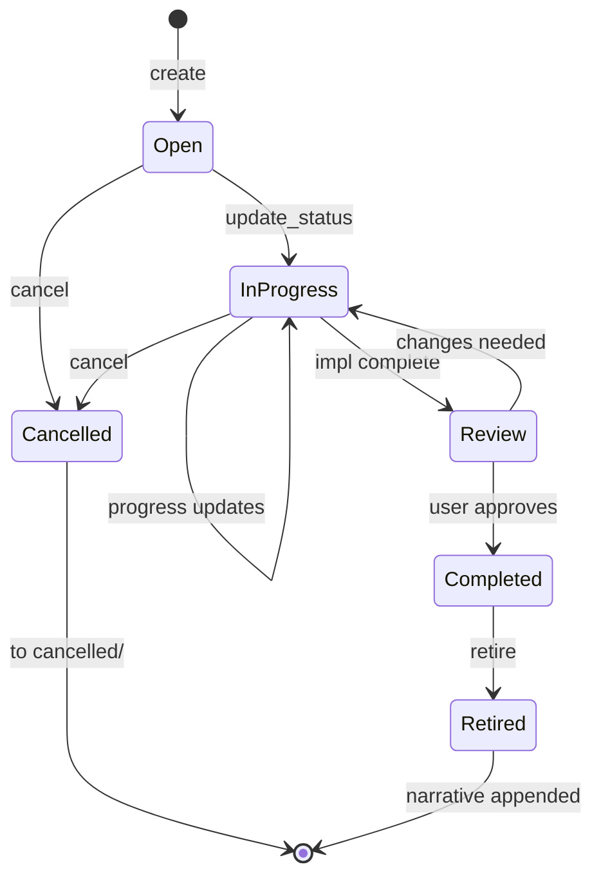

**State notes:**
- **Review:** Validation task spawned — 80% test coverage, integration test pass, code quality review.
- **Retired:** Task moved to `done/`, `vp_append_iteration` called with completion narrative.

### 3.4 Knowledge Graph Triple Lifecycle

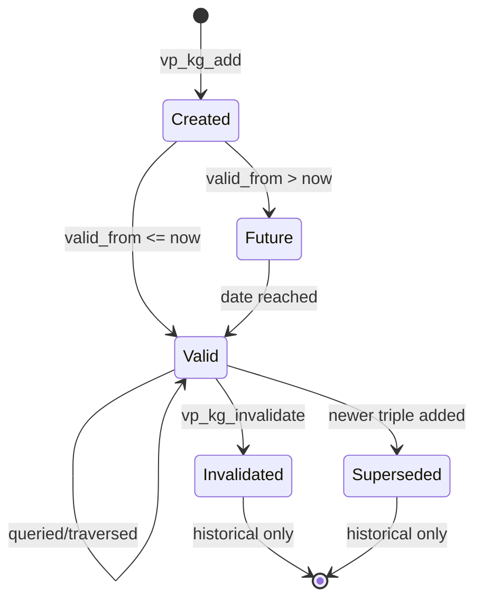

**State notes:**
- **Valid:** e.g. "Kai works_on Orion", valid_from=2025-06-01, valid_to=NULL.
- **Invalidated:** valid_to set (e.g. 2026-03-01). Still queryable via `as_of` parameter.
- **Superseded:** Auto-invalidated when a new triple replaces the same subject+predicate.

### 3.5 Context Template Lifecycle

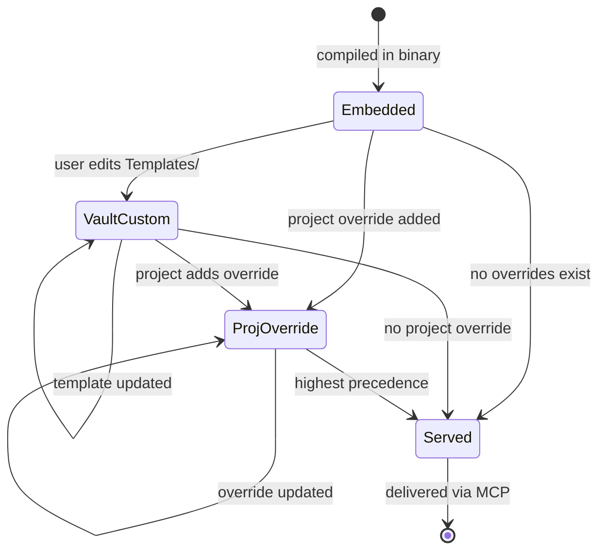

**State notes:**
- **Embedded:** Default workflow.md, resume template, commands. Updated only on binary upgrade.
- **VaultCustom:** User's preferred defaults for all future projects. Git-managed in vault.
- **ProjOverride:** This project's specific rules. In vault, NOT in source tree.

---

## 4. Data Lifecycle

### 4.1 Context Injection Data Flow

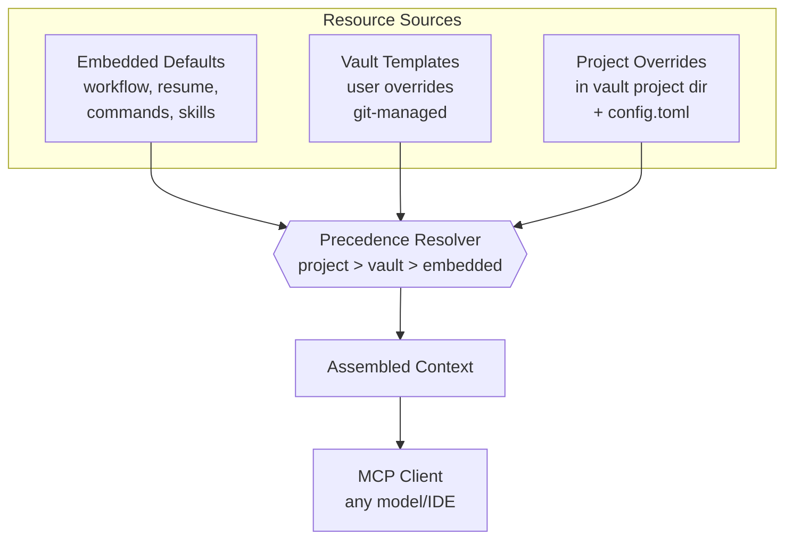

For each resource type (workflow, resume, commands, skills, config),
the resolver checks project override first, then vault template,
then embedded default. First match wins.

### 4.2 Session Data Lifecycle

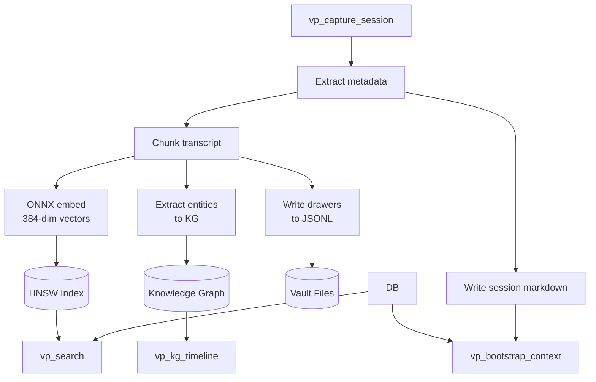

### 4.3 Search Data Flow

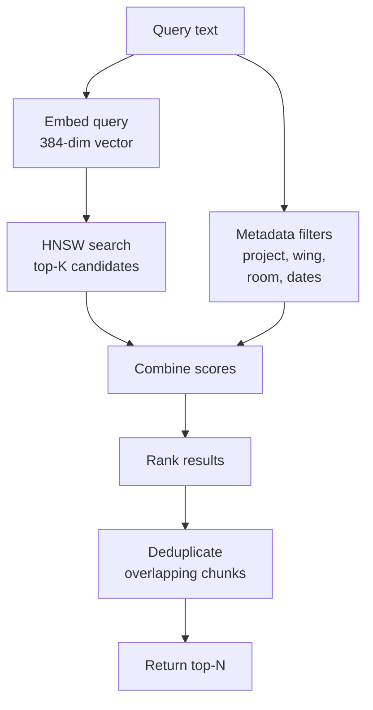

**Structural boost values (proposed, to be tuned):** wing +12%, wing+hall +24%, wing+room +34%. These are initial proposals, not empirically derived — must be validated against MemPalace benchmark scores before production use.
Results include verbatim text, source, wing/room/hall, date, score.

---

## 5. Session Lifecycle Flowchart

### 5.1 Full Session Flow

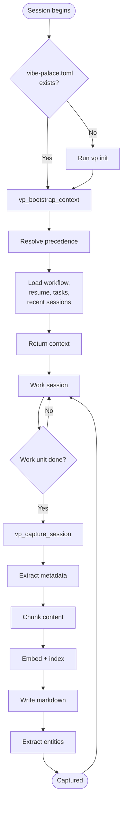

### 5.2 Context Bootstrap Subflow

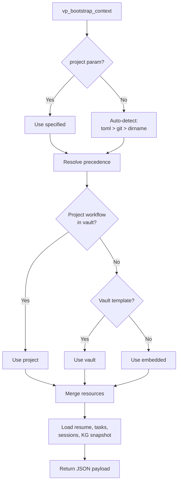

### 5.3 Semantic Search Subflow

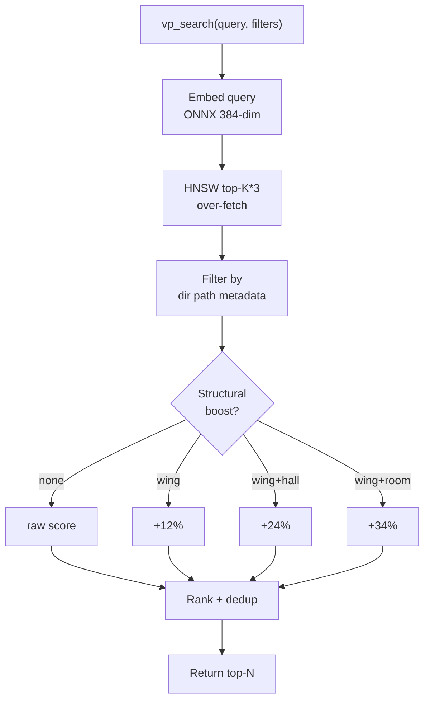

### 5.4 Task Management Subflow

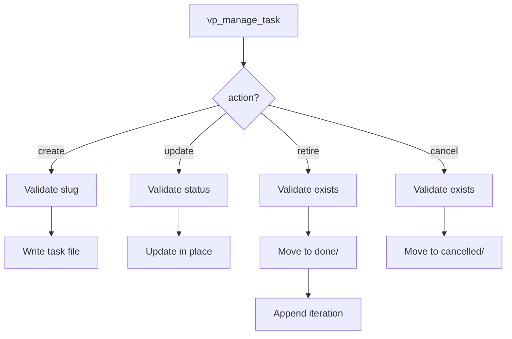

---

## 6. MCP Tool Surface

### 6.1 Context Tools (from VibeVault, enhanced)

| Tool | Parameters | Description |
|------|-----------|-------------|
| `vp_bootstrap_context` | project?, max_tokens? | Single-call context restoration: workflow + resume + tasks + recent sessions + KG snapshot + available commands. Precedence-aware. |
| `vp_get_workflow` | project? | Workflow rules with precedence resolution (project > vault > embedded) |
| `vp_get_resume` | project? | Current project state and open threads |
| `vp_update_resume` | project?, section, content | Update a section of resume.md |
| `vp_get_knowledge` | project? | Curated project knowledge (knowledge.md) |
| `vp_get_command` | command, project? | Retrieve a command definition with precedence resolution |
| `vp_get_skill` | skill, project? | Retrieve a skill definition with precedence resolution |
| `vp_list_commands` | project? | List available commands for current project |
| `vp_list_skills` | project? | List available skills for current project |
| `vp_cmd` | name?, project? | Execute a command by name (with LLM-agnostic execution framing), or list available commands when called with no arguments. Portable across all MCP clients. |
| `vp_skill` | name?, project? | Activate a skill by name (with behavioral framing), or list available skills when called with no arguments. Portable across all MCP clients. |

### 6.2 Session Tools (from VibeVault, model-agnostic)

| Tool | Parameters | Description |
|------|-----------|-------------|
| `vp_capture_session` | summary (req), title?, tag?, model?, decisions?, files_changed?, open_threads?, transcript? | Record a session. Auto-chunks and indexes transcript if provided. |
| `vp_list_projects` | — | All projects with session counts and date ranges |
| `vp_get_project_context` | project?, sections?, max_tokens? | Condensed context: sessions, threads, decisions, friction |
| `vp_search_sessions` | query?, project?, date_from?, date_to?, min_friction?, max_results? | Search session metadata |
| `vp_get_session_detail` | project, date, iteration? | Full session markdown |
| `vp_get_friction_trends` | project?, weeks? | Friction and efficiency trends |
| `vp_get_effectiveness` | project? | Context availability vs outcome correlation |
| `vp_append_iteration` | project?, iteration?, title (req), narrative (req), date? | Append iteration narrative |

### 6.3 Search Tools (from MemPalace, new)

| Tool | Parameters | Description |
|------|-----------|-------------|
| `vp_search` | query (req), project?, wing?, room?, hall?, date_from?, date_to?, limit? | Semantic + structural hybrid search across all stored content |
| `vp_search_cross_project` | query (req), limit? | Search across all projects (read-only) |

### 6.4 Task Tools (from VibeVault)

| Tool | Parameters | Description |
|------|-----------|-------------|
| `vp_list_tasks` | project?, include_done? | List tasks with status and priority |
| `vp_get_task` | task (req), project? | Full task file content |
| `vp_manage_task` | task (req), action (req: create/update_status/retire/cancel), status?, content? | Task lifecycle management |

### 6.5 Knowledge Graph Tools (from MemPalace, new)

| Tool | Parameters | Description |
|------|-----------|-------------|
| `vp_kg_query` | entity (req), project?, as_of?, direction? | Query entity relationships |
| `vp_kg_add` | subject (req), predicate (req), object (req), project?, valid_from?, confidence?, source? | Add a temporal fact |
| `vp_kg_invalidate` | subject (req), predicate (req), object (req), project?, ended? | End a fact's validity |
| `vp_kg_timeline` | entity?, project? | Chronological entity story |
| `vp_kg_stats` | project? | Entity, triple, and relationship type counts |

### 6.6 Palace Navigation Tools (from MemPalace, new)

| Tool | Parameters | Description |
|------|-----------|-------------|
| `vp_palace_status` | project? | Palace overview: wings, rooms, drawer counts |
| `vp_list_wings` | project? | All wings with drawer counts |
| `vp_list_rooms` | project?, wing? | Rooms in a wing with counts |
| `vp_traverse` | start_room (req), project?, max_hops? | Walk the room graph (BFS) |
| `vp_find_tunnels` | project?, wing_a?, wing_b? | Cross-wing room connections |

### 6.7 System Tools

| Tool | Parameters | Description |
|------|-----------|-------------|
| `vp_init` | project?, domain?, tags? | Initialize project (create .vibe-palace.toml + vault dir) |
| `vp_vault_sync` | — | Pull/push vault git remotes |
| `vp_refresh_index` | project? | Rebuild session index and re-embed if needed |

**Total: 34 tools** (vs VibeVault's 16 + MemPalace's 19 = 35, with dedup and consolidation)

---

## 7. Storage Schema

### 7.1 Design Philosophy: Filesystem-Native, Git-Mergeable

Vibe-Palace stores all persistent data as human-readable files organized by
project-first directory structure. There is no database. The filesystem layout
**is** the schema — directory paths encode the relationships that a database
would express with tables and indexes.

**Why not SQLite:**
- SQLite is a binary blob that git cannot diff, blame, or three-way merge
- Multi-machine sync requires conflict-free replication or last-write-wins —
  neither is acceptable for knowledge data
- Half the proposed tables would duplicate data that already exists as files
  (sessions, tasks, config)
- The actual query workload (metadata filtering on small datasets, semantic
  search via HNSW) does not require a database engine
- Human readability matters — `cat`, `grep`, `jq` should work on all stored data

**What git taught us:** Git manages billions of objects across millions of
repositories using nothing but POSIX filesystem semantics and hash references.
No key-value store, no database, no binary index files in the critical path.
The data volumes in Vibe-Palace are trivially small by comparison.

**The only binary artifact** is the HNSW vector index, which is:
- **Derived** — rebuilt deterministically from drawer content + ONNX model
- **Ephemeral** — gitignored, machine-local
- **Deterministic** — same input text + same model = same embeddings, every time

This is the same pattern as compiled code: you don't check in binaries, you
rebuild from source. Drawer JSONL files are the "source code" of your knowledge.
The HNSW index is the "compiled binary."

### 7.2 Vault Directory Layout

```
vault/
├── palace/
│   ├── {project}/                     ← project-first for human navigation
│   │   ├── drawers/
│   │   │   └── {wing}/
│   │   │       └── {room}/
│   │   │           └── drawers.jsonl  ← one line per drawer
│   │   │
│   │   ├── kg/
│   │   │   ├── entities.jsonl         ← one line per entity
│   │   │   └── triples/
│   │   │       └── {subj}--{pred}--{obj}.json
│   │   │
│   │   └── .local/                    ← gitignored, machine-local
│   │       ├── hnsw.idx              ← rebuilt from drawers
│   │       └── embed-cache/          ← speeds up rebuild
│   │           └── {drawer-id}.vec
│   │
│   └── .local/                        ← vault-wide, gitignored
│       └── cross-project.idx          ← cross-project search index
│
├── Projects/                          ← unchanged from VibeVault
│   └── {project}/
│       ├── agentctx/
│       │   ├── resume.md
│       │   ├── workflow.md            (project override, optional)
│       │   ├── iterations.md
│       │   ├── config.toml            (project config override)
│       │   └── tasks/
│       │       ├── {slug}.md
│       │       ├── done/
│       │       └── cancelled/
│       ├── sessions/
│       │   └── YYYY-MM-DD-NN.md
│       └── knowledge.md
│
├── Templates/                         (vault-level template overrides)
│   ├── workflow.md
│   ├── resume.md
│   ├── commands/
│   └── skills/
│
└── .git/                              (vault git repo)
```

**Key design decisions:**

- **Project-first under `palace/`:** `ls palace/` shows all projects. `rm -rf
  palace/recmeet/` cleanly removes one project's palace data with no orphans
  across sibling directories.

- **`palace/` is separate from `Projects/`:** Palace data (drawers, KG) is
  structured for machine consumption. Project context (sessions, tasks,
  iterations) is structured for human + AI consumption. They coexist in the
  same git-managed vault but serve different purposes.

- **No `.claude/` directory, no symlinks, no command/skill files in source tree.**
  Commands and skills are served via MCP tools (`vp_get_command`, `vp_get_skill`)
  and never touch the project repository.

### 7.3 Drawer Storage

**Path:** `palace/{project}/drawers/{wing}/{room}/drawers.jsonl`

One JSONL file per room. Each line is an independent drawer record. Appending a
drawer is appending a line. Git merges JSONL cleanly — append-only files with
independent lines are the best case for three-way merge.

**Drawer record schema:**

```json
{
  "id": "a1b2c3d4",
  "hall": "facts",
  "content": "We decided to cap the audio buffer at 120 minutes...",
  "source_type": "session",
  "source_ref": "2026-03-15-02",
  "chunk_index": 0,
  "filed_at": "2026-03-15T14:23:00Z",
  "added_by": "system"
}
```

| Field | Type | Required | Description |
|-------|------|----------|-------------|
| `id` | string | yes | Deterministic: first 8 chars of md5(wing+room+content) |
| `hall` | string | yes | Memory type: facts, events, discoveries, preferences, advice |
| `content` | string | yes | Verbatim text chunk (never summarized) |
| `source_type` | string | yes | Origin: session, file, conversation, manual |
| `source_ref` | string | no | Session date-iteration, file path, etc. |
| `chunk_index` | int | no | Position within source document (0-based) |
| `filed_at` | string | yes | ISO 8601 timestamp |
| `added_by` | string | no | Agent name or "user" (default: "system") |

**Why JSONL per room (not per drawer):**

- Per-drawer files would create thousands of tiny files — git overhead, filesystem
  noise, `ls` unusable
- Per-wing files would be too coarse — a single wing might have 10K drawers,
  making the file large and merge-prone
- Per-room is the sweet spot: typically 10-500 drawers per room, manageable file
  size (10-500KB), meaningful grouping, and git diffs show exactly which room
  gained content

**Indexing via directory structure:**

The filesystem layout replaces SQL indexes:

| SQL equivalent | Filesystem equivalent |
|----------------|----------------------|
| `WHERE project = 'recmeet'` | `palace/recmeet/drawers/` |
| `AND wing = 'wing_recmeet'` | `palace/recmeet/drawers/wing_recmeet/` |
| `AND room = 'audio-pipeline'` | `palace/recmeet/drawers/wing_recmeet/audio-pipeline/` |
| Full scan | `palace/*/drawers/**/*.jsonl` |

### 7.4 Knowledge Graph Storage

**Entities path:** `palace/{project}/kg/entities.jsonl`

One JSONL file per project containing all entities. Typically small (tens to low
hundreds of entities per project).

```json
{
  "id": "kai",
  "name": "Kai",
  "type": "person",
  "properties": {"role": "backend engineer", "tenure_start": "2023-04-01"},
  "created_at": "2026-01-15T10:00:00Z"
}
```

**Triples path:** `palace/{project}/kg/triples/{subject}--{predicate}--{object}.json`

One file per triple. The relationship is encoded in the filename for O(1) lookup.

```json
{
  "valid_from": "2025-06-01",
  "valid_to": null,
  "confidence": 1.0,
  "source_session": "2026-01-15-03",
  "extracted_at": "2026-01-15T14:30:00Z"
}
```

| Query | Filesystem operation |
|-------|---------------------|
| All triples for entity "kai" | `glob("palace/*/kg/triples/kai--*")` + `glob("palace/*/kg/triples/*--*--kai.json")` |
| Specific relationship | `read("palace/recmeet/kg/triples/kai--works_on--orion.json")` |
| All relationships of type | `glob("palace/*/kg/triples/*--works_on--*.json")` |
| Invalidate a fact | Update the file: set `valid_to` |
| History of a fact | `git log palace/recmeet/kg/triples/kai--works_on--orion.json` |

**Why one file per triple:**

- Triples are updated individually (invalidation sets `valid_to`)
- Git tracks history per file — you get full audit trail of when facts were
  created, modified, and invalidated
- Glob patterns provide all the query capability needed
- File count stays manageable: typical project has tens to low hundreds of triples

**Filename encoding rules:**

- Subject, predicate, and object are lowercased, spaces replaced with `_`
- Delimiter is `--` (double hyphen, unambiguous in entity names)
- Example: `kai--works_on--orion.json`, `auth0--replaced_by--clerk.json`

### 7.5 Session Storage

Sessions continue to be stored as markdown files with YAML frontmatter, exactly
as VibeVault does today:

**Path:** `Projects/{project}/sessions/YYYY-MM-DD-NN.md`

No change from current VibeVault format. The session markdown files are
human-readable, git-tracked, and already proven across 686+ sessions.

The session frontmatter serves as the "session index" — to list or filter
sessions, parse the YAML frontmatter from matching files. For performance, a
machine-local cache can be built on startup (gitignored, in `.local/`).

### 7.6 Task Storage

Tasks continue to be stored as markdown files:

**Path:** `Projects/{project}/agentctx/tasks/{slug}.md`
**Done:** `Projects/{project}/agentctx/tasks/done/{slug}.md`
**Cancelled:** `Projects/{project}/agentctx/tasks/cancelled/{slug}.md`

No change from current VibeVault format.

### 7.7 Configuration Storage

Configuration continues to use TOML files in the existing precedence chain:

- **Embedded defaults:** compiled into the binary
- **Vault-level:** `~/.config/vibe-palace/config.toml`
- **Project-level:** `Projects/{project}/agentctx/config.toml`

No database table needed.

### 7.8 HNSW Index (Machine-Local, Derived)

The HNSW vector index is the only binary artifact in the system. It is:

- **Stored at:** `palace/{project}/.local/hnsw.idx` (gitignored)
- **Built from:** drawer JSONL files + ONNX embedder
- **Rebuilt on:** startup if missing, or incrementally updated on new drawers
- **Parameters:** ef_construction=200, M=16, ef_search=100
- **Distance metric:** L2 (Euclidean), matching ChromaDB default
- **Capacity:** Tested to 1M+ vectors with sub-millisecond search

**Embedding cache:** `palace/{project}/.local/embed-cache/{drawer-id}.vec`

Optional binary cache of pre-computed embeddings (gitignored). Speeds up HNSW
rebuild — only re-embed drawers whose IDs are not in the cache. Since embeddings
are deterministic (same text + same model = same vector), the cache is a pure
performance optimization, never authoritative.

**Startup rebuild strategy:**

1. Scan `palace/{project}/drawers/**/*.jsonl` for all drawer IDs
2. For each drawer ID, check embed-cache for existing vector
3. For cache misses, embed via ONNX and write to cache
4. Build HNSW index from all vectors
5. Ready to serve search queries

For 10K drawers with warm cache: <2 seconds. Cold cache (first run on new
machine): 30-60 seconds (dominated by ONNX inference).

**Cross-project index:** `palace/.local/cross-project.idx` (gitignored)

Optional combined HNSW index spanning all projects, built for
`vp_search_cross_project`. Rebuilt by merging per-project indexes.

### 7.9 The .local Convention

Every directory under `palace/` may contain a `.local/` subdirectory for
machine-specific derived artifacts. All `.local/` directories are gitignored
via a single rule in the vault's `.gitignore`:

```
palace/**/.local/
```

This convention means:
- `git status` never shows derived artifacts
- `git pull` never conflicts on binary files
- Each machine rebuilds its own indexes from the shared source files
- Deleting `.local/` and restarting is always safe (full rebuild)

### 7.10 Git Mergeability Analysis

| Data type | Format | Git merge behavior |
|-----------|--------|-------------------|
| Drawer JSONL | Append-only lines | Clean merge — independent lines never conflict |
| KG entity JSONL | Append-only lines | Clean merge — new entities append cleanly |
| KG triple JSON | One file per triple | Clean merge — different triples are different files |
| Session markdown | One file per session | Clean merge — different sessions are different files |
| Task markdown | One file per task | Possible conflict if two machines edit same task |
| Config TOML | Key-value pairs | Possible conflict if two machines edit same key |
| HNSW index | Binary (gitignored) | No conflict — never tracked |
| Embed cache | Binary (gitignored) | No conflict — never tracked |

**Conflict scenarios and resolution:**

- **Same task edited on two machines:** Standard git three-way merge on markdown.
  Usually resolves automatically (different sections edited). Manual resolution
  if same lines changed — acceptable, since task edits are rare concurrent events.

- **Same triple invalidated on two machines:** Both set `valid_to` — if to
  different dates, git shows a conflict on one JSON file. Trivial to resolve
  (pick the earlier date).

- **Drawers appended on two machines:** JSONL append-only means both machines'
  new lines are concatenated. No conflict. Possible duplicate drawer IDs if both
  machines indexed the same content — deduplicated on HNSW rebuild (same ID =
  same content = same embedding, skip duplicate).

### 7.11 Comparison: Filesystem vs. Database

| Capability | Database (SQLite) | Filesystem (this design) |
|-----------|-------------------|--------------------------|
| Complex JOINs | Yes | No — not needed |
| Atomic transactions | Yes | No — acceptable for this workload |
| COUNT/SUM aggregation | Yes | glob + count — slightly slower |
| Arbitrary SQL queries | Yes | No — our queries are simple |
| Git mergeability | No (binary blob) | Yes (text files) |
| Human readability | No (requires tooling) | Yes (cat, grep, jq) |
| Multi-machine sync | Problematic | Native git three-way merge |
| History / blame | None | Full git history per file |
| Debugging | Requires sqlite3 CLI | cat, less, jq |
| Backup | Copy binary file | Already in git |
| Branch / experiment | Not possible | Branch knowledge, merge back |
| Delete a project | Multi-table DELETE | `rm -rf palace/{project}/` |

---

## 8. Precedence System

### 8.1 Resolution Algorithm

```go
func (r *PrecedenceResolver) Resolve(resource string, project string) string {
    // 1. Check project-level override
    if content, ok := r.projectOverride(project, resource); ok {
        return content
    }
    // 2. Check vault template
    if content, ok := r.vaultTemplate(resource); ok {
        return content
    }
    // 3. Return embedded default
    return r.embeddedDefault(resource)
}
```

### 8.2 Resources Subject to Precedence

| Resource | Embedded Default | Vault Override | Project Override |
|----------|-----------------|----------------|------------------|
| workflow.md | Yes (compiled in) | Templates/workflow.md | Projects/{p}/agentctx/workflow.md |
| resume.md template | Yes | Templates/resume.md | Projects/{p}/agentctx/resume.md |
| commands/* | Yes | Templates/commands/* | Projects/{p}/agentctx/commands/* |
| skills/* | Yes | Templates/skills/* | Projects/{p}/agentctx/skills/* |
| config values | Yes (code defaults) | Global config.toml | Projects/{p}/agentctx/config.toml |

### 8.3 Precedence for First-Time Projects

When a project is initialized for the first time:

1. `.vibe-palace.toml` is created in the source tree (only file that touches it)
2. `Projects/{project}/agentctx/` directory is created in the vault
3. `resume.md` is expanded from the highest-precedence template (embedded or vault)
4. `iterations.md` is initialized with metadata frontmatter
5. No workflow.md, commands/, or skills/ are written — they will be resolved at
   runtime via precedence (embedded defaults serve until overridden)

This means a new project has **zero vault template files by default**. Everything
comes from embedded defaults until the user explicitly overrides something.

### 8.4 Command Graduation Lifecycle

Commands follow a natural promotion path through the precedence tiers:

1. **Project-local** (`source: "project"`): Created in
   `{vault}/Projects/{proj}/agentctx/commands/{name}.md`. Only available for
   that project. This is where new commands are born — developed, tested, and
   iterated in the context of a single project.

2. **Vault template** (`source: "vault"`): Promoted to
   `{vault}/Templates/commands/{name}.md`. Available to all projects (unless
   overridden at project level). Commands graduate here when they prove useful
   across multiple projects.

3. **Embedded default** (`source: "embedded"`): Compiled into the binary in
   `internal/context/templates/commands/{name}.md`. Ships with every vibe-palace
   installation. Commands graduate here when they are universally useful.

The `source` field in `vp_cmd` discovery mode and `vp_bootstrap_context`
response makes this lifecycle visible. Users can see which project-local
commands are candidates for graduation. Promotion is manual: copy the file
from the project directory to the vault Templates directory, or submit a PR
to add it to embedded defaults.

### 8.5 Portable Command Execution

Commands and skills must be executable from any MCP client, not just Claude
Code's slash command convention. The `vp_cmd` and `vp_skill` tools provide
LLM-agnostic execution framing that works with any model:

- **`vp_cmd`** returns command content wrapped in explicit execution framing
  (`=== EXECUTE COMMAND: {name} ===`) with instructions to follow each step.
  The framing uses universally-recognized delimiters and explicit "perform,
  don't summarize" phrasing that works across Claude, GPT, Gemini, Llama, etc.

- **`vp_skill`** returns skill content with behavioral framing
  (`=== ACTIVATE SKILL: {name} ===`) instructing the AI to internalize and
  apply the guidelines during the session.

- Both tools support **discovery mode**: called with no name, they return a
  formatted list of available commands/skills with sources and brief
  descriptions. This replaces IDE-specific autocomplete with protocol-level
  discoverability.

- **`vp_get_command`** and **`vp_get_skill`** remain as read-only inspection
  tools (returning JSON with name, content, source metadata). `vp_cmd` and
  `vp_skill` are the execution-oriented counterparts.

---

## Phase 1: Storage Engine

**Goal:** Filesystem-native storage layer with CRUD operations for all entity
types. All data stored as human-readable, git-mergeable files.

**Duration estimate:** This phase establishes the data foundation everything
else builds on.

### Task 1.1: Vault Layout and Path Resolution

**Deliverable:** `internal/storage/paths.go`, `internal/storage/vault.go`

- `VaultRoot(configPath string) (string, error)` — resolve vault path from config
- `PalacePath(project string) string` — `{vault}/palace/{project}/`
- `DrawerDir(project, wing, room string) string` — full path to drawer JSONL dir
- `DrawerFile(project, wing, room string) string` — path to `drawers.jsonl`
- `KGEntitiesFile(project string) string` — path to `entities.jsonl`
- `KGTriplePath(project, subject, predicate, object string) string` — triple file
- `LocalDir(project string) string` — path to `.local/` (gitignored)
- `EnsureDir(path string) error` — create directory tree if needed
- Path sanitization: validate project/wing/room slugs (alphanumeric + hyphens)

**Acceptance criteria:**
- All path functions produce correct, deterministic paths
- Slug validation rejects path traversal attempts (`../`, absolute paths)
- `EnsureDir` creates nested directories idempotently
- 80%+ unit test coverage

### Task 1.2: Drawer CRUD

**Deliverable:** `internal/storage/drawers.go`

- `AppendDrawer(project, wing, room string, d Drawer) error` — append line to JSONL
- `GetDrawer(project, wing, room, id string) (Drawer, error)` — scan JSONL for ID
- `ListDrawers(project, wing, room string) ([]Drawer, error)` — parse full JSONL
- `ListDrawersByWing(project, wing string) ([]Drawer, error)` — glob rooms, parse
- `DeleteDrawer(project, wing, room, id string) error` — rewrite JSONL without line
- `DrawerExists(project, wing, room, id string) (bool, error)` — scan for ID
- Drawer ID generation: first 8 chars of `md5(wing + room + content)`
- Deduplication: check ID existence before append
- File locking: advisory lock on JSONL file during write (flock)

**Acceptance criteria:**
- Append + read round-trip produces identical drawer records
- JSONL files contain one valid JSON object per line
- Duplicate IDs rejected on append
- Concurrent writes to different rooms do not interfere
- Concurrent writes to same room serialized via flock
- 80%+ unit test coverage

### Task 1.3: Session Operations

**Deliverable:** `internal/storage/sessions.go`

- `WriteSession(project string, s Session) (string, error)` — write markdown to vault
- `ReadSession(project, date string, iteration int) (Session, error)` — parse markdown
- `ListSessions(project string, dateFrom, dateTo string, limit int) ([]SessionMeta, error)`
  — glob session files, parse YAML frontmatter only
- `SearchSessions(query, project string, minFriction int, limit int) ([]SessionMeta, error)`
  — filter by frontmatter fields + text match on summary/decisions
- `NextIteration(project, date string) (int, error)` — count existing files for date
- Session markdown format: YAML frontmatter + transcript content (VibeVault-compatible)

**Acceptance criteria:**
- Write + read round-trip preserves all frontmatter fields
- Date range filtering works correctly (glob + parse)
- Iteration auto-increment per project+date (count files)
- Text search matches against summary and decision fields
- 80%+ test coverage

### Task 1.4: Knowledge Graph CRUD

**Deliverable:** `internal/storage/knowledge_graph.go`

- `AddEntity(project string, e Entity) error` — append to entities.jsonl
- `GetEntity(project, id string) (Entity, error)` — scan entities.jsonl
- `ListEntities(project string) ([]Entity, error)` — parse full entities.jsonl
- `AddTriple(project string, t Triple) error` — write triple JSON file
- `GetTriple(project, subject, predicate, object string) (Triple, error)` — read file
- `QueryEntity(project, name string, asOf string, direction string) ([]Triple, error)`
  — glob `{name}--*` and `*--*--{name}.json`, filter by temporal validity
- `InvalidateTriple(project, subject, predicate, object string, ended string) error`
  — read file, set valid_to, rewrite
- `Timeline(project, entity string) ([]Triple, error)` — glob + sort by valid_from
- `KGStats(project string) (KGStats, error)` — count entity lines + triple files
- Filename encoding: lowercase, spaces to underscores, `--` delimiter

**Acceptance criteria:**
- Temporal queries return correct results for past dates
- Invalidation updates file without deleting it
- Direction filtering (outgoing, incoming, both) works via glob patterns
- Triple filenames are deterministic and unambiguous
- `git log` on a triple file shows its history
- 80%+ test coverage

### Task 1.5: Task CRUD

**Deliverable:** `internal/storage/tasks.go`

- `CreateTask(project, slug, title, content string, priority string) error`
  — write `tasks/{slug}.md` in vault
- `GetTask(project, slug string) (Task, error)` — read + parse task markdown
- `ListTasks(project string, includeDone bool) ([]TaskMeta, error)`
  — glob tasks/, optionally include done/ and cancelled/
- `UpdateTaskStatus(project, slug, status string) error` — edit status line in file
- `RetireTask(project, slug string) error` — mv to tasks/done/
- `CancelTask(project, slug string) error` — mv to tasks/cancelled/

**Acceptance criteria:**
- Lifecycle transitions enforced (can't retire already-retired)
- Status enum validated on update
- Slug uniqueness per project enforced (check file existence)
- File moves preserve content and git history (`git mv` semantics)
- 80%+ test coverage

### Task 1.6: Config with Precedence

**Deliverable:** `internal/storage/config.go`

- `LoadConfig(project string) (Config, error)` — merge embedded + vault + project TOML
- `GetConfigValue(project, key string) (string, string, error)` — value + source level
- Embedded defaults compiled via `//go:embed config/defaults.toml`
- Vault config at `~/.config/vibe-palace/config.toml`
- Project config at `Projects/{project}/agentctx/config.toml`
- Merge strategy: project keys override vault keys override embedded keys

**Acceptance criteria:**
- Precedence: project > vault > embedded
- Missing config files at any level transparently fall through
- Source tracking reports which level provided each value
- TOML parsing handles all value types (string, int, bool, array, table)
- 80%+ test coverage

---

## Phase 2: MCP Server Core

**Goal:** A working MCP server over stdio that can register tools and handle
JSON-RPC 2.0 requests. HTTP REST server on localhost with identical handlers.

### Task 2.1: JSON-RPC 2.0 Protocol Layer

**Deliverable:** `internal/mcp/protocol.go`, `internal/mcp/transport_stdio.go`

- JSON-RPC 2.0 request/response/notification types
- Stdio transport: read lines from stdin, write lines to stdout
- Request routing: method name → handler function
- Error types: ParseError, InvalidRequest, MethodNotFound, InvalidParams, InternalError
- Protocol version negotiation (MCP `initialize` / `initialized` handshake)

**Acceptance criteria:**
- Full JSON-RPC 2.0 compliance (batch requests not required initially)
- MCP `initialize` handshake returns server info + capabilities
- Unknown methods return MethodNotFound
- Malformed JSON returns ParseError
- 80%+ test coverage with mock stdin/stdout

### Task 2.2: HTTP REST Transport

**Deliverable:** `internal/mcp/transport_http.go`

- HTTP server on configurable localhost port (default 7423)
- `POST /tools/{tool_name}` — invoke a tool with JSON body
- `GET /tools` — list available tools with schemas
- `GET /health` — health check endpoint
- Same handler functions as MCP stdio transport
- CORS headers for local browser-based clients

**Acceptance criteria:**
- Same tool invocations work over HTTP and stdio
- Tool listing returns JSON schemas
- Health endpoint returns status + version
- 80%+ test coverage

### Task 2.3: Tool Registration Framework

**Deliverable:** `internal/mcp/tools.go`

- `Tool` struct: name, description, parameters schema (JSON Schema), handler func
- `Registry` struct: register tools, list tools, dispatch by name
- Parameter validation against JSON Schema before handler invocation
- Handler signature: `func(ctx context.Context, params json.RawMessage) (any, error)`

**Acceptance criteria:**
- Tools self-describe with JSON Schema for parameters
- Parameter validation catches missing required params, wrong types
- Handler errors are wrapped as JSON-RPC errors
- 80%+ test coverage

### Task 2.4: Project Detection

**Deliverable:** `internal/project/detect.go`

- `DetectProject(cwd string) (string, error)`
- Detection priority:
  1. `.vibe-palace.toml` in cwd or parent directories
  2. Git remote name heuristics
  3. Directory basename
- `ParseProjectConfig(path string) (ProjectConfig, error)` — parse .vibe-palace.toml

**Acceptance criteria:**
- Detects project from .vibe-palace.toml in cwd
- Walks parent directories up to filesystem root
- Falls back to git remote → directory name
- Handles missing/empty .vibe-palace.toml gracefully
- 80%+ test coverage

---

## Phase 3: Context Injection Engine

**Goal:** Precedence-aware context assembly and delivery via MCP tools.

### Task 3.1: Precedence Resolver

**Deliverable:** `internal/context/precedence.go`

- `Resolver` struct holds: embedded defaults (embed.FS), vault path, project path
- `Resolve(resource, project string) (string, string, error)` — returns content + source
- Resource types: `workflow`, `resume`, `command:{name}`, `skill:{name}`, `config:{key}`
- Vault template location: `{vault_path}/Templates/{resource}`
- Project override location: `{vault_path}/Projects/{project}/agentctx/{resource}`
- Embedded defaults compiled via `//go:embed templates/*`

**Acceptance criteria:**
- Project override wins over vault template over embedded default
- Missing resources at any level transparently fall through
- Source tracking reports which level was used
- Embedded defaults exist for: workflow.md, resume.md template, all core commands
- 80%+ test coverage with temp directories

### Task 3.2: Embedded Default Templates

**Deliverable:** `internal/context/templates/` (embedded via `//go:embed`)

- `workflow.md` — pair programming paradigm, investigation-first workflow, task
  management rules (adapted from VibeVault's current workflow.md)
- `resume.md` — template with `{{PROJECT}}` and `{{DATE}}` placeholders
- `commands/restart.md` — vault sync and context restoration
- `commands/wrap.md` — session wrap-up
- `commands/review-plan.md` — architecture review
- `commands/cancel-plan.md` — task cancellation

**Acceptance criteria:**
- Templates compile into binary via go:embed
- Variable expansion works for `{{PROJECT}}` and `{{DATE}}`
- Templates are complete and functional (not stubs)
- Content derived from proven VibeVault templates

### Task 3.3: Bootstrap Context Tool

**Deliverable:** `internal/tools/context_tools.go` — `vp_bootstrap_context` handler

- Resolve workflow via precedence
- Load resume.md for project
- List active tasks from vault task files
- Load recent sessions (last 5)
- Load KG snapshot (current entities for project)
- Assemble into single JSON response with token budget awareness
- Return: `{project, workflow, resume, active_tasks, recent_sessions, kg_snapshot, available_commands}`
- `available_commands` added by Task 3.5: `[{name, source, brief}]` array

**Acceptance criteria:**
- Returns valid context in <100ms for typical project
- Token budget respected (truncates sessions/KG if over budget)
- Missing resources handled gracefully (empty sections, not errors)
- Integration test: init project → capture session → bootstrap returns session
- 80%+ test coverage

### Task 3.4: Command and Skill Retrieval Tools

**Deliverable:** `internal/tools/context_tools.go` — `vp_get_command`, `vp_get_skill`,
`vp_list_commands`, `vp_list_skills` handlers

- Commands and skills resolved via precedence (project > vault > embedded)
- List tools return name + description for each available command/skill
- Get tools return full markdown content
- **No file deployment to source tree** — served purely via MCP

**Acceptance criteria:**
- Commands from embedded defaults are available with no vault setup
- Vault-level overrides take precedence over embedded
- Project-level overrides take precedence over vault
- List tools return commands from all precedence levels (merged, no duplicates)
- 80%+ test coverage

### Task 3.5: Portable Command Execution

**Deliverables:**
- `internal/tools/cmd_tools.go` — `vp_cmd`, `vp_skill` handlers and helpers
- `internal/tools/cmd_tools_test.go` — tests for both tools
- `internal/tools/context_tools.go` — add `AvailableCommands` to bootstrap
- `internal/tools/context_tools_test.go` — bootstrap command tests
- `internal/tools/register.go` — register 2 new tools (7 total)
- `internal/tools/register_test.go` — update expected tool count

#### Design rationale

`vp_cmd` coexists with `vp_get_command`. They serve different purposes:
`vp_get_command` is read-only inspection (returns JSON struct with `name`,
`content`, `source` metadata for debugging overrides). `vp_cmd` is
execution-oriented (returns plain text with execution framing so any LLM
follows the instructions). The `string` vs `struct` return type distinction
naturally separates them via `marshalResult` in `internal/mcp/tools.go` —
strings produce `NewToolResultText`, structs produce `NewToolResultJSON`.

Commands are imperative ("do this now"); skills are behavioral ("apply these
guidelines when relevant"). `vp_skill` is a separate tool from `vp_cmd` with
different framing language. A combined tool with a `type` parameter would add
complexity for zero benefit.

#### `vp_cmd` tool specification

**Tool identity:**

| Field | Value |
|-------|-------|
| Name | `vp_cmd` |
| Description | `Execute a command by name, or list available commands when called with no arguments. Commands are instructions for you to follow immediately.` |

**Input schema** (no required fields — both optional):

```json
{
  "type": "object",
  "properties": {
    "name": {
      "type": "string",
      "description": "Command name (e.g. 'vp-restart'). Omit to list available commands."
    },
    "project": {
      "type": "string",
      "description": "Project slug for project-level resolution."
    }
  }
}
```

**Execute mode** (name provided):
1. Resolve via `resolver.Resolve("command:"+name, project)` — 3-tier precedence
2. Build LLM-agnostic execution frame (no Claude XML, no GPT tokens)
3. Return as `string` → `NewToolResultText` (text content, not JSON)

Execution frame format (uses `===` delimiters universally recognized by LLMs,
`---` separators prevent command markdown headers from breaking the envelope):

```
=== EXECUTE COMMAND: {name} ===
Project: {project} | Source: {source}

The following are instructions for you to execute now. Follow each step.
Do not merely summarize or describe these instructions — perform them.

---

{resolved command content}

---

End of command: {name}
```

When `project` is empty: `Project: (none)`.

**Discovery mode** (no name, empty name, or whitespace-only name):
1. Call `resolver.ListResources("command", project)` to get merged list
2. For each command, resolve content and extract a brief description via
   `extractBrief(content, 60)` — first non-blank, non-heading line, truncated
3. Format as readable text:

```
Available commands for project "my-project":

  vp-restart       [embedded]  Context restoration and session bootstrap
  vp-wrap          [embedded]  Session capture and wrap-up
  vp-review-plan   [embedded]  Architecture review before implementation
  vp-cancel-plan   [embedded]  Cancel a planned task
  deploy           [vault]     Deploy workflow
  custom-check     [project]   Project-specific validation

Call vp_cmd with a command name to execute it.
```

When `project` is empty: header reads `Available commands:` (no project name).

#### `vp_skill` tool specification

Mirrors `vp_cmd` with behavioral framing. Same schema (name?, project?).

Execute mode frame:

```
=== ACTIVATE SKILL: {name} ===
Project: {project} | Source: {source}

The following describes a skill you should apply during this session.
Internalize these guidelines and apply them when relevant.

---

{resolved skill content}

---

End of skill: {name}
```

Discovery mode lists skills instead of commands, same format.

#### Bootstrap enhancement

Add `AvailableCommands` field to `BootstrapResult`:

```go
type BootstrapResult struct {
    Project           string             `json:"project"`
    Workflow          string             `json:"workflow"`
    Resume            string             `json:"resume"`
    ActiveTasks       []storage.TaskMeta `json:"active_tasks"`
    RecentSessions    []sessionSummary   `json:"recent_sessions,omitempty"`
    KGSnapshot        *storage.KGStats   `json:"kg_snapshot,omitempty"`
    AvailableCommands []commandSummary   `json:"available_commands,omitempty"`
}

type commandSummary struct {
    Name   string `json:"name"`
    Source string `json:"source"`
    Brief  string `json:"brief,omitempty"`
}
```

Bootstrap handler resolves command list after KG snapshot, before truncation:

```go
if commands, err := resolver.ListResources("command", p.Project); err == nil {
    for _, cmd := range commands {
        cs := commandSummary{Name: cmd.Name, Source: cmd.Source}
        if content, _, err := resolver.Resolve("command:"+cmd.Name, p.Project); err == nil {
            cs.Brief = extractBrief(content, 60)
        }
        result.AvailableCommands = append(result.AvailableCommands, cs)
    }
}
```

Token budget truncation order (updated):
1. Shed `RecentSessions` (oldest first) — existing behavior
2. Shed `KGSnapshot` (nil) — existing behavior
3. Shed `AvailableCommands` (nil) — new, last resort (cheapest context)

#### Implementation types and functions

New file `internal/tools/cmd_tools.go`:

```go
type cmdParams struct {
    Name    string `json:"name,omitempty"`
    Project string `json:"project,omitempty"`
}

type commandSummary struct {
    Name   string `json:"name"`
    Source string `json:"source"`
    Brief  string `json:"brief,omitempty"`
}

// Factory functions returning mcp.Tool (close over resolver)
func CmdTool(resolver *vpctx.Resolver) mcp.Tool
func SkillCmdTool(resolver *vpctx.Resolver) mcp.Tool

// Shared handler parameterized by resource type ("command" or "skill")
func cmdExecHandler(resolver *vpctx.Resolver, resourceType string) mcp.HandlerFunc

// Helpers
func buildExecutionFrame(name, project, source, content, resourceType string) string
func buildDiscoveryList(resolver *vpctx.Resolver, project, resourceType string) (string, error)
func extractBrief(content string, maxLen int) string
```

`extractBrief`: scans lines, skips blanks and lines starting with `#`, returns
first substantive line truncated to `maxLen`. Returns `"(no description)"` if
no substantive line found.

Registration in `internal/tools/register.go`:

```go
func RegisterAll(reg *mcp.Registry, resolver *vpctx.Resolver, vault *storage.Vault) {
    reg.MustRegister(BootstrapContextTool(resolver, vault))
    reg.MustRegister(GetCommandTool(resolver))
    reg.MustRegister(GetSkillTool(resolver))
    reg.MustRegister(ListCommandsTool(resolver))
    reg.MustRegister(ListSkillsTool(resolver))
    reg.MustRegister(CmdTool(resolver))       // NEW
    reg.MustRegister(SkillCmdTool(resolver))   // NEW
}
```

#### Test inventory

`internal/tools/cmd_tools_test.go`:
- Execute mode: embedded command, vault override, project override, not found
- Discovery mode: empty name, whitespace-only name, with project commands
- Skill execute mode + skill discovery mode
- `extractBrief`: table-driven (normal, empty content, long line, heading-only,
  no substantive line)
- Execution frame: contains delimiters, project, source, content; command with
  its own markdown headers doesn't break framing
- Tool schema validation for both `vp_cmd` and `vp_skill`

`internal/tools/context_tools_test.go` (additions):
- `TestBootstrapIncludesCommands`: result contains `available_commands`
- `TestBootstrapCommandsTruncationOrder`: commands shed last under budget

`internal/tools/register_test.go` (modification):
- Update expected tool count from 5 to 7, add `"vp_cmd"` and `"vp_skill"`

**Acceptance criteria:**
- `vp_cmd` with name returns text with execution framing and resolved content
- `vp_cmd` with no name returns formatted command list with briefs
- `vp_skill` mirrors `vp_cmd` with `=== ACTIVATE SKILL` framing
- All three precedence tiers work for both tools
- `vp_bootstrap_context` response includes `available_commands` array
- Token budget truncation: sessions → KG → commands (commands last)
- Commands with their own markdown headers don't break execution framing
- `RegisterAll` registers 7 tools (was 5)
- 80%+ test coverage on new code
- Copyright/SPDX headers on new files
- `make test` passes clean

---

## Phase 4: Semantic Search

**Goal:** HNSW vector index with ONNX embeddings, hybrid search with structural
metadata filtering.

### Task 4.1: ONNX Embedder Integration

**Deliverable:** `internal/embedder/onnx.go`

- Load `all-MiniLM-L6-v2` ONNX model (bundled with binary or downloaded on first run)
- `Embed(text string) ([]float32, error)` — returns 384-dim vector
- `EmbedBatch(texts []string) ([][]float32, error)` — batch embedding
- Tokenization: WordPiece tokenizer (embedded vocabulary)
- Max sequence length: 256 tokens (model limit)
- Thread-safe: multiple goroutines can embed concurrently

**Acceptance criteria:**
- Produces identical embeddings to Python sentence-transformers for the same input
- Batch embedding is faster than N individual calls
- Memory usage stable under sustained embedding (no leaks)
- Cold start < 500ms (model load)
- 80%+ test coverage with known input/output pairs

**Spike validation (2026-04-07):** Pure-Go hugot backend confirmed viable.
See `spike/hugot-embed/VERDICT.md` for full results. Key metrics: 66ms single
embed, 290ms batch-32 (9ms/item), 17MB binary, no CGO, ~306MB peak heap over
1024 embeds with stable memory. All go thresholds passed. Implementation
should follow the patterns established in `spike/hugot-embed/embed.go`.

### Task 4.2: HNSW Index

**Deliverable:** `internal/search/hnsw.go`

- In-memory HNSW index with L2 distance
- `Build(vectors [][]float32, ids []string) error` — bulk build from drawer files
- `Insert(id string, vector []float32) error` — incremental insert
- `Search(query []float32, k int) ([]SearchResult, error)` — returns ids + distances
- `Delete(id string) error` — remove from index
- Persistence: rebuild from `embeddings` table on startup
- Parameters: ef_construction=200, M=16, ef_search=100

**Acceptance criteria:**
- Search returns correct nearest neighbors (validated against brute-force)
- Incremental insert maintains index quality
- Rebuild from drawer files produces identical results to incremental build
- 100K vectors searchable in <5ms
- 80%+ test coverage

### Task 4.3: Hybrid Search Engine

**Deliverable:** `internal/search/engine.go`

- `Search(query string, filters SearchFilters) ([]SearchResult, error)`
- Pipeline:
  1. Embed query via ONNX
  2. HNSW search for top-(limit * 3) candidates
  3. Filter by filesystem metadata (project/wing/room paths, hall, date)
  4. Apply structural boosts (proposed values, to be tuned: wing +12%, wing+hall +24%, wing+room +34%)
  5. Deduplicate overlapping chunks (same source, adjacent positions)
  6. Return top-N with verbatim text, source, metadata, score
- SearchFilters: project, wing, room, hall, date_from, date_to, source_type

**Acceptance criteria:**
- Structural filtering reduces result set correctly
- Boost percentages measurably improve retrieval (test on sample data)
- Deduplication removes adjacent overlapping chunks
- Empty filters return global results
- Integration test: insert 100 drawers, search, verify top results
- 80%+ test coverage

### Task 4.4: Search MCP Tools

**Deliverable:** `internal/tools/search_tools.go`

- `vp_search` handler — project-scoped semantic + structural search
- `vp_search_cross_project` handler — cross-project read-only search
- Results include: text, source_type, source_ref, wing, room, hall, date, score

**Acceptance criteria:**
- MCP tool invocation returns correct search results
- Cross-project search respects read-only constraint (no writes)
- Parameter validation: limit bounds, date format validation
- 80%+ test coverage

---

## Phase 5: Session Capture

**Goal:** Model-agnostic session recording with automatic semantic indexing.

### Task 5.1: Session Capture Handler

**Deliverable:** `internal/tools/session_tools.go` — `vp_capture_session` handler

- Accept: summary (required), title, tag, model, decisions, files_changed,
  open_threads, transcript (optional)
- Generate session ID (UUID)
- Calculate iteration number for project+date
- Write session markdown to vault
- If transcript provided: chunk and index (Task 5.2)
- Write session markdown to vault directory
- Return: {status, project, note_path, iteration, session_id}

**Acceptance criteria:**
- Captures session with all metadata correctly
- Iteration auto-increments per project+date
- Session markdown written to correct vault path
- Missing optional fields handled gracefully
- 80%+ test coverage

### Task 5.2: Transcript Indexing Pipeline

**Deliverable:** `internal/capture/indexer.go`

- `IndexTranscript(sessionID, project, transcript string) error`
- Pipeline:
  1. Detect format (plain text, JSON-RPC, markdown — format-agnostic)
  2. Chunk into semantic units (800 chars, 100 overlap, exchange-pair aware)
  3. Auto-detect wing (from project name) and room (from content keywords)
  4. Auto-detect hall (from memory type: fact, event, discovery, preference, advice)
  5. Embed each chunk via ONNX
  6. Append drawers to JSONL + update HNSW index
  7. Extract entities for KG (optional, best-effort)

**Acceptance criteria:**
- Chunks maintain semantic boundaries (don't split mid-sentence)
- Wing/room/hall auto-detection produces reasonable assignments
- Embeddings stored correctly and searchable
- Pipeline handles 100KB transcripts in <5s
- 80%+ test coverage

### Task 5.3: Friction Analysis

**Deliverable:** `internal/capture/friction.go`

- `AnalyzeFriction(transcript string) (int, error)` — returns 0-100 score
- Heuristics:
  - Correction count ("no not that", "wrong", "undo", "revert")
  - Retry count (same tool called 3+ times)
  - Error density (error/exception keywords per 1000 tokens)
  - Rework signals ("go back", "start over", "try again")
- `GetFrictionTrends(project string, weeks int) ([]WeeklyMetric, error)`

**Acceptance criteria:**
- Known high-friction transcripts score > 50
- Known smooth transcripts score < 20
- Trend analysis correctly aggregates per-week
- 80%+ test coverage

### Task 5.4: Session Query Tools

**Deliverable:** `internal/tools/session_tools.go` — remaining session handlers

- `vp_search_sessions` — metadata search with date/friction/query filters
- `vp_get_session_detail` — full session markdown from vault
- `vp_get_project_context` — condensed context with configurable sections
- `vp_get_friction_trends` — weekly trend data
- `vp_get_effectiveness` — context availability vs outcome correlation

**Acceptance criteria:**
- All VibeVault session query capabilities preserved
- Date range filtering, friction filtering, text search all work
- Project context assembles correctly from multiple data sources
- 80%+ test coverage

---

## Phase 6: Palace Architecture

**Goal:** Wing/hall/room structural metadata, palace graph navigation, AAAK
compression dialect.

### Task 6.1: Palace Metadata System

**Deliverable:** `internal/palace/metadata.go`

- Wing/hall/room taxonomy definition
- `DetectWing(project, sourcePath string) string` — auto-assign wing
- `DetectRoom(content string, sourcePath string, keywords map[string][]string) string`
- `DetectHall(content string) string` — classify memory type
- 5 hall types: facts, events, discoveries, preferences, advice
- Room detection: path keyword match → filename match → content scoring → fallback
- Room keyword configuration per project (stored in config table)

**Acceptance criteria:**
- Wing detection defaults to project name (sensible default)
- Room detection matches MemPalace's accuracy on test content
- Hall classification covers all 5 types with keyword sets
- Custom room keywords configurable per project
- 80%+ test coverage

### Task 6.2: Palace Graph

**Deliverable:** `internal/palace/graph.go`

- `BuildGraph(project string) (*PalaceGraph, error)` — from drawer directory structure
- `Traverse(startRoom string, maxHops int) ([]GraphNode, error)` — BFS traversal
- `FindTunnels(wingA, wingB string) ([]Tunnel, error)` — cross-wing rooms
- `Stats() PalaceStats` — nodes, edges, tunnels, connectivity
- Graph built from drawer metadata (group by wing/room, count edges)

**Acceptance criteria:**
- Graph correctly represents room connectivity
- Tunnels (rooms in 2+ wings) detected accurately
- BFS traversal respects max_hops
- Stats match manual count of metadata
- 80%+ test coverage

### Task 6.3: AAAK Compression Dialect

**Deliverable:** `internal/palace/aaak.go`

- `Compress(text string, metadata DrawerMetadata) string` — text → AAAK format
- `CompressBatch(drawers []Drawer) []string` — batch compression
- Entity code generation (3-letter uppercase from known entities)
- Topic extraction (frequency-ranked, stop words removed, top 3)
- Key sentence extraction (decision keywords, entity mentions, length scoring)
- Emotion detection (24 categories, keyword-based)
- Flag detection (ORIGIN, CORE, SENSITIVE, PIVOT, GENESIS, DECISION, TECHNICAL)
- Format: `ZID:ENTITIES|topics|"key_quote"|WEIGHT|EMOTIONS|FLAGS`

**Note:** AAAK is explicitly documented as **lossy compression** (structured
summarization). The palace stores verbatim content in drawers; AAAK provides
token-efficient summaries for context loading. Both representations coexist.

**Acceptance criteria:**
- Compression output matches MemPalace's format
- Emotion and flag detection produce reasonable results on test content
- Entity codes generated correctly from known entity registry
- Compressed output is <10% of input length (token count)
- 80%+ test coverage

### Task 6.4: Palace Navigation Tools

**Deliverable:** `internal/tools/palace_tools.go`

- `vp_palace_status` — overview with wing/room/drawer counts
- `vp_list_wings` — wings with counts
- `vp_list_rooms` — rooms per wing with counts
- `vp_traverse` — BFS graph traversal
- `vp_find_tunnels` — cross-wing connections

**Acceptance criteria:**
- All tools return accurate data from filesystem metadata
- Traverse returns rooms in BFS order with hop distances
- Tunnel detection identifies rooms spanning multiple wings
- 80%+ test coverage

---

## Phase 7: Knowledge Graph

**Goal:** Temporal entity-relationship graph with time-travel queries, integrated
with session capture pipeline.

### Task 7.1: Entity Detection

**Deliverable:** `internal/kg/entity_detector.go`

- `DetectEntities(text string) ([]DetectedEntity, error)`
- Person detection: verb patterns ("Name said", "Name thinks"), capitalization
- Project detection: build/deploy/launch signals, version references
- Confidence scoring per candidate
- Classification: person, project, concept, tool, unknown

**Acceptance criteria:**
- Detects named entities in conversational text with >70% precision
- Distinguishes people from projects from concepts
- Handles edge cases: possessives, mid-sentence capitalization, technical terms
- 80%+ test coverage with annotated test sentences

### Task 7.2: Automatic KG Population

**Deliverable:** `internal/kg/extractor.go`

- `ExtractTriples(text string, sessionID string) ([]Triple, error)`
- Relationship extraction from text:
  - "X works on Y" → (X, works_on, Y)
  - "X decided to use Y" → (X, decided, Y) + DECISION flag
  - "X started/joined Y" → (X, member_of, Y, valid_from=context_date)
- Source attribution: each triple linked to source session
- Confidence scoring based on signal strength

**Acceptance criteria:**
- Extracts reasonable triples from conversational text
- Source attribution links to correct session
- Confidence scores reflect extraction certainty
- Does not hallucinate relationships not present in text
- 80%+ test coverage

### Task 7.3: KG MCP Tools

**Deliverable:** `internal/tools/kg_tools.go`

- `vp_kg_query` — entity relationships with temporal filtering
- `vp_kg_add` — manually add a fact
- `vp_kg_invalidate` — end a fact's validity
- `vp_kg_timeline` — chronological entity story
- `vp_kg_stats` — counts and type breakdowns

**Acceptance criteria:**
- Temporal queries correctly filter by as_of date
- Manual additions coexist with auto-extracted triples
- Invalidation sets valid_to without deletion
- Timeline returns facts in chronological order
- 80%+ test coverage

---

## Phase 8: Migration & Import

**Goal:** Import existing VibeVault sessions and MemPalace ChromaDB data into
Vibe-Palace.

### Task 8.1: VibeVault Session Import

**Deliverable:** `internal/migrate/vibevault.go`

- `ImportVibeVault(vaultPath string) (ImportResult, error)`
- Parse session markdown files from `Projects/*/sessions/*.md`
- Extract YAML frontmatter → session records
- Extract transcript content → chunk and embed
- Parse iterations.md → iteration records
- Parse tasks/ → task records (active and done)
- Parse knowledge.md → knowledge entries
- Preserve original session IDs and dates
- Idempotent: skip already-imported sessions (by ID)

**Acceptance criteria:**
- All 686+ existing sessions imported correctly
- Frontmatter metadata preserved (friction scores, tool counts, etc.)
- Session content semantically searchable after import
- Tasks, iterations, and knowledge preserved
- Import is idempotent (safe to re-run)
- Integration test: import sample vault, verify searchability

### Task 8.2: MemPalace ChromaDB Import

**Deliverable:** `internal/migrate/mempalace.go`

- `ImportMemPalace(palacePath, kgPath string) (ImportResult, error)`
- Read ChromaDB persistent storage → extract drawers with metadata
- Re-embed content with ONNX (ensures consistent embedding model)
- Import knowledge graph from MemPalace's SQLite KG database
- Map MemPalace wing/room/hall to Vibe-Palace schema
- Preserve source file references

**Acceptance criteria:**
- All drawers imported with correct wing/room/hall metadata
- Content re-embedded (don't depend on ChromaDB format)
- Knowledge graph triples imported with temporal validity
- Entity registry imported
- Integration test: import sample palace, verify search accuracy

### Task 8.3: Import CLI Commands

**Deliverable:** `cmd/vp/migrate.go`

- `vp migrate vibevault [--vault-path PATH]` — import from VibeVault
- `vp migrate mempalace [--palace-path PATH] [--kg-path PATH]` — import from MemPalace
- Progress reporting: session count, drawer count, entity count
- Dry-run mode: `--dry-run` reports what would be imported
- Error reporting: individual item failures don't abort the import

**Acceptance criteria:**
- CLI provides clear progress output
- Dry-run mode accurately previews import
- Partial failures reported but don't abort
- 80%+ test coverage

---

## Phase 9: CLI & Distribution

**Goal:** Human-facing CLI, cross-platform builds, package distribution.

### Task 9.1: CLI Framework

**Deliverable:** `cmd/vp/main.go`, `cmd/vp/*.go`

- `vp init [path]` — initialize project (.vibe-palace.toml + vault dir)
- `vp search "query" [--project P] [--wing W] [--room R]` — semantic search
- `vp status [--project P]` — palace overview
- `vp sessions [--project P] [--last N]` — recent sessions
- `vp tasks [--project P]` — active tasks
- `vp vault sync` — pull/push vault git remotes
- `vp vault pull` — pull only
- `vp vault push` — push only
- `vp mcp` — start MCP server (stdio)
- `vp serve [--port N]` — start HTTP server
- `vp inject [--project P]` — output context to stdout (for non-MCP clients)
- `vp version` — version and build info
- `vp check` — validate config, vault structure, JSONL integrity

Each command's help text must be defined as a structured Go data type (not
ad-hoc strings) containing: command name, one-line synopsis, detailed
description, flag definitions, and usage examples. `--help` output is
rendered from these structs at runtime. This is the **single source of truth**
for all human-facing documentation — man pages (Phase 10) are generated
from the same data at build time.

**Acceptance criteria:**
- All commands functional with clear help text
- `--help` works for every command and subcommand
- Help text rendered from structured metadata, not ad-hoc strings
- Exit codes: 0 for success, 1 for user error, 2 for system error
- 80%+ test coverage for command parsing and dispatch

### Task 9.2: Cross-Platform Build

**Deliverable:** `.goreleaser.yml`, `Makefile`

- goreleaser configuration for: linux/amd64, linux/arm64, darwin/amd64, darwin/arm64, windows/amd64
- ONNX model bundled via go:embed or downloaded on first run
- Version injection via ldflags (-X main.version=...)
- Makefile: `make build`, `make test`, `make release`, `make install`

**Acceptance criteria:**
- Builds succeed on all target platforms
- Binary size reasonable (<100MB including ONNX model)
- `vp version` shows correct version, commit hash, build date
- `make test` runs full test suite

### Task 9.3: Package Distribution

**Deliverable:** Package scripts and CI workflows

- Homebrew formula (macOS/Linux)
- AUR PKGBUILD (Arch Linux)
- GitHub Releases with checksums
- Install script: `curl -fsSL ... | sh`

**Acceptance criteria:**
- `brew install vibe-palace` works on macOS
- GitHub Release assets include all platform binaries
- Install script detects platform and downloads correct binary
- SHA256 checksums published with each release

---

## Phase 10: Documentation & Human Interface

**Goal:** Ensure the human half of the human–AI pair can confidently set up,
operate, and maintain Vibe-Palace without trial-and-error. Lessons from
VibeVault deployment showed that the biggest friction source was not missing
features but missing guidance — users didn't know what to do, when, or why.
This phase treats documentation as a first-class deliverable, not an
afterthought.

### Task 10.1: Man Page Generation from Code

**Deliverable:** `cmd/gen-man/main.go`, `man/` directory, Makefile integration

Man pages are generated at build time from the structured help metadata
defined in Task 9.1 — **no separate authoring step**. This guarantees that
man pages are always in sync with the running binary.

- `cmd/gen-man/main.go` — reads the same help data structs used by `--help`
  and emits roff-formatted man pages (one per command and subcommand)
- Output: `man/vp.1` (overview), `man/vp-init.1`, `man/vp-search.1`,
  `man/vp-mcp.1`, etc.
- Makefile target: `make man` generates all pages; `make build` includes
  man page generation; `make install` copies to `$(PREFIX)/share/man/man1/`
- Each man page includes: NAME, SYNOPSIS, DESCRIPTION, OPTIONS, EXAMPLES,
  EXIT STATUS, SEE ALSO (cross-references to related subcommands)
- Version and build date embedded deterministically from git metadata

**Acceptance criteria:**
- `make man` generates roff man pages for every registered command
- `man vp` and `man vp-<subcommand>` render correctly
- Adding a new command to the help registry automatically produces its man page
- No manual man page authoring required — code is the single source of truth
- Man pages include version, date, and cross-references
- 80%+ test coverage for the generation logic

### Task 10.2: Getting Started Tutorial

**Deliverable:** `doc/tutorial.md`

A step-by-step walkthrough that takes a novice user from zero to a fully
operational Vibe-Palace setup. Written for someone who has never used MCP,
may not know what a vault is, and needs to understand both the concepts and
the concrete commands.

The tutorial covers the complete lifecycle:

1. **Installation** — install the binary, verify with `vp version`
2. **First-time setup** — create a vault, understand the vault directory
   structure, configure `~/.config/vibe-palace/config.toml`
3. **Project initialization** — `vp init` in a project directory, what
   `.vibe-palace.toml` does, how projects map to vault directories
4. **MCP integration** — configure Claude Code (or other MCP clients) to
   use `vp mcp`, verify the connection works, understand what happens when
   the AI calls tools
5. **Daily workflow** — how sessions are captured, how context is bootstrapped,
   what the AI sees vs. what the human manages
6. **Vault maintenance** — `vp vault sync`, `vp check`, managing multiple
   machines, resolving sync conflicts
7. **Search and knowledge** — `vp search`, `vp sessions`, `vp tasks`,
   understanding wings/halls/rooms, browsing the knowledge graph
8. **Troubleshooting** — common problems (missing config, stale vault,
   model download failures), how to diagnose with `vp check`

**Acceptance criteria:**
- A new user can follow the tutorial end-to-end without external help
- Every command shown in the tutorial works as documented
- Concepts are explained before they are used (no forward references)
- Includes concrete terminal output examples (not just command names)
- Reviewed by at least one person unfamiliar with the project

### Task 10.3: MCP Tool Reference

**Deliverable:** `doc/mcp-tools.md`

A reference document listing every MCP tool exposed by Vibe-Palace with its
purpose, parameters, return format, and usage examples. This serves both
human operators (who need to understand what their AI assistant can do) and
AI assistant developers (who may write prompts referencing these tools).

- One section per tool: name, description, parameters (with types and
  defaults), response format, example request/response
- Organized by domain: context tools, session tools, search tools, task
  tools, knowledge graph tools, palace tools
- Includes a quick-reference table at the top with tool name and one-line
  description
- Notes on error handling: what triggers `isError: true` vs. protocol errors

**Acceptance criteria:**
- Every registered MCP tool is documented
- Parameter descriptions match the JSON Schema definitions in code
- At least one example per tool
- Kept in sync with tool registration code (review checklist item: "did you
  update mcp-tools.md?")

### Task 10.4: Configuration Reference

**Deliverable:** `doc/configuration.md`

Complete reference for all configuration options across the three precedence
levels (embedded defaults → vault-level → project-level).

- Every config key documented with: name, type, default value, description,
  which precedence levels can override it
- Example config files for common scenarios (single machine, multi-machine
  sync, custom embedding model)
- Explanation of the precedence system with concrete examples showing how
  values are resolved
- Environment variable overrides (if any)

**Acceptance criteria:**
- Every config key in `config/defaults.toml` is documented
- Precedence resolution is explained with before/after examples
- Example configs are valid TOML that can be copied directly

---

## Cross-Cutting Concerns

### Error Handling

All errors are structured with:
- Error code (for programmatic handling)
- Human-readable message
- Source context (which operation failed)

MCP errors use JSON-RPC error codes. HTTP errors use standard status codes.
CLI errors print to stderr and exit with appropriate code.

### Logging

- Structured JSON logging to configurable output (stderr default)
- Log levels: debug, info, warn, error
- Request/response logging for MCP and HTTP (debug level)
- Performance timing for search queries and embedding operations

### Configuration

Global config at `~/.config/vibe-palace/config.toml`:

```toml
vault_path = "~/obsidian/VibePalace"
http_port = 7423
log_level = "info"

[domains]
work = "~/work"
personal = "~/personal"
opensource = "~/opensource"

[embedder]
model = "all-MiniLM-L6-v2"
max_sequence_length = 256
batch_size = 32

[search]
default_limit = 10
# Boost values are initial proposals, not empirically derived.
# Must be tuned against MemPalace benchmark scores before production use.
structural_boost_wing = 0.12
structural_boost_hall = 0.24
structural_boost_room = 0.34

[archive]
compress = true
dormant_days = 90
```

### Security

- All file access validated against vault path (no path traversal)
- HTTP server binds to localhost only (no network exposure)
- No secrets stored in vault files (API keys via environment variables only)
- Session transcripts may contain sensitive content — vault directory should
  have appropriate file permissions

### Concurrency

- JSONL append with flock for concurrent write safety
- HNSW index protected by RWMutex (concurrent reads, exclusive writes)
- ONNX embedder thread-safe (uses ONNX Runtime's built-in thread pool)
- Session capture is asynchronous — MCP returns immediately, indexing runs in background

---

## Validation Framework

### Per-Task Validation

After each task is implemented, a validation task is spawned that checks:

1. **Test Coverage:** Run `go test -coverprofile=coverage.out ./...` and verify
   that the package under test has >= 80% coverage. Report exact percentage.

2. **Code Quality:**
   - `go vet ./...` — no warnings
   - `golangci-lint run` — no errors (with standard config)
   - No `TODO` or `FIXME` in committed code without a linked task
   - No hardcoded paths or credentials
   - Error returns are always checked

3. **Interface Compliance:** For MCP tools, verify:
   - Tool schema matches specification in this document
   - Required parameters are enforced
   - Optional parameters have documented defaults
   - Return format matches specification

4. **Integration Testing:** Where applicable:
   - Storage tasks: round-trip test (insert → query → verify)
   - MCP tasks: full request/response cycle over mock stdio
   - Search tasks: insert known content → search → verify ranking
   - Session tasks: capture → index → search for captured content

### Phase Gate Validation

Before moving to the next phase, verify:

1. All tasks in current phase pass validation
2. Integration tests pass between current phase's components
3. No regressions in previously-completed phases (`go test ./...` all green)
4. Binary builds successfully for at least one platform

### Benchmark Validation (Phase 4+)

Once semantic search is operational:

1. Import MemPalace's LongMemEval test data
2. Run retrieval accuracy benchmark
3. Verify R@5 >= 95% (allowing margin for embedding model differences)
4. If below threshold, investigate and document before proceeding

---

## Appendix A: Glossary

| Term | Definition |
|------|-----------|
| **Drawer** | A verbatim text chunk stored in the palace, the atomic unit of memory |
| **Wing** | Top-level organizational scope — typically a person or project |
| **Hall** | Memory type classification: facts, events, discoveries, preferences, advice |
| **Room** | Topic-level grouping within a wing (e.g., "auth-migration", "ci-pipeline") |
| **Tunnel** | A room that appears in two or more wings, creating cross-domain connections |
| **Closet** | An AAAK-compressed summary of drawer content for token-efficient loading |
| **AAAK** | Autonomous Adaptive Associative Knowledge — a lossy structured compression format |
| **Triple** | A subject-predicate-object fact in the knowledge graph, with temporal validity |
| **Session** | A captured work unit with metadata, transcript, and semantic index |
| **Precedence** | The resolution order: project override > vault template > embedded default |
| **Vault** | The git-managed directory containing all persistent context data |

## Appendix B: File Inventory

### Source Tree (what Vibe-Palace creates in a project repo)

```
project-root/
└── .vibe-palace.toml          # Project identity (only file)
```

That's it. One file. Everything else is served via MCP.

### Vault Tree (managed by Vibe-Palace)

```
vault/
├── Projects/
│   └── {project}/
│       ├── agentctx/
│       │   ├── resume.md          # Project state (editable)
│       │   ├── workflow.md        # Project-specific override (optional)
│       │   ├── iterations.md      # Append-only archive
│       │   ├── config.toml        # Project config override (optional)
│       │   ├── commands/          # Project-specific commands (optional)
│       │   ├── skills/            # Project-specific skills (optional)
│       │   └── tasks/
│       │       ├── {slug}.md
│       │       ├── done/
│       │       └── cancelled/
│       ├── sessions/
│       │   └── YYYY-MM-DD-NN.md
│       └── knowledge.md
├── Templates/                     # Vault-level overrides
│   ├── workflow.md
│   ├── resume.md
│   ├── commands/
│   └── skills/
├── palace/
│   └── {project}/                 # Drawers (JSONL), KG (JSON), .local/ (gitignored)
│   └── model/                     # ONNX model files (if not embedded)
│       └── all-MiniLM-L6-v2.onnx
└── .git/
```

### Binary Contents (compiled in)

```
embedded/
├── templates/
│   ├── workflow.md
│   ├── resume.md
│   └── commands/
│       ├── restart.md
│       ├── wrap.md
│       ├── review-plan.md
│       └── cancel-plan.md
└── tokenizer/
    └── vocab.txt                  # WordPiece vocabulary for tokenizer
```

Note: The ONNX model is **not** embedded in the binary. It is downloaded on
first run and cached in the vault (see Decisions Register, Section C.1).

---

## Appendix C: Implementation Supplement

This supplement resolves all ambiguous design decisions, defines interface
contracts between phases, specifies the task dependency graph, provides test
fixtures, and inlines all template content. Its purpose is to make the PRD
fully self-contained so that an orchestrating AI agent can dispatch subagent
implementation tasks without stalling on unresolved choices or missing context.

---

### C.1 Decisions Register

Every deferred choice is resolved here. Subagents MUST NOT revisit these
decisions — they are final.

| # | Decision | Options Considered | Choice | Rationale |
|---|----------|-------------------|--------|-----------|
| D1 | Go module path | `github.com/suykerbuyk/vibe-palace` | `github.com/suykerbuyk/vibe-palace` | Matches GitHub account and project name |
| D2 | Minimum Go version | 1.21, 1.23 | **1.23** | Required by `mark3labs/mcp-go` (our MCP library). The minimum is set by our dependencies, not by the developer's machine. `go.mod` declares `go 1.23`. |
| D3 | ONNX model delivery | Embed in binary (~80MB) vs download on first run | **Download on first run** | Keeps binary under 20MB. Model cached at `{vault}/palace/.local/model/all-MiniLM-L6-v2.onnx`. Downloaded from HuggingFace. SHA256 verified. `vp check` validates cache integrity. |
| D4 | Embedding library | hugot pure-Go backend, hugot+ORT, ollama sidecar | **hugot with pure Go backend** (`knights-analytics/hugot`) | **Validated via spike** (`spike/hugot-embed/VERDICT.md`, 2026-04-07): single embed 66ms, batch-32 290ms (9ms/item amortized), 17MB stripped binary, no CGO. 10K-drawer reindex projected at ~90s. Pure-Go backend produces correct 384-dim L2-normalized embeddings. All go thresholds passed. License: Apache-2.0. |
| D5 | HNSW library | `coder/hnsw`, `fogfish/hnsw`, brute-force with vek | **`coder/hnsw`** | Pure Go, no CGO. Uses `viterin/vek` for SIMD-accelerated L2 distance. CC0 license. 214 stars, actively maintained by Coder. Supports incremental insertion, deletion, export/import persistence. Min Go: 1.21. |
| D6 | MCP library | `mark3labs/mcp-go`, `modelcontextprotocol/go-sdk`, hand-rolled | **`mark3labs/mcp-go`** | MIT license. 8,500 stars. Handles full JSON-RPC protocol, stdio transport, tool registration with fluent JSON Schema builders. Go 1.23. The official `go-sdk` requires Go 1.25 (not yet released). |
| D7 | MCP protocol version | 2024-11-05, 2025-03-26 | **2025-03-26** | Latest stable spec. `mcp-go` supports it. Matches VibeVault's upper protocol bound. |
| D8 | HTTP framework | stdlib `net/http`, chi, echo, gin | **stdlib `net/http`** | Zero additional dependencies. Sufficient for localhost-only REST API. Routing via `http.NewServeMux` (Go 1.22+ pattern matching). |
| D9 | File locking strategy | flock (POSIX), lockfile (create/delete) | **flock (POSIX advisory locks)** | Atomic, no stale lockfiles on crash. Go's `syscall.Flock()`. Cross-platform: works on Linux and macOS. On Windows, use `LockFileEx` via `golang.org/x/sys/windows`. |
| D10 | TOML library | `BurntSushi/toml`, `pelletier/go-toml` | **`BurntSushi/toml`** | De facto standard. MIT license. Zero dependencies. Stable. |
| D11 | YAML frontmatter parsing | `go-yaml/yaml`, custom parser | **`go-yaml/yaml` v3** | Session markdown files use YAML frontmatter. yaml.v3 is the standard choice. MIT license. |
| D12 | CLI framework | cobra, urfave/cli, stdlib `flag` | **stdlib `flag`** with subcommand dispatch | Zero dependencies. Vibe-Palace has ~15 commands — `flag` with a manual subcommand switch is sufficient. Avoids cobra's 5+ transitive deps. |
| D13 | Man page generation | Hand-written roff, cobra doc generation, build-time codegen from help structs | **Build-time codegen from help structs** | Man pages generated by `cmd/gen-man/main.go` from the same structured help metadata used by `--help`. Single source of truth — no manual authoring, no drift. Follows VibeVault's proven pattern (`cmd/gen-man` + `help.FormatRoff()`). Zero new dependencies. |

**Dependency summary (8 external modules):**

```
require (
    github.com/coder/hnsw         v0.x.x   // HNSW vector index (CC0)
    github.com/viterin/vek         v0.x.x   // SIMD vector ops (MIT, transitive via hnsw)
    github.com/mark3labs/mcp-go    v0.x.x   // MCP server (MIT)
    github.com/knights-analytics/hugot v0.x.x // Embeddings (Apache-2.0)
    github.com/BurntSushi/toml     v1.x.x   // TOML parsing (MIT)
    gopkg.in/yaml.v3               v3.x.x   // YAML frontmatter (MIT)
    golang.org/x/sys               v0.x.x   // Windows flock (BSD)
)
```

---

### C.2 Project Skeleton

This is the directory structure that `go mod init` and initial scaffolding
must produce. All subagents code against this layout.

```
vibe-palace/
├── go.mod                         # github.com/suykerbuyk/vibe-palace, go 1.23
├── go.sum
├── Makefile                       # build, test, lint, release
├── cmd/
│   ├── vp/
│   │   └── main.go                # CLI entry point, subcommand dispatch
│   └── gen-man/
│       └── main.go                # Man page generator (reads help structs, emits roff)
├── internal/
│   ├── interfaces/
│   │   └── interfaces.go          # All cross-phase interface contracts (C.3)
│   ├── storage/
│   │   ├── paths.go               # Vault path resolution and slug validation
│   │   ├── vault.go               # Vault initialization and structure
│   │   ├── drawers.go             # Drawer CRUD (JSONL append/read/delete)
│   │   ├── sessions.go            # Session write/read/list/search
│   │   ├── knowledge_graph.go     # Entity and triple CRUD (JSONL + JSON files)
│   │   ├── tasks.go               # Task CRUD (markdown files)
│   │   ├── config.go              # Config loading with precedence
│   │   └── flock.go               # File locking abstraction
│   ├── embedder/
│   │   ├── embedder.go            # Hugot pure-Go embedding wrapper
│   │   └── download.go            # Model download + SHA256 verification
│   ├── search/
│   │   ├── hnsw.go                # HNSW index (coder/hnsw wrapper)
│   │   └── engine.go              # Hybrid search (semantic + structural)
│   ├── context/
│   │   ├── precedence.go          # Precedence resolver (project > vault > embedded)
│   │   ├── bootstrap.go           # Context assembly for vp_bootstrap_context
│   │   └── templates/             # go:embed default templates
│   │       ├── workflow.md
│   │       ├── resume.md
│   │       └── commands/
│   │           ├── restart.md
│   │           ├── wrap.md
│   │           ├── review-plan.md
│   │           └── cancel-plan.md
│   ├── capture/
│   │   ├── session.go             # Session capture handler
│   │   ├── indexer.go             # Transcript chunking + embedding pipeline
│   │   └── friction.go            # Friction score analysis
│   ├── palace/
│   │   ├── metadata.go            # Wing/hall/room detection
│   │   ├── graph.go               # Palace graph (BFS, tunnels)
│   │   └── aaak.go                # AAAK compression dialect
│   ├── kg/
│   │   ├── entity_detector.go     # Regex-based entity detection
│   │   └── extractor.go           # Triple extraction from text
│   ├── mcp/
│   │   ├── server.go              # MCP server setup + tool registration
│   │   └── http.go                # HTTP REST transport
│   ├── tools/
│   │   ├── context_tools.go       # vp_bootstrap_context, vp_get_workflow, etc.
│   │   ├── session_tools.go       # vp_capture_session, vp_search_sessions, etc.
│   │   ├── search_tools.go        # vp_search, vp_search_cross_project
│   │   ├── task_tools.go          # vp_list_tasks, vp_manage_task, etc.
│   │   ├── kg_tools.go            # vp_kg_query, vp_kg_add, etc.
│   │   └── palace_tools.go        # vp_palace_status, vp_traverse, etc.
│   └── migrate/
│       ├── vibevault.go           # VibeVault session import
│       └── mempalace.go           # MemPalace ChromaDB import
├── testdata/
│   └── fixtures/                  # Shared test fixtures (C.6)
│       ├── drawers.jsonl
│       ├── entities.jsonl
│       ├── triples/
│       ├── sessions/
│       └── README.md
├── man/                               # Generated man pages (build artifact)
│   ├── vp.1
│   └── vp-*.1                     # One per subcommand
└── doc/
    ├── PRD-vibe-palace.md         # This document
    ├── tutorial.md                # Getting started guide (Task 10.2)
    ├── mcp-tools.md               # MCP tool reference (Task 10.3)
    └── configuration.md           # Configuration reference (Task 10.4)
```

**Build commands:**

```makefile
.PHONY: build test lint clean

build:
	go build -o bin/vp ./cmd/vp/

test:
	go test -race -coverprofile=coverage.out ./...

lint:
	go vet ./...
	golangci-lint run

clean:
	rm -rf bin/ coverage.out

install:
	go install ./cmd/vp/
```

---

### C.3 Interface Contracts

These Go interfaces define the seams between phases. Each phase's
implementation MUST satisfy these interfaces. Integration tests (C.4)
verify compliance.

```go
// internal/interfaces/interfaces.go
package interfaces

import "context"

// ======= STORAGE LAYER (Phase 1) =======

// Drawer represents a verbatim content chunk stored in the palace.
type Drawer struct {
    ID         string `json:"id"`
    Hall       string `json:"hall"`
    Content    string `json:"content"`
    SourceType string `json:"source_type"`
    SourceRef  string `json:"source_ref,omitempty"`
    ChunkIndex int    `json:"chunk_index,omitempty"`
    FiledAt    string `json:"filed_at"`
    AddedBy    string `json:"added_by,omitempty"`
}

// DrawerStore handles drawer persistence in JSONL files.
type DrawerStore interface {
    Append(project, wing, room string, d Drawer) error
    Get(project, wing, room, id string) (Drawer, error)
    List(project, wing, room string) ([]Drawer, error)
    ListByWing(project, wing string) ([]Drawer, error)
    ListAll(project string) ([]Drawer, error)
    Delete(project, wing, room, id string) error
    Exists(project, wing, room, id string) (bool, error)
}

// SessionMeta is the lightweight metadata parsed from YAML frontmatter.
type SessionMeta struct {
    ID             string   `yaml:"session_id"`
    Project        string   `yaml:"project"`
    Date           string   `yaml:"date"`
    Iteration      int      `yaml:"iteration"`
    Title          string   `yaml:"title,omitempty"`
    Summary        string   `yaml:"summary,omitempty"`
    Tag            string   `yaml:"tag,omitempty"`
    Model          string   `yaml:"model,omitempty"`
    Branch         string   `yaml:"branch,omitempty"`
    Domain         string   `yaml:"domain,omitempty"`
    DurationMin    int      `yaml:"duration_minutes,omitempty"`
    Messages       int      `yaml:"messages,omitempty"`
    TokensIn       int      `yaml:"tokens_in,omitempty"`
    TokensOut      int      `yaml:"tokens_out,omitempty"`
    ToolUses       int      `yaml:"tool_uses,omitempty"`
    FrictionScore  int      `yaml:"friction_score,omitempty"`
    Decisions      []string `yaml:"decisions,omitempty"`
    FilesChanged   []string `yaml:"files_changed,omitempty"`
    OpenThreads    []string `yaml:"open_threads,omitempty"`
    NotePath       string   `yaml:"note_path,omitempty"`
}

// SessionStore handles session persistence as markdown files.
type SessionStore interface {
    Write(project string, meta SessionMeta, body string) (string, error)
    Read(project, date string, iteration int) (SessionMeta, string, error)
    List(project, dateFrom, dateTo string, limit int) ([]SessionMeta, error)
    Search(query, project string, minFriction, limit int) ([]SessionMeta, error)
    NextIteration(project, date string) (int, error)
}

// Entity represents a person, project, concept, or tool in the KG.
type Entity struct {
    ID         string            `json:"id"`
    Name       string            `json:"name"`
    Type       string            `json:"type"`
    Properties map[string]string `json:"properties,omitempty"`
    CreatedAt  string            `json:"created_at"`
}

// Triple represents a temporal fact in the knowledge graph.
type Triple struct {
    Subject       string  `json:"subject"`
    Predicate     string  `json:"predicate"`
    Object        string  `json:"object"`
    ValidFrom     string  `json:"valid_from,omitempty"`
    ValidTo       string  `json:"valid_to,omitempty"`
    Confidence    float64 `json:"confidence,omitempty"`
    SourceSession string  `json:"source_session,omitempty"`
    ExtractedAt   string  `json:"extracted_at,omitempty"`
}

// KGStats summarizes knowledge graph contents.
type KGStats struct {
    EntityCount     int      `json:"entity_count"`
    TripleCount     int      `json:"triple_count"`
    CurrentFacts    int      `json:"current_facts"`
    ExpiredFacts    int      `json:"expired_facts"`
    PredicateTypes  []string `json:"predicate_types"`
}

// KnowledgeGraphStore handles entity and triple persistence.
type KnowledgeGraphStore interface {
    AddEntity(project string, e Entity) error
    GetEntity(project, id string) (Entity, error)
    ListEntities(project string) ([]Entity, error)
    AddTriple(project string, t Triple) error
    GetTriple(project, subject, predicate, object string) (Triple, error)
    QueryEntity(project, name, asOf, direction string) ([]Triple, error)
    InvalidateTriple(project, subject, predicate, object, ended string) error
    Timeline(project, entity string) ([]Triple, error)
    Stats(project string) (KGStats, error)
}

// TaskMeta is the lightweight metadata for task listing.
type TaskMeta struct {
    Slug     string `json:"slug"`
    Title    string `json:"title"`
    Status   string `json:"status"`
    Priority string `json:"priority"`
    Done     bool   `json:"done"`
}

// TaskStore handles task persistence as markdown files.
type TaskStore interface {
    Create(project, slug, title, content, priority string) error
    Get(project, slug string) (TaskMeta, string, error)
    List(project string, includeDone bool) ([]TaskMeta, error)
    UpdateStatus(project, slug, status string) error
    Retire(project, slug string) error
    Cancel(project, slug string) error
}

// Config holds resolved configuration values.
type Config struct {
    VaultPath string
    HTTPPort  int
    LogLevel  string
    // Embedder settings
    EmbedderModel     string
    EmbedderMaxSeqLen int
    EmbedderBatchSize int
    // Search settings
    SearchDefaultLimit  int
    BoostWing           float64
    BoostHall           float64
    BoostRoom           float64
}

// ConfigStore loads and resolves configuration with precedence.
type ConfigStore interface {
    Load(project string) (Config, error)
    GetValue(project, key string) (string, string, error) // value, source
}

// ======= EMBEDDER (Phase 4) =======

// Embedder generates vector embeddings from text.
type Embedder interface {
    Embed(ctx context.Context, text string) ([]float32, error)
    EmbedBatch(ctx context.Context, texts []string) ([][]float32, error)
    Dimensions() int // Returns 384 for all-MiniLM-L6-v2
    Close() error
}

// ======= SEARCH ENGINE (Phase 4) =======

// SearchResult represents a single search hit.
type SearchResult struct {
    DrawerID   string  `json:"drawer_id"`
    Content    string  `json:"content"`
    Project    string  `json:"project"`
    Wing       string  `json:"wing"`
    Room       string  `json:"room"`
    Hall       string  `json:"hall"`
    SourceType string  `json:"source_type"`
    SourceRef  string  `json:"source_ref"`
    Date       string  `json:"date"`
    Score      float64 `json:"score"`
}

// SearchFilters constrains a search query.
type SearchFilters struct {
    Project  string
    Wing     string
    Room     string
    Hall     string
    DateFrom string
    DateTo   string
    Limit    int
}

// SearchEngine performs hybrid semantic + structural search.
type SearchEngine interface {
    Search(ctx context.Context, query string, f SearchFilters) ([]SearchResult, error)
    IndexDrawer(project, wing, room string, d Drawer) error
    RemoveDrawer(id string) error
    Rebuild(ctx context.Context, project string) error
    Close() error
}

// ======= CONTEXT ENGINE (Phase 3) =======

// BootstrapResult is the response from vp_bootstrap_context.
type BootstrapResult struct {
    Project       string       `json:"project"`
    Workflow      string       `json:"workflow"`
    Resume        string       `json:"resume"`
    ActiveTasks   []TaskMeta   `json:"active_tasks"`
    RecentSessions []SessionMeta `json:"recent_sessions,omitempty"`
    KGSnapshot    []Triple     `json:"kg_snapshot,omitempty"`
}

// ContextEngine assembles context with precedence resolution.
type ContextEngine interface {
    Bootstrap(ctx context.Context, project string, maxTokens int) (BootstrapResult, error)
    GetWorkflow(project string) (string, string, error) // content, source
    GetResume(project string) (string, error)
    GetCommand(command, project string) (string, string, error) // content, source
    GetSkill(skill, project string) (string, string, error) // content, source
    ListCommands(project string) ([]string, error)
    ListSkills(project string) ([]string, error)
}

// ======= CAPTURE ENGINE (Phase 5) =======

// CaptureRequest is the input to session capture.
type CaptureRequest struct {
    Summary      string   `json:"summary"`
    Title        string   `json:"title,omitempty"`
    Tag          string   `json:"tag,omitempty"`
    Model        string   `json:"model,omitempty"`
    Decisions    []string `json:"decisions,omitempty"`
    FilesChanged []string `json:"files_changed,omitempty"`
    OpenThreads  []string `json:"open_threads,omitempty"`
    Transcript   string   `json:"transcript,omitempty"`
}

// CaptureResult is the output of session capture.
type CaptureResult struct {
    Status    string `json:"status"` // "captured" or "skipped"
    Project   string `json:"project"`
    NotePath  string `json:"note_path,omitempty"`
    Iteration int    `json:"iteration,omitempty"`
    SessionID string `json:"session_id,omitempty"`
    Reason    string `json:"reason,omitempty"` // if skipped
}

// CaptureEngine records sessions and indexes their content.
type CaptureEngine interface {
    Capture(ctx context.Context, project string, req CaptureRequest) (CaptureResult, error)
    AnalyzeFriction(transcript string) (int, error) // returns 0-100
}
```

---

### C.4 Task Dependency DAG

Tasks within and across phases have explicit dependencies. An orchestrator
MUST respect these ordering constraints. Tasks with no dependency between
them CAN be dispatched to parallel subagents.

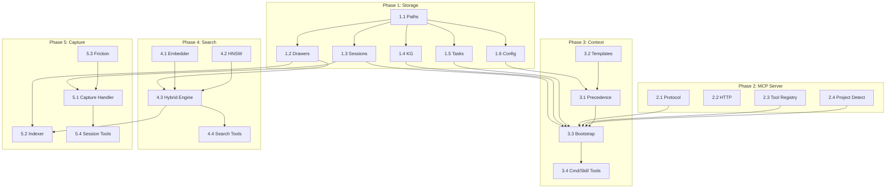

**Parallel execution opportunities:**

| Parallel group | Tasks | Rationale |
|---------------|-------|-----------|
| P1-parallel | 1.2, 1.3, 1.4, 1.5, 1.6 | All depend only on 1.1 (paths), not on each other |
| P2-parallel | 2.1, 2.2, 2.3, 2.4 | Independent protocol/transport/registry/detection |
| P3-templates | 3.2 | Can run anytime (just writes embedded files) |
| P4-parallel | 4.1, 4.2 | Embedder and HNSW are independent; 4.3 depends on both |
| P5-sequential | 5.3 → 5.1 | Capture handler (5.1) depends on friction analysis (5.3); 5.3 must complete first |

**Sequential constraints:**

- Phase 1 Task 1.1 (Paths) must complete before any other Phase 1 task
- Phase 3 Task 3.3 (Bootstrap) requires: 1.3, 1.4, 1.5, 1.6, 2.1, 2.3, 2.4, 3.1
- Phase 4 Task 4.3 (Hybrid Engine) requires: 1.2, 4.1, 4.2
- Phase 5 Task 5.2 (Indexer) requires: 1.2, 4.3

---

### C.5 Integration Test Contracts

Each integration test proves that one module correctly consumes the output
of its dependency. These tests use the shared fixtures from C.6.

**Integration test 1: Storage round-trip**
```
Test: Write fixtures to drawer JSONL → read back → verify identical
Modules: storage/drawers.go
Fixture: testdata/fixtures/drawers.jsonl
Asserts: All fields round-trip, duplicate IDs rejected, glob by wing/room works
```

**Integration test 2: Search indexes storage**
```
Test: Insert fixture drawers → embed → build HNSW → search → verify ranking
Modules: storage/drawers.go, embedder/embedder.go, search/hnsw.go, search/engine.go
Fixture: testdata/fixtures/drawers.jsonl
Asserts: Query "audio buffer overflow" returns recmeet/audio-pipeline drawer first
```

**Integration test 3: Context bootstrap assembles storage**
```
Test: Write fixture sessions + tasks + KG → call Bootstrap() → verify payload
Modules: storage/sessions.go, storage/tasks.go, storage/knowledge_graph.go,
         context/precedence.go, context/bootstrap.go
Fixture: testdata/fixtures/sessions/, testdata/fixtures/drawers.jsonl
Asserts: BootstrapResult contains workflow, resume, tasks, recent sessions
```

**Integration test 4: Capture indexes through search**
```
Test: Call Capture() with transcript → search for content → verify found
Modules: capture/session.go, capture/indexer.go, search/engine.go
Fixture: Inline test transcript
Asserts: Captured content searchable within 1 second of capture
```

**Integration test 5: MCP tool invocation end-to-end**
```
Test: Send JSON-RPC tools/call for vp_search → verify response format
Modules: mcp/server.go, tools/search_tools.go, search/engine.go
Fixture: Pre-indexed fixture data
Asserts: JSON-RPC response has correct structure, content matches
```

**Integration test 6: KG temporal queries**
```
Test: Add fixture triples → query as_of past date → verify correct results
Modules: storage/knowledge_graph.go
Fixture: testdata/fixtures/triples/
Asserts: as_of="2025-09-01" returns kai--works_on--orion; as_of="2026-04-01" does not
```

---

### C.6 Test Fixtures

All subagents use these fixtures for unit and integration tests. The fixtures
are committed to `testdata/fixtures/` and loaded via `os.ReadFile` in tests.

#### Fixture: drawers.jsonl

Location: `testdata/fixtures/drawers.jsonl`

This file contains 8 sample drawers spanning 2 projects, 3 wings, 4 rooms,
and 3 halls.

```jsonl
{"id":"d001a1b2","hall":"facts","content":"We decided to cap the audio buffer at 120 minutes to prevent unbounded memory growth. PipeWire buffers were growing to 230MB+ during long meetings.","source_type":"session","source_ref":"2026-03-15-02","chunk_index":0,"filed_at":"2026-03-15T14:23:00Z","added_by":"system"}
{"id":"d002c3d4","hall":"events","content":"PipeWire buffer overflow detected during 3-hour meeting recording. Process memory hit 1.2GB before OOM killer intervened. Root cause: no flush-to-disk cycle in capture loop.","source_type":"session","source_ref":"2026-03-14-01","chunk_index":0,"filed_at":"2026-03-14T10:00:00Z","added_by":"system"}
{"id":"d003e5f6","hall":"discoveries","content":"Discovered that PulseAudio monitor sources report double the actual sample rate when running under PipeWire compatibility mode. Must divide by 2 for correct duration calculation.","source_type":"session","source_ref":"2026-03-16-01","chunk_index":0,"filed_at":"2026-03-16T09:15:00Z","added_by":"system"}
{"id":"d004g7h8","hall":"facts","content":"Authentication migration from Auth0 to Clerk completed. Decision driven by pricing (Auth0 raised rates 3x) and developer experience (Clerk's React hooks are significantly simpler).","source_type":"session","source_ref":"2026-02-20-01","chunk_index":0,"filed_at":"2026-02-20T11:30:00Z","added_by":"system"}
{"id":"d005i9j0","hall":"preferences","content":"Team prefers PostgreSQL over MySQL for all new services. Kai investigated both and found PostgreSQL's JSONB support eliminates the need for a separate document store.","source_type":"session","source_ref":"2026-02-22-01","chunk_index":0,"filed_at":"2026-02-22T14:00:00Z","added_by":"system"}
{"id":"d006k1l2","hall":"facts","content":"GraphQL migration abandoned in favor of keeping REST. The team found that GraphQL's N+1 query problem created more complexity than it solved for our use case.","source_type":"session","source_ref":"2026-01-15-01","chunk_index":0,"filed_at":"2026-01-15T16:45:00Z","added_by":"system"}
{"id":"d007m3n4","hall":"events","content":"Sprint retrospective: velocity dropped 30% due to auth migration taking longer than estimated. Kai spent 4 extra days on session token edge cases. Lesson: budget 2x for auth work.","source_type":"session","source_ref":"2026-02-28-01","chunk_index":0,"filed_at":"2026-02-28T17:00:00Z","added_by":"system"}
{"id":"d008o5p6","hall":"advice","content":"When debugging PipeWire audio issues, always check pw-top first. It shows real-time buffer utilization and sample rate mismatches that are invisible in pavucontrol.","source_type":"session","source_ref":"2026-03-17-01","chunk_index":0,"filed_at":"2026-03-17T08:30:00Z","added_by":"system"}
```

**Fixture directory mapping** (where each drawer lives on disk):

| Drawer ID | Project | Wing | Room | File path |
|-----------|---------|------|------|-----------|
| d001a1b2 | recmeet | wing_recmeet | audio-pipeline | `palace/recmeet/drawers/wing_recmeet/audio-pipeline/drawers.jsonl` |
| d002c3d4 | recmeet | wing_recmeet | audio-pipeline | (same file as above) |
| d003e5f6 | recmeet | wing_recmeet | audio-pipeline | (same file) |
| d008o5p6 | recmeet | wing_recmeet | audio-pipeline | (same file) |
| d004g7h8 | driftwood | wing_driftwood | auth-migration | `palace/driftwood/drawers/wing_driftwood/auth-migration/drawers.jsonl` |
| d005i9j0 | driftwood | wing_driftwood | tech-decisions | `palace/driftwood/drawers/wing_driftwood/tech-decisions/drawers.jsonl` |
| d006k1l2 | driftwood | wing_driftwood | tech-decisions | (same file) |
| d007m3n4 | driftwood | wing_driftwood | sprint-retros | `palace/driftwood/drawers/wing_driftwood/sprint-retros/drawers.jsonl` |

#### Fixture: entities.jsonl

Location: `testdata/fixtures/entities.jsonl`

```jsonl
{"id":"kai","name":"Kai","type":"person","properties":{"role":"backend engineer","tenure_start":"2023-04-01"},"created_at":"2026-01-15T10:00:00Z"}
{"id":"priya","name":"Priya","type":"person","properties":{"role":"team lead"},"created_at":"2026-01-15T10:00:00Z"}
{"id":"orion","name":"Orion","type":"project","properties":{"stack":"rust,postgresql"},"created_at":"2026-01-15T10:00:00Z"}
{"id":"driftwood","name":"Driftwood","type":"project","properties":{"stack":"typescript,react,postgresql"},"created_at":"2026-01-15T10:00:00Z"}
{"id":"clerk","name":"Clerk","type":"tool","properties":{"category":"auth"},"created_at":"2026-02-20T11:30:00Z"}
{"id":"auth0","name":"Auth0","type":"tool","properties":{"category":"auth"},"created_at":"2026-01-01T00:00:00Z"}
```

#### Fixture: KG triples

Location: `testdata/fixtures/triples/`

**File: `kai--works_on--orion.json`**
```json
{
  "valid_from": "2025-06-01",
  "valid_to": null,
  "confidence": 1.0,
  "source_session": "2026-01-15-03",
  "extracted_at": "2026-01-15T14:30:00Z"
}
```

**File: `kai--works_on--driftwood.json`**
```json
{
  "valid_from": "2023-04-01",
  "valid_to": "2025-05-31",
  "confidence": 1.0,
  "source_session": "2026-01-15-03",
  "extracted_at": "2026-01-15T14:30:00Z"
}
```

**File: `priya--leads--driftwood.json`**
```json
{
  "valid_from": "2024-01-01",
  "valid_to": null,
  "confidence": 1.0,
  "source_session": "2026-01-15-02",
  "extracted_at": "2026-01-15T12:00:00Z"
}
```

**File: `auth0--replaced_by--clerk.json`**
```json
{
  "valid_from": "2026-02-20",
  "valid_to": null,
  "confidence": 1.0,
  "source_session": "2026-02-20-01",
  "extracted_at": "2026-02-20T11:30:00Z"
}
```

**File: `kai--recommended--clerk.json`**
```json
{
  "valid_from": "2026-02-18",
  "valid_to": null,
  "confidence": 0.9,
  "source_session": "2026-02-18-01",
  "extracted_at": "2026-02-18T15:00:00Z"
}
```

#### Fixture: Sample sessions

Location: `testdata/fixtures/sessions/`

**File: `recmeet/2026-03-15-02.md`**
```markdown
---
date: 2026-03-15
type: session
project: recmeet
branch: main
domain: personal
model: claude-opus-4-6
session_id: "fix-001-audio-buffer"
iteration: 2
duration_minutes: 45
messages: 28
tokens_in: 52000
tokens_out: 3800
tool_uses: 12
friction_score: 15
tags: [debugging, implementation]
summary: "Fixed audio buffer overflow by adding 120-minute soft cap"
decisions:
  - "Cap audio buffer at 120 minutes (230MB) with warning"
  - "Add flush-to-disk cycle every 30 minutes"
files_changed:
  - "src/audio_capture.cpp"
  - "src/audio_monitor.cpp"
open_threads:
  - "Consider hard cap at 180 minutes"
---

Fixed the PipeWire buffer overflow that was causing OOM kills during long
meeting recordings. Added a soft warning at 120 minutes and a flush-to-disk
cycle every 30 minutes to prevent unbounded memory growth.
```

**File: `driftwood/2026-02-20-01.md`**
```markdown
---
date: 2026-02-20
type: session
project: driftwood
branch: feat/clerk-migration
domain: work
model: claude-sonnet-4-6
session_id: "auth-002-clerk-complete"
iteration: 1
duration_minutes: 120
messages: 65
tokens_in: 180000
tokens_out: 12000
tool_uses: 34
friction_score: 35
tags: [implementation]
summary: "Completed Auth0 to Clerk migration"
decisions:
  - "Use Clerk React hooks over custom wrapper"
  - "Keep Auth0 session tokens valid for 30-day transition"
files_changed:
  - "src/auth/clerk-provider.tsx"
  - "src/auth/middleware.ts"
  - "src/auth/session.ts"
open_threads:
  - "Remove Auth0 SDK after 30-day transition period"
  - "Update API rate limiting to use Clerk user IDs"
---

Completed the Auth0 to Clerk migration. Kai recommended Clerk based on
pricing (Auth0 raised rates 3x) and developer experience. Migration
involved replacing the auth provider, middleware, and session handling.
```

**File: `driftwood/2026-01-15-01.md`**
```markdown
---
date: 2026-01-15
type: session
project: driftwood
branch: main
domain: work
model: claude-opus-4-6
session_id: "arch-001-graphql-decision"
iteration: 1
duration_minutes: 60
messages: 40
tokens_in: 95000
tokens_out: 5200
tool_uses: 8
friction_score: 10
tags: [exploration, planning]
summary: "Evaluated GraphQL migration; decided to keep REST"
decisions:
  - "Abandon GraphQL migration in favor of keeping REST"
  - "GraphQL N+1 problem creates more complexity than it solves"
files_changed: []
open_threads:
  - "Document REST API conventions in doc/api-guide.md"
---

Evaluated migrating from REST to GraphQL. After Kai's analysis of the N+1
query problem and the additional complexity of schema stitching for our
microservice architecture, the team decided to keep REST. The benefits of
GraphQL (flexible queries, single endpoint) did not outweigh the costs for
our use case.
```

---

### C.7 Inline Template Content

These templates are compiled into the binary via `//go:embed` and serve as
the lowest-precedence defaults. They are adapted from VibeVault's proven
templates with tool names updated from `vv_*` to `vp_*`.

#### C.7.1 workflow.md

```markdown
# {{PROJECT}} — Workflow

## Files

- **resume.md** — current project state, open threads, navigation (thin gateway)
- **iterations.md** — iteration narratives and project history (append-only)
- **tasks/** — active tasks; **tasks/done/** — completed
- **doc/** — stable project reference: architecture, design, testing

## Workflow Rules

- **Never commit without explicit human permission.** Stage files and
  update commit.msg freely, but the actual git commit requires human approval.
- **Never commit AI context files.** .vibe-palace.toml is committed, but
  nothing else AI-related should be in the source tree.
- **Git commit messages are the project's history.** Write them to be
  clear, detailed, and self-sufficient.

## The Pair Programming Paradigm

### The AI's Role: Expert Implementation

- Expert coder with deep technical knowledge
- Investigate problems thoroughly BEFORE implementing fixes
- Present findings and action plans for review
- Implement solutions only after architectural approval

### The Human's Role: Architectural Vision

- Context that spans the entire project across many days and iterations
- Understanding of long-term maintainability goals
- Guide architectural decisions and approve implementation approaches

### Critical Anti-Pattern: Premature Implementation

Never jump to coding short-term fixes without investigation.

## Investigation-First Workflow

### 1. Plan Mode Default

- Enter plan mode for ANY non-trivial task (3+ steps or architectural decisions)
- If something goes sideways, STOP and re-plan immediately
- Write detailed specs upfront to reduce ambiguity
- After creating a plan, immediately create it as a task using
  `vp_manage_task` with `action: create`

### 2. Subagent Strategy

- Use subagents liberally to keep main context window clean
- Offload research, exploration, and parallel analysis to subagents
- One tack per subagent for focused execution

### 3. Self-Improvement Loop

- After ANY correction from the user: update lessons with the pattern
- Write rules that prevent the same mistake
- Review lessons at session start

### 4. Verification Before Done

- Never mark a task complete without proving it works
- No task is "done" until the user says it is and does the actual commit
- Run tests, check logs, demonstrate correctness
- Ask yourself: "Would a staff engineer approve this?"
- No warnings or diagnostic messages in committed code

### 5. Demand Elegance (Balanced)

- For non-trivial changes: pause and ask "is there a more elegant way?"
- Skip this for simple, obvious fixes — don't over-engineer

### 6. Autonomous Bug Fixing

- When given a bug report: generate a plan and review with the user
- Point at logs, errors, failing tests — then plan to resolve them
- Never fix a test without understanding the root cause

## Task Management

1. Write plan using `vp_manage_task` with `action: create`
2. Check in before starting implementation
3. Track progress using `vp_manage_task` with `action: update_status`
4. Add review section to the task file
5. When complete: use `vp_manage_task` with `action: retire`

## Core Principles

- **Simplicity First**: Make every change as simple as possible but no simpler
- **No Laziness**: Find root causes. No temporary fixes. Senior developer standards.
- **Minimal Impact**: Changes should only touch what's necessary
- **Test Coverage**: Ensure close to 80% unit test coverage for code changes

Read resume.md for current project state and open threads. Consult doc/ files
for stable reference material (architecture, design decisions, test inventory).
```

#### C.7.2 resume.md

```markdown
---
type: project-resume
project: {{PROJECT}}
---

# {{PROJECT}} — Working Context

<!-- KEEP THIS FILE THIN. resume.md is a gateway, not a diary.
     - Stable architecture, design decisions, test inventories -> doc/
     - Completed iteration narratives -> iterations.md
     - Active work items -> tasks/ directory
     Only current state, open threads, and pointers belong here. -->

## What This Project Is

<!-- Brief description of the project, stack, build/test commands -->

## Current State

<!-- Iteration count, test count, what phase the project is in -->

## Open Threads

<!-- Active tasks, unresolved questions, next steps -->

## Reference Documents

| Document | Access | Purpose |
|----------|--------|---------|
| resume.md | `vp_get_resume` | This file — current state and navigation |
| workflow.md | `vp_get_workflow` | AI workflow rules and pair programming paradigm |
| iterations.md | `vp_get_project_context` | Append-only archive of iteration narratives |
| tasks/ | `vp_list_tasks` / `vp_get_task` | Active task files; tasks/done/ for completed |
```

#### C.7.3 commands/restart.md

```markdown
## Vault Sync

Before loading context, sync the vault:

1. **Discover remotes**: Run `git remote` in the vault directory to discover
   all configured remotes. Do NOT assume any particular remote name.
2. Run `vp vault pull` via Bash. If it fails, pull from discovered remotes
   directly (`git -C <vault_path> pull <remote> main`).
3. If it fails (no remote, network error), warn and proceed — local state
   is still valid.

## Context Restoration

Call `vp_bootstrap_context` to load resume, workflow, active tasks, recent
sessions, and KG snapshot in a single call.

After bootstrap:

1. **Auto-retire completed tasks**: List active tasks via `vp_list_tasks`.
   For each task:
   - Read its title and status via `vp_get_task`.
   - Check `git log --oneline -20` for commits matching the task's objective.
   - **Auto-retire if**: status says "Done" or "Complete", OR all checklist
     items are checked AND recent commits match the task's subject matter.
   - **Never auto-retire if**: unchecked items remain, status says
     "In Progress" or "Blocked", or no matching commits found.
   - For each retirement: use `vp_manage_task` with `action: retire`, then
     `vp_append_iteration` with a brief narrative.
   - On uncertainty: leave active. False negatives beat false positives.

2. Call `vp_get_project_context` for structured context (sessions, threads,
   decisions, friction trends).
3. `doc/*.md` — read on demand when needed.

After loading, briefly confirm: test count, open tasks, recent session
activity, and what was last worked on. If active tasks exist, summarize
each with priority and status, recommend which to start.
```

#### C.7.4 commands/wrap.md

```markdown
Update resume.md and its dependent documents to reflect current project state.

resume.md is a THIN GATEWAY — not a diary. Keep it focused on current state,
open threads, and pointers. Stable reference material belongs in doc/.

Steps:

1. Ensure all code compiles without warnings, errors, or diagnostics
2. Ensure all unit and integration tests pass
3. Read current resume.md via `vp_get_resume`
4. Compare against actual codebase state
5. Update resume.md via `vp_update_resume`: current state (test count,
   iteration count), open threads. Do NOT add file inventories, architecture,
   or design decisions — those belong in doc/
6. If stable documentation changed, update the relevant doc/ file
7. Append a new iteration narrative via `vp_append_iteration`
8. Retire completed tasks: use `vp_list_tasks`, check each against session
   work — if implemented and committed, use `vp_manage_task` with
   `action: retire`
9. Stage all modified project files (explicit paths, never `git add -A`)

Do not add "Co-Authored-By" lines to commit messages or source files.

After staging project files, sync vault:

1. Discover remotes via `git remote` in the vault directory
2. Commit vault changes: `git -C <vault_path> add -A` then commit
3. Push to each discovered remote. If a push fails, show the error and
   continue — do not abort.

Do not ask for confirmation — just do the updates, stage files, show what
changed, note user should review before committing.
```

#### C.7.5 commands/review-plan.md

```markdown
Perform a critical architecture review of a task plan before implementation.

This is a senior staff engineer review. Find real problems, don't rubber-stamp.

## Inputs

Use `vp_list_tasks` to find active tasks. If an argument is given, use
`vp_get_task` to read only that task.

## Step 1: Read the plan

Extract: what code it modifies, what assumptions it makes, proposed ordering.

## Step 2: Validate against the codebase

For every claim about existing code, read the actual source. Check:
- Function signatures: does the plan accurately describe them?
- Coupling claims: verify by reading the function body
- Data flow: trace how data actually moves
- Naming and constants: hardcoded strings, fallback values

Use subagents to parallelize investigation of independent components.

## Step 3: Structured review

Produce a review covering (skip categories with no findings):
- **Factual errors**: where the plan misunderstands the codebase
- **Architectural concerns**: anti-patterns, better alternatives
- **Risk assessment**: what could go wrong, what is underestimated
- **Performance concerns**: bottlenecks, quadratic behavior
- **Dependency concerns**: binary size, transitive deps, maintenance
- **Missing considerations**: what did the plan forget
- **Opportunities**: what could be done better
- **Phasing critique**: is the ordering correct

## Step 4: Severity ranking

| Severity | Meaning |
|----------|---------|
| Critical | Will cause incorrect behavior. Must fix before implementation. |
| High | Significant design flaw. Should fix before implementation. |
| Medium | Suboptimal but workable. Fix during implementation. |
| Low | Minor improvement. Address if convenient. |

## Step 5: Present to user

Highest-severity items first. For critical/high: what the plan says, what
the code actually does, recommended fix. End with: proceed, revise, or
investigate further.
```

#### C.7.6 commands/cancel-plan.md

```markdown
Cancel a planned task found not worth implementing.

Preserves analysis for future reference — prevents re-proposing the same work.

## Step 1: Identify the task

Use `vp_list_tasks`. If 0 tasks: stop. If 1: proceed with that task. If 2+:
present numbered list, ask user which to cancel. If argument provided, match
against task filenames.

## Step 2: Draft cancellation rationale

Based on conversation context, draft 2-4 sentences on why the task isn't
worth doing. Present to user for approval.

## Step 3: Cancel the task

Use `vp_manage_task` with `action: cancel`.

## Step 4: Update iterations.md

Use `vp_append_iteration`:
- Title: `Cancelled: {task name}`
- Narrative: `Investigated {task name}; cancelled. {Rationale summary}.`

## Step 5: Update resume.md

Via `vp_update_resume`: remove references to cancelled task from Open Threads.

## Step 6: Confirm

Report: task cancelled, iterations.md updated, resume.md cleaned up.
```

---

### C.8 MCP Protocol Reference

Protocol version: **2025-03-26**

**Transport:** stdio (newline-delimited JSON, one message per line)

**Initialize handshake:**

```json
// Client → Server
{"jsonrpc":"2.0","id":1,"method":"initialize","params":{
  "protocolVersion":"2025-03-26",
  "capabilities":{"roots":{"listChanged":true}},
  "clientInfo":{"name":"claude-code","version":"2.1.0"}
}}

// Server → Client
{"jsonrpc":"2.0","id":1,"result":{
  "protocolVersion":"2025-03-26",
  "capabilities":{"tools":{"listChanged":true}},
  "serverInfo":{"name":"vibe-palace","version":"0.1.0"}
}}

// Client → Server (notification, no id)
{"jsonrpc":"2.0","method":"notifications/initialized"}
```

**Tool listing:**

```json
// Client → Server
{"jsonrpc":"2.0","id":2,"method":"tools/list","params":{}}

// Server → Client
{"jsonrpc":"2.0","id":2,"result":{"tools":[
  {"name":"vp_search","description":"Semantic search",
   "inputSchema":{"type":"object","properties":{
     "query":{"type":"string","description":"Search text"}
   },"required":["query"]}}
]}}
```

**Tool invocation:**

```json
// Client → Server
{"jsonrpc":"2.0","id":3,"method":"tools/call","params":{
  "name":"vp_search","arguments":{"query":"audio buffer"}
}}

// Server → Client (success)
{"jsonrpc":"2.0","id":3,"result":{
  "content":[{"type":"text","text":"[{\"content\":\"We decided...\"}]"}],
  "isError":false
}}

// Server → Client (tool error — application level)
{"jsonrpc":"2.0","id":3,"result":{
  "content":[{"type":"text","text":"Project not found: unknown"}],
  "isError":true
}}
```

**JSON-RPC error codes** (protocol level):

| Code | Meaning |
|------|---------|
| -32700 | Parse error (malformed JSON) |
| -32600 | Invalid request |
| -32601 | Method not found |
| -32602 | Invalid params |
| -32603 | Internal error |

The `mark3labs/mcp-go` library handles all protocol-level concerns. Tool
implementors only write handler functions with signature:
`func(ctx context.Context, req mcp.CallToolRequest) (*mcp.CallToolResult, error)`
