# Vibe-Palace: Product Requirements Document

**Version:** 0.2.0 **Date:** 2026-04-06 (split 2026-08-15) **Authors:** John Suykerbuyk, Claude Opus
4.6 **Status:** Phases 1–10, 12–18 Implemented | Phase 11 Planned | Host-local search index
(ADR-014) Accepted, not shipped **Current as of:** v8.2.0 (MCP surface 8, data format 2).
`vp --version` reports the build.

> **🔴 THIS DOCUMENT SPECIFIES, IT DOES NOT NARRATE (split 2026-08-15).** It grew
> to 4,355 lines / 188 KB by fusing a specification with an implementation
> journal, and at that size nobody re-read it — which is how the drift recorded
> in ADR-006/008/009 went unnoticed for three weeks. The implementation record of
> the seventeen COMPLETE/IMPLEMENTED phases, and Appendix C.2–C.8, were **cut,
> not relocated**: git holds them, and a second copy is a fifth home for state
> this project already struggles to keep in one place. Recover any of it with
> `git log -p -- doc/PRD-vibe-palace.md`.
>
> What remains is what a reader must know to *change* the system: principles,
> architecture, state machines, data lifecycle, the tool surface, storage schema,
> precedence, the one PLANNED phase, and the decisions register. **Nothing that
> only records what was already built belongs back in here.**

> **Implementation notes** are marked with blockquotes throughout.

> **Target behaviour: the marker convention (ADR-014).** This document describes the
> code at `a32a2d4` (v8.2.0) in the present tense. ADR-014 (Accepted 2026-10-02)
> specifies a redesign of storage and search that is **not shipped**. Its
> requirements appear in requirement voice ("must"), each marked with one of two
> tags:
>
> - **[ADR-014 · v9.2.0]** — the git-health release, v9.2.0 (MCP surface 9). The
>   vault keeps authored artifacts only, each host compiles its search index from
>   them, and a search of a project with nothing to search is an error.
> - **[ADR-014 · HNSW]** — the HNSW index, used by each project at or above a measured size (brute force below it).
>   It lands with its own child tasks and has no release version. v9.2.0 may ship with
>   the brute-force index for every project.
>
> A section that is target behaviour from end to end carries the tag once, under its
> heading. Inside code blocks and diagrams, which cannot carry bold text, the tags are
> written `[v9.2.0]` and `[HNSW]`. Inside a section tagged as a whole, *(shipped)* marks a
> passage that describes code shipping today. Untagged present tense is shipped behaviour. **Until v9.2.0**, the shipped
> behaviour is this: search is an exact brute-force cosine index built lazily from
> the tracked drawers, notes and iterations; drawers and extracted triples are
> tracked and committed by tidy; and a search that finds nothing returns `[]`.

---

## Executive Summary

Vibe-Palace is a compiled Go binary that unifies the proven concepts of VibeVault
(session capture, workflow orchestration, project context management across 686+
sessions and 32+ projects) with MemPalace (semantic search achieving 96.6% R@5 on
LongMemEval, temporal knowledge graphs, structural metadata filtering).

**The core architectural principle:** The MCP interface is the product. File system
conventions, symlinks, and markdown file management are implementation details that
should be invisible to both the AI consumer and the human developer. Context
injection, behavioral calibration, session capture, semantic search, and knowledge
graph operations all flow through a standard MCP (or HTTP) interface, decoupled
from any specific AI provider's file system expectations.

**What this replaces:**
- VibeVault's dependency on Claude Code's JSON-RPC protocol and `.claude/` directory
  conventions
- MemPalace's dependency on Python, ChromaDB, and pip-based distribution
- The symlink/dual-git complexity of maintaining vault project context alongside source code
- The CLAUDE.md sprawl problem across multiple AI providers and IDEs

**What this preserves:**
- VibeVault's 686+ sessions of captured knowledge (full migration path)
- MemPalace's retrieval approach (same embedding model; search is an exact
  brute-force cosine index; **[ADR-014 · HNSW]** ADR-014 keeps brute force below a measured
  size threshold and uses HNSW at or above it). The 96.6% figure is
  MemPalace's own result, and the session/project counts above are 2026-04 figures.
- VibeVault's workflow orchestration and pair programming paradigm
- MemPalace's temporal knowledge graph with validity windows
- Both systems' local-first, zero-cloud-dependency architecture

---

## Table of Contents

1. [Design Principles](#1-design-principles)
2. [Architecture Overview](#2-architecture-overview)
3. [State Machines](#3-state-machines)
4. [Data Lifecycle](#4-data-lifecycle)
5. [Session Lifecycle Flowchart](#5-session-lifecycle-flowchart)
6. [MCP Tool Surface](#6-mcp-tool-surface)
7. [Storage Schema](#7-storage-schema)
8. [Precedence System](#8-precedence-system)
9. [Phase 11: Pluggable Embedding Backends](#phase-11-pluggable-embedding-backends) — *the only unbuilt phase*
10. [Cross-Cutting Concerns](#cross-cutting-concerns)
11. [Validation Framework](#validation-framework)
12. [Appendix A: Glossary](#appendix-a-glossary)
13. [Appendix B: File Inventory](#appendix-b-file-inventory)
14. [Appendix C: Decisions Register](#appendix-c-decisions-register)

*Phases 1–10 and 12–18 are built; their task breakdowns were cut in the
2026-08-15 split and live in git history.*

---

## 1. Design Principles

### 1.1 MCP-First, File-System-Last

The MCP interface is the canonical way to interact with Vibe-Palace. Every
capability — context injection, session capture, search, task management,
knowledge graph queries — is available via MCP tools. File system artifacts
(session markdown files, task files, iteration narratives) are *generated outputs*
of the MCP server, not inputs to it.

**The project-local footprint is exactly one tracked file:** `.vibe-palace.toml` at the
project root. This file contains only the project identity (name, domain, tags).
It MAY be committed to the project repository; a committed copy never carries
`vault_path`, because a path is a fact about one host. Which vault a project
lives in on a given host is that host's own `[project_vaults]` binding in its
global config (ADR-012).
`vp init` also touches the working tree in other ways: it adds ignore lines to
`.gitignore` (`/AGENTS.md`, `/CLAUDE.md`, `/.claude/`, `/.grok/`, `/.vibe-palace/`,
`/commit.msg`), writes the untracked host artifacts those lines cover (the
`AGENTS.md` block and, unless the user-global plugin already serves them, the
`.claude/` / `.grok/` command and skill shims), and installs
`.git/hooks/post-commit`. None of them is the project's identity.
Everything else — workflow rules, behavioral calibration, commands, skills,
templates — is delivered through the MCP interface on demand.

No symlinks. No dual-git management. **Nothing host-specific is ever committed**
— a host may keep its own untracked shims (a `.claude/` directory, a `CLAUDE.md`)
so long as they only call MCP tools and the repo does not track them. `vp init`
and `vp commands upgrade` create these shims themselves, and a skill shim carries
only a menu label, never the skill's trigger text.

**Write/wrap surface (complete).** The session *wrap* — updating `resume.md`,
ingesting the commit message, recording the iteration, and committing/pushing
the vault — is fully completable through MCP: generic vault file CRUD (§6.8),
commit ingest (§6.9), wrap-state tools (§6.11), and `vp_vault_sync` with
explicit-path commit-then-push. An agent never needs to shell out to the
filesystem to finish a session.

> **Corrected 2026-08-15.** This paragraph previously cited "surgical resume
> editors (§6.10)" as evidence the surface was complete. §6.10 is titled
> *REMOVED*. A document that cites its own removed section as proof of
> completeness is the `honest-instruments` failure applied to the spec.

### 1.2 Out-of-Band Context Storage

The vault directory is completely separate from any source code tree. Context data
(sessions, tasks, iterations, transcripts, knowledge graph, search drawers) lives in
the vault; embeddings are cached per host under the ignored `palace/.local/`. Source
code lives in the project repository. The MCP server bridges them.

**[ADR-014 · v9.2.0]** The vault must hold only authored and immutable context: sessions,
tasks, iterations, transcripts, authored knowledge-graph facts, iteration summaries
and surface stamps.
Search indexes, chunks and extracted triples must be compiled by each host from that
content and must never leave the host (§7.8).

The vault is git-managed for multi-machine sync and history. The source code
repository has no knowledge of the vault's existence beyond the single
`.vibe-palace.toml` identity file.

### 1.3 Precedence Hierarchy

Context injection follows a strict precedence chain:

```
Project-local overrides  (highest — in vault, not source tree)
        ↓
Vault templates          (user-customized defaults)
        ↓
Embedded defaults        (compiled into binary — lowest)
```

This ensures:
- New projects work immediately with sensible defaults (embedded)
- Users can customize defaults for all future projects (vault templates)
- Individual projects can override anything (project-local in vault)
- Nothing touches the source code tree

### 1.4 Project-Scoped by Default, Cross-Project Read Access Available

All write operations (session capture, task management, knowledge graph mutations)
are scoped to the current project. Search and read operations can optionally span
all projects, enabling cross-project knowledge discovery.

### 1.5 Model-Agnostic

The MCP server makes no assumptions about which AI model or IDE is calling it.
Tools accept plain text and return plain text or structured JSON. No
Claude-specific, GPT-specific, or IDE-specific behaviors. The same binary works
with Claude Code, Cursor, Windsurf, Cline, Zed, Ollama, or any future MCP client.

### 1.6 Single Binary, Zero Dependencies

The compiled Go binary contains:
- The MCP server (stdio transport, plus an optional bearer-authenticated, read-only-by-default Streamable-HTTP transport via `vp mcp serve`)
- A CLI for human interaction
- A pure-Go ONNX embedder (`hugot`, no CGO) for text embeddings; the model is
  downloaded on first use, not embedded
- An exact brute-force cosine vector index. **[ADR-014 · v9.2.0]** It must be compiled per host
  from vault content (§7.8). **[ADR-014 · HNSW]** Each project must use exactly one index,
  chosen by chunk count: brute force below a measured size threshold, HNSW (`coder/hnsw`,
  pure Go) at or above it, switching back to brute force only below a lower bound
  (hysteresis; ADR-014 decision 6)
- Embedded default templates for project initialization

No Python. No Docker. No pip. No node_modules. Download, run, done.

### 1.7 Language-Agnostic Classification

All content classification — room detection, filename pattern matching, entity
extraction, friction analysis — must be language-agnostic. No single programming
language, framework, or build system receives preferential treatment in default
keyword lists or pattern tables. Specifically:

- **Filename rules** cover test file conventions across Go, Python, TypeScript,
  JavaScript, Java, Rust, Ruby, Elixir, and Dart (suffix, prefix, and contains
  patterns).
- **Content keywords** use only terms that are universal across development
  contexts (e.g., "test", "assert", "coverage") — not language-specific tokens
  (e.g., `_test.go`, `panic`).
- **Entity extraction** skips dependency manifests and lock files from all major
  ecosystems (Go, Node, Python, Rust, Ruby, Java, PHP, .NET, Dart, Elixir, Swift).
- **Error/friction detection** uses cross-language error indicators (e.g., "error",
  "exception", "fatal", "segfault") — not language-specific ones (e.g., `panic`).
- **Custom keywords** (per-project `[palace.rooms]` config) allow users to extend
  classification for domain-specific or language-specific needs without polluting
  the defaults.

While vibe-palace itself is written in Go, it serves developers working in any
language. The defaults must reflect that.

### 1.8 The Network Test — the acceptance criterion for §1.1

§1.1 states the principle; this states how to *check* it, because "MCP-first" has
been asserted in this document since 2026-04-06 while host-local filesystem reads
shipped anyway.

> **Would this feature still work if the MCP server were reached over the network,
> at an offsite provider, with the vault mounted beside the SERVER and not beside
> the agent?**

If the answer is no, the design is wrong. The vault does not need to be local to
the machine the agent runs on — it needs to be readable by the MCP server. Any
step that reads a host's filesystem, computes a vault path, or depends on a
host's on-disk layout fails this test.

**The 2026-08-15 failures, and what became of each** (disposition recorded
2026-08-27). Two were deleted; the rest are salvage, exempted here in writing:

| Host-local read | Where | Disposition |
|---|---|---|
| Sweeping a host-local plan/scratch directory | `restart` command, Step 3 | **DELETED.** The step no longer walks a directory: plans are vault tasks, listed with `vp_list_tasks` and written with `vp_manage_task`. |
| "Read your host's persisted copy of the tool result" as a truncation remedy | `restart` command, Step 2 | **DELETED.** A cut INDEX is answered by re-calling `vp_bootstrap_context`; the documents are fetched by URI and end with `eof`. |
| Sweeping the same directory late in a session | `wrap` command, Step 6b; `review-plan` command | **EXEMPT — Claude-colocated salvage.** |
| Reporting on that directory over MCP | `vp_scan_plans` | **EXEMPT — Claude-colocated salvage.** |
| Draining host-local memory into the vault | SessionEnd harvest, `internal/memory/harvest.go`; `vp_memory_harvest` | **EXEMPT — Claude-colocated salvage.** |
| Reading host-local transcripts | `vp hook` | **EXEMPT — Claude-colocated salvage.** |

**What the exemption means, since it must be written down rather than inferred
from the fact that the code exists.** Every exempt row reads a Claude Code
layout that only exists on a machine where Claude Code ran, and each one is
*recovering* context that host already wrote somewhere else — it is not the
route by which context arrives. Each has a network-clean counterpart that is the
real path, and the salvage runs beside it, never instead of it:

- memory is written by `vp_memory_*`, and the harvest only drains what a host
  wrote before that rule reached the agent;
- a transcript reaches the vault as inline bytes on `vp_capture_session`, and
  `vp hook`'s `os.ReadFile` only serves the host that has one on disk;
- a plan reaches the vault as a task through `vp_manage_task`, and the scan only
  reports scratch files that never made it.

So an exempt path is allowed to find nothing. Reached over the network the
directory is absent, empty, or belongs to the wrong machine, and every one of
these degrades to a no-op rather than to a wrong answer — which is the property
that makes the exemption safe. **A feature whose only route is one of these rows
is not exempt; it fails §1.8.**

### 1.9 Context Is Retrieved, Not Delivered

**The vault's purpose is to restore operational context for the work ahead —
fast.** Not to archive everything, and not to hand an agent everything it might
conceivably need.

- **Session start returns an INDEX plus what is relevant to what comes next.**
  Bulk bodies are reachable by URI and fetched on demand, never pushed.
- **"What comes next" is DERIVED from the active task graph** — head-of-queue and
  its dependencies — and everything else is ranked against it. It is not asked
  for, and it is not guessed from recency. (ADR-006 §1: the server can see the
  task graph, so the server computes it.)
- **Eviction is relevance-ordered, not size-ordered.** Where context must be
  dropped, the least relevant to the work ahead goes first.
- **The server parses; the agent asks.** Deterministic, algorithmic text
  parsing — iteration bodies, section boundaries, summaries, ranges — is
  server-side work. An agent must never compose a parser on the fly, and must
  never be handed raw text to parse when a typed query would do.
- **An orchestrating agent must be able to mine history on demand.** It dispatches
  a subagent that queries the MCP for prior iterations, their work products, and
  the decisions made. **vp provides the queries; it never models agents or
  dispatch** — that keeps §1.5 intact and passes §1.8 unchanged.

`iterations.md` stays **one perpetual append-only document back to the genesis
commit**. It is the project's narrative, and splitting it into per-iteration files
would trade a readable history for a directory listing. All structure over it is
derived server-side.

> **The failure this corrects.** `iterations.md` was written as a diary of every
> major decision. It became an archive nobody references, because no tool could
> query it — so the project's own history was re-summarized by hand into
> `resume.md` instead, where it rotted. The remedy is a reader, not a librarian.

### 1.10 A Budget Measures the Work Unit, Not the Payload

**There is no numeric ceiling on a session-start payload.** A payload is small
because it is an index (§1.9), not because a number forced it to be.

The token budget is retained, and its subject changes: it measures **one
iteration**. An iteration that runs over budget is a signal that **too much
happened between one `/vpc-capture` and the next `/vpc-wrap`** — a workflow
warning addressed to the human, not a gate that discards information.

An iteration's *summary* must carry enough for an agent, or its delegated
subagent, to decide whether mining the full body is warranted.

> **Withdrawn 2026-08-15, both of them.** ADR-009 §3 ("the budget stays binding;
> the remedy is a smaller core, never a bigger budget") and the iteration-261
> ruling ("the contract sets the budget, not the reverse") were direct
> contradictions of each other, both live, and the epic `inline-delivery` was
> built on the later one. Neither survives: with no payload budget there is
> nothing for either to be right about. Losing information to satisfy an
> arbitrary size rule is the wrong trade in every case this project has met.

### 1.11 Enforcement Lives in the Server; Prose Is the Absence of Enforcement

ADR-006 states this as a decision procedure. It is repeated here as a product
requirement because the drift it warns about happened anyway.

**A rule that matters becomes a gate in the tool it governs.** Prose is reserved
for what genuinely cannot be enforced — and prose is not free: every rule shipped
as a paragraph is a rule an agent may skim, and a byte every session pays for.

The measurable form of this requirement: **the project-specific instruction
surface shrinks because rules moved into `check.Producers` and tool guards — never
because they were un-marked, excerpted, or dropped to fit.** A rule enforced in
code must have its paragraph **deleted**, not left as a receipt.

**Derived facts are properties the server reports, never arithmetic an agent
performs.** If an agent is counting bytes, measuring a document, or re-deriving a
count that the server could return, that is a missing field on a tool result.

---

## 2. Architecture Overview

```
┌──────────────────────────────────────────────────────────────────┐
│                        vibe-palace binary                        │
│                                                                  │
│  ┌────────────┐  ┌────────────┐  ┌────────────┐                │
│  │ MCP Server │  │ MCP Server │  │    CLI     │                │
│  │  (stdio)   │  │  (HTTP)    │  │            │                │
│  └─────┬──────┘  └─────┬──────┘  └─────┬──────┘                │
│        │               │               │                        │
│        └───────────────┬┘               │                        │
│                        ▼               ▼                        │
│              ┌─────────────────────────────┐                    │
│              │       Service Layer         │                    │
│              │                             │                    │
│              │  ┌───────┐ ┌────────────┐  │                    │
│              │  │Context│ │  Session    │  │                    │
│              │  │Engine │ │  Capture    │  │                    │
│              │  └───────┘ └────────────┘  │                    │
│              │  ┌───────┐ ┌────────────┐  │                    │
│              │  │Search │ │  Task      │  │                    │
│              │  │Engine │ │  Manager   │  │                    │
│              │  └───────┘ └────────────┘  │                    │
│              │  ┌───────┐ ┌────────────┐  │                    │
│              │  │Palace │ │ Knowledge  │  │                    │
│              │  │Graph  │ │ Graph      │  │                    │
│              │  └───────┘ └────────────┘  │                    │
│              │  ┌───────────────────────┐  │                    │
│              │  │  Precedence Resolver  │  │                    │
│              │  └───────────────────────┘  │                    │
│              └──────────────┬──────────────┘                    │
│                             │                                    │
│              ┌──────────────┴──────────────┐                    │
│              │       Storage Layer         │                    │
│              │                             │                    │
│              │  ┌───────────┐ ┌─────────┐ │                    │
│              │  │Filesystem │ │ Vector  │ │                    │
│              │  │(JSONL+JSON│ │ index   │ │                    │
│              │  │ + markdown│ │ (exact) │ │                    │
│              │  └───────────┘ └─────────┘ │                    │
│              │  ┌───────────────────────┐  │                    │
│              │  │  ONNX Embedder       │  │                    │
│              │  │ (all-MiniLM-L6-v2)   │  │                    │
│              │  └───────────────────────┘  │                    │
│              └────────────────────────────┘                     │
│                                                                  │
│              ┌────────────────────────────┐                     │
│              │    Vault (git-managed)     │                     │
│              │  Sessions, tasks, iters    │                     │
│              │  Templates, knowledge.md   │                     │
│              └────────────────────────────┘                     │
└──────────────────────────────────────────────────────────────────┘
```

### Component Responsibilities

| Component | Responsibility |
|-----------|---------------|
| **MCP Server** | JSON-RPC 2.0 over stdio; tool registration and dispatch |
| **MCP over HTTP** | `vp mcp serve`: the same MCP tools over Streamable HTTP (not a REST API); bearer-authenticated when the token variable is set, read-only unless `--allow-writes`, binds 127.0.0.1:7423 by default |
| **CLI** | Human-facing commands; see `vp --help` for the list |
| **Context Engine** | Precedence-aware context assembly; workflow/resume/template merging |
| **Session Capture** | Model-agnostic session recording; metadata extraction; auto-indexing. **[ADR-014 · v9.2.0]** Its vault writes must be the session note and, on a host without a hook, the transcript archive only. It must not index the transcript text it is given; transcripts reach this host's index only through the pending-archive ingester (ADR-014 decision 7) |
| **Search Engine** | Hybrid semantic + structural search; vector-index queries + metadata filters |
| **Task Manager** | Task CRUD; lifecycle management; retirement on explicit human approval |
| **Palace Graph** | Wing/hall/room navigation; tunnel discovery; structural filtering. **[ADR-014 · v9.2.0]** It must read classification metadata from the host-local chunk store |
| **Knowledge Graph** | Temporal entity-relationship triples; time-travel queries |
| **Precedence Resolver** | Merge embedded defaults + vault templates + project overrides |
| **Filesystem Store** | All structured data as JSONL/JSON/markdown in git-tracked vault. **[ADR-014 · v9.2.0]** Authored data only |
| **Vector Index** | In-memory exact brute-force cosine index, rebuilt from drawer files, notes and iterations. **[ADR-014 · v9.2.0]** It must read the host-local chunk store under `palace/.local/index/` (§7.8). **[ADR-014 · HNSW]** Each project must use exactly one index, chosen by chunk count: brute force below a measured size threshold, HNSW (`coder/hnsw`, behind a thin wrapper) at or above it |
| **ONNX Embedder** | `all-MiniLM-L6-v2` inference; 384-dim embeddings; ~90 MB model |
| **Vault** | Git-managed directory tree; markdown artifacts; multi-machine sync |

---

## 3. State Machines

### 3.1 Project Lifecycle

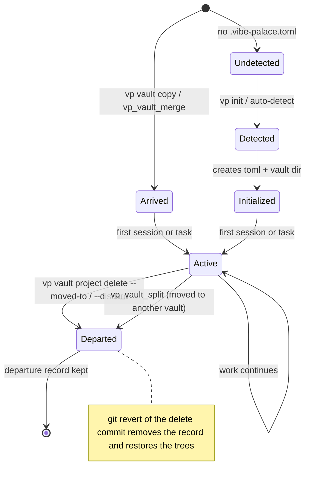
```mermaid
stateDiagram-v2
    [*] --> Undetected : no .vibe-palace.toml
    Undetected --> Detected : vp init / auto-detect
    Detected --> Initialized : creates toml + vault dir
    [*] --> Arrived : vp vault copy / vp_vault_merge
    Arrived --> Active : first session or task
    Initialized --> Active : first session or task
    Active --> Active : work continues
    Active --> Departed : vp vault project delete --moved-to / --discard
    Active --> Departed : vp_vault_split (moved to another vault)
    Departed --> [*] : departure record kept
    note right of Departed : git revert of the delete commit removes the record and restores the trees
```

**State notes:**
- **Detected:** Only `.vibe-palace.toml` is tracked in the source tree. Everything else is in the vault.
- **Arrived:** The project came from another vault rather than from `vp init`: copied
  (`vp vault copy <project>... --from <url>`) or merged (`vp_vault_merge`, MCP only).
  When that vault is not the host's default, the host reaches it through its own
  `[project_vaults]` binding (`vp config bind`, ADR-012). Another host reaches an arrived
  project with `vp vault clone <url> <path> --bind <project>...` (pull the default vault
  first, so it records the move) or `vp config bind`; that changes the host's binding, not
  the vault, and `vp vault clone` makes no commit, so it is not an arrival.
- **Active:** Semantic index live, KG updating, sessions captured. **[ADR-014 · v9.2.0]** Each
  host's search index must report its own coverage (§7.8).
- **Departed:** The project's trees are gone from this vault and a tracked departure record
  remains at `Audits/departures/<slug>.json` (`format: vp-departure/1`; kind
  `moved-to-vault` or `deleted`, and readers also honor `renamed`). Writes into a departed project are refused. Only
  `vp vault project delete` / `vp_vault_project_delete` and the purge step of
  `vp_vault_split` write departure records. A project cannot be copied back over its
  own departure record in v1, so Departed ends there unless a `git revert` of the delete
  commit, then a push, removes the record and restores the trees (ADR-013, Consequences). The supported way to remove a project is
  `vp vault project delete <project>... (--moved-to <url> | --discard)`, never `rm -rf`.
- A slug renamed with `vp migrate project-slug` leaves the vault with no departure record.
  `vp vault rename`, which would write a `renamed` record, is designed but not built
  (ADR-013, Open questions).
- There is no Dormant or Archived project state and no `vp unarchive`; `vp archive`
  archives session *transcripts* only (§3.2).

The decision record is
[ADR-013](adr/013-vault-project-lifecycle-and-departure-records.md); the user guide is
[VAULT-LIFECYCLE.md](VAULT-LIFECYCLE.md).

### 3.2 Session Lifecycle

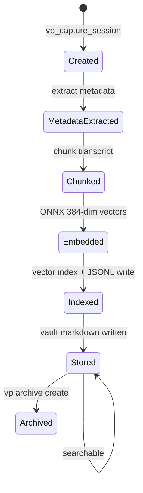
```mermaid
stateDiagram-v2
    [*] --> Created : vp_capture_session
    Created --> MetadataExtracted : extract metadata
    MetadataExtracted --> Chunked : chunk transcript
    Chunked --> Embedded : ONNX 384-dim vectors
    Embedded --> Indexed : vector index + JSONL write
    Indexed --> Stored : vault markdown written
    Stored --> Stored : searchable
    Stored --> Archived : vp archive create
```

**State notes:**
- **Created:** Model-agnostic input — summary, decisions, files, open threads. No Claude dependency.
- **Indexed:** Content is semantically searchable. "What did we decide about auth?" works.
  **[ADR-014 · v9.2.0]** Capture must not chunk or index the transcript. A session's transcript must
  reach the host-local index, never the vault, only once its archive exists, through the
  pending-archive ingester (§4.2; ADR-014 decision 7).
- **Archived:** The raw host transcript is archived under `Projects/<slug>/transcripts/` with a manifest (ADR-001); the session note itself is not compressed and stays searchable.

### 3.3 Task Lifecycle

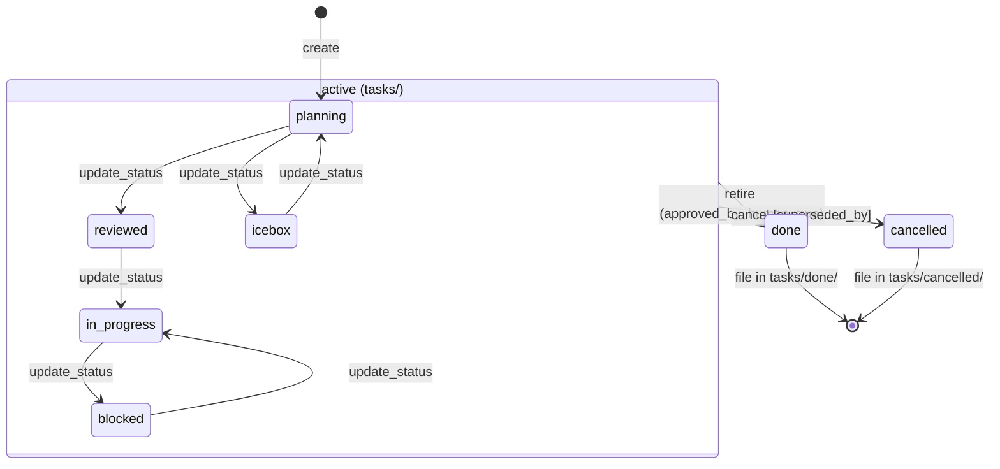
```mermaid
stateDiagram-v2
    [*] --> planning : create
    state "active (tasks/)" as Active {
        planning --> reviewed : update_status
        reviewed --> in_progress : update_status
        in_progress --> blocked : update_status
        blocked --> in_progress : update_status
        planning --> icebox : update_status
        icebox --> planning : update_status
    }
    Active --> done : retire (approved_by_human=true)
    Active --> cancelled : cancel [superseded_by]
    done --> [*] : file in tasks/done/
    cancelled --> [*] : file in tasks/cancelled/
```

**State notes:**
- **Active statuses** are `planning`, `reviewed`, `in_progress`, `blocked` and `icebox`
  (the `status` enum on `vp_manage_task`). `update_status` may set any of them; the
  arrows above are the usual path, not an enforced order. `icebox` means known but
  not scheduled: the file stays in `tasks/` and default listings hide it.
- **Terminal states** `done` and `cancelled` are reached only by moving the file
  (`retire` to `tasks/done/`, `cancel` to `tasks/cancelled/`); `update_status`
  cannot set them.
- **Retire** requires `approved_by_human=true` and does not append an iteration
  narrative; that is a separate `vp_append_iteration` call.
- Header schema and the data-format coupling:
  [ADR-011](adr/011-open-task-header-schema-and-format-axis.md).

### 3.4 Knowledge Graph Triple Lifecycle

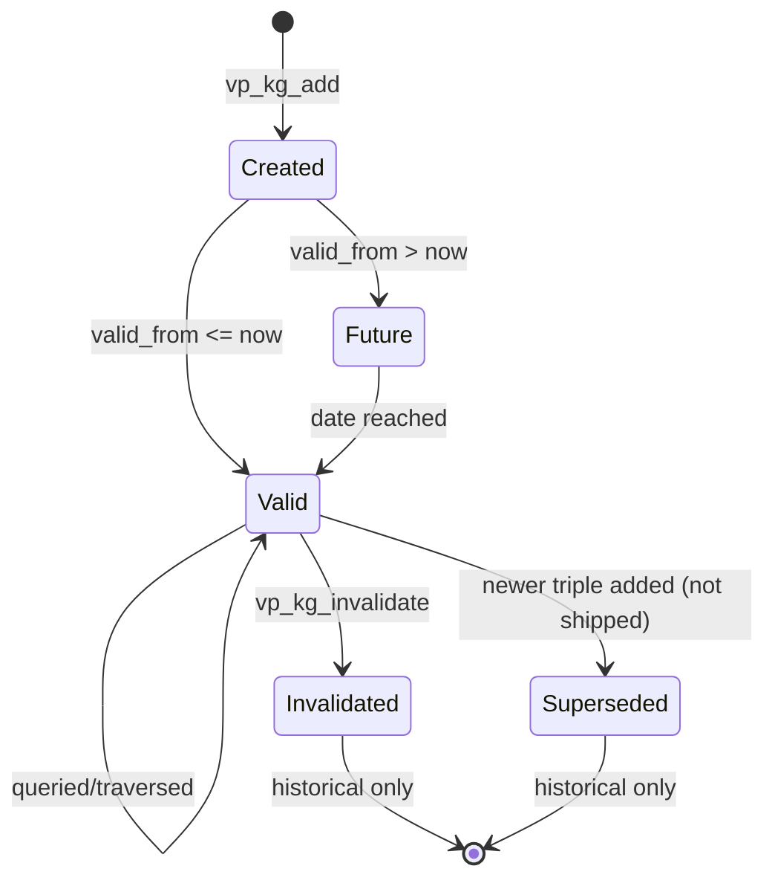
```mermaid
stateDiagram-v2
    [*] --> Created : vp_kg_add
    Created --> Valid : valid_from <= now
    Valid --> Valid : queried/traversed
    Valid --> Superseded : newer triple added (not shipped)
    Valid --> Invalidated : vp_kg_invalidate
    Created --> Future : valid_from > now
    Future --> Valid : date reached
    Invalidated --> [*] : historical only
    Superseded --> [*] : historical only
```

**State notes:**
- **Valid:** e.g. "Kai works_on Orion", valid_from=2025-06-01, valid_to=NULL.
- **Invalidated:** valid_to set (e.g. 2026-03-01). Still queryable via `as_of` parameter.
- **Superseded:** NOT SHIPPED. Adding a triple only rejects an exact duplicate; nothing auto-invalidates an older triple with the same subject+predicate. The only invalidation path is `vp_kg_invalidate`.

### 3.5 Context Template Lifecycle

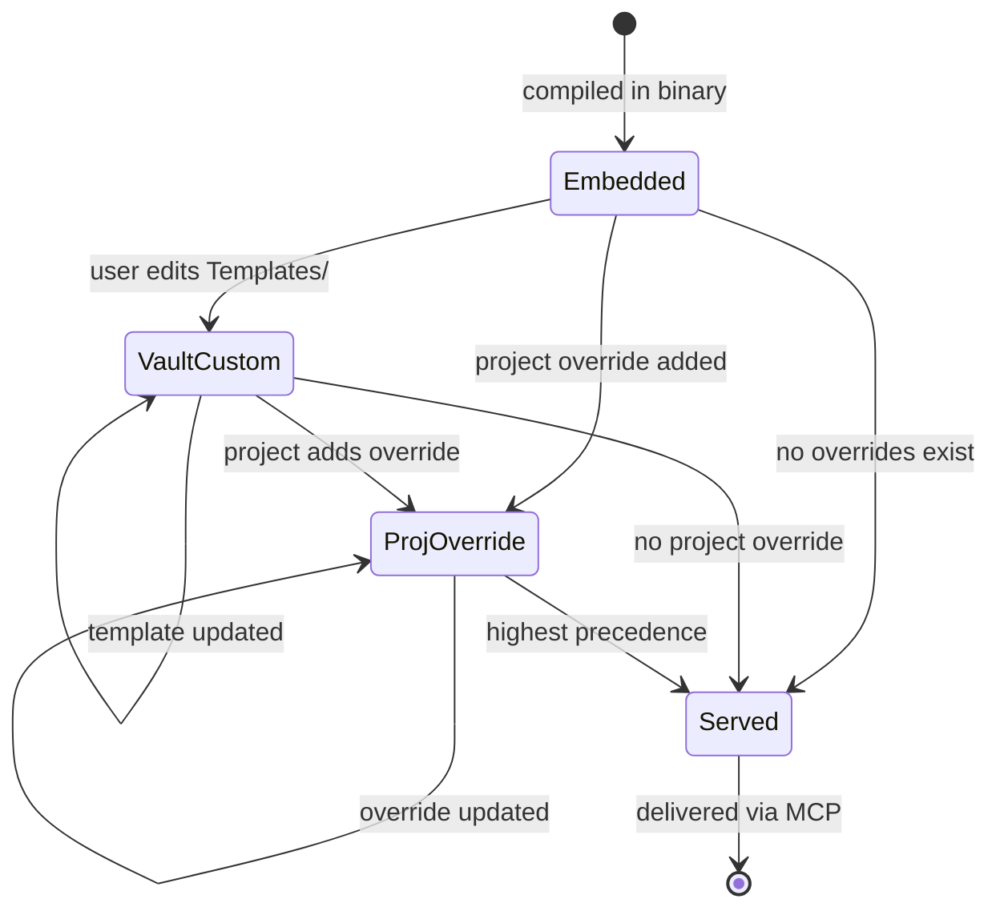
```mermaid
stateDiagram-v2
    [*] --> Embedded : compiled in binary
    Embedded --> VaultCustom : user edits Templates/
    Embedded --> ProjOverride : project override added
    VaultCustom --> ProjOverride : project adds override
    VaultCustom --> VaultCustom : template updated
    ProjOverride --> ProjOverride : override updated
    Embedded --> Served : no overrides exist
    VaultCustom --> Served : no project override
    ProjOverride --> Served : highest precedence
    Served --> [*] : delivered via MCP
```

**State notes:**
- **Embedded:** Default workflow.md, resume template, commands. Updated only on binary upgrade.
- **VaultCustom:** User's preferred defaults for all future projects. Git-managed in vault.
- **ProjOverride:** This project's specific rules. In vault, NOT in source tree.

---

## 4. Data Lifecycle

### 4.1 Context Injection Data Flow

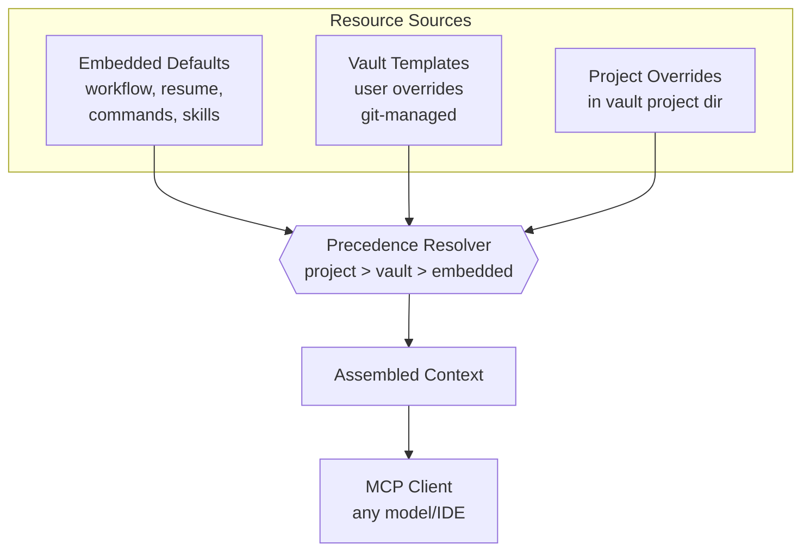
```mermaid
flowchart TD
    subgraph Sources ["Resource Sources"]
        direction TB
        E["Embedded Defaults<br/>workflow, resume,<br/>commands, skills"]
        V["Vault Templates<br/>user overrides<br/>git-managed"]
        P["Project Overrides<br/>in vault project dir"]
    end

    E --> PR
    V --> PR
    P --> PR

    PR{{"Precedence Resolver<br/>project > vault > embedded"}}
    PR --> CTX["Assembled Context"]
    CTX --> MCP["MCP Client<br/>any model/IDE"]
```

For each resource type (workflow, resume, commands, skills, config),
the resolver checks project override first, then vault template,
then embedded default. First match wins.

### 4.2 Session Data Lifecycle

**[ADR-014 · v9.2.0]** This section, diagram and prose, is target behaviour from end to end.
At `a32a2d4`, capture chunks and indexes the transcript text it is given, writes drawers to
tracked JSONL and extracted entities and triples to the tracked knowledge graph, and tidy
commits them. No pending-archive ingester exists, and `vp_kg_invalidate` only sets
`valid_to` on the triple file it finds.

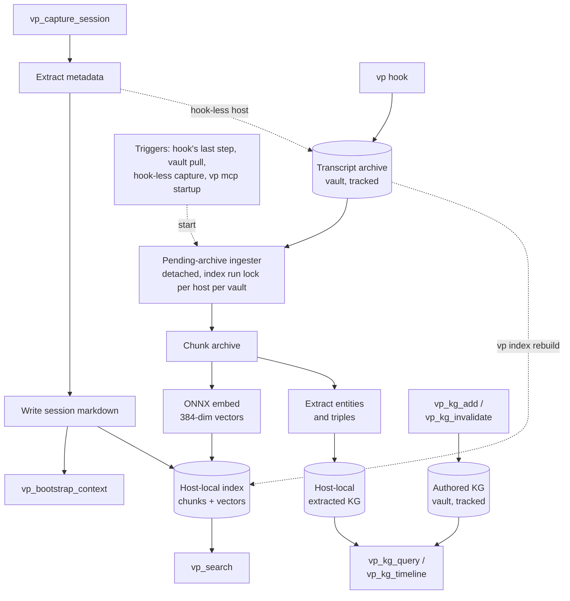
```mermaid
flowchart TD
    AI[vp_capture_session] --> META[Extract metadata]
    META --> NOTE[Write session markdown]
    META -. hook-less host .-> ARCH[(Transcript archive<br/>vault, tracked)]
    HOOK[vp hook] --> ARCH

    ARCH --> ING[Pending-archive ingester<br/>detached, index run lock per host per vault]
    TRIG[Triggers: hook's last step, vault pull,<br/>hook-less capture, vp mcp startup] -. start .-> ING
    ING --> CHUNK[Chunk archive]
    CHUNK --> EMBED[ONNX embed<br/>384-dim vectors]
    CHUNK --> KGX[Extract entities<br/>and triples]

    EMBED --> LIDX[(Host-local index<br/>chunks + vectors)]
    KGX --> LKG[(Host-local<br/>extracted KG)]
    ADD[vp_kg_add /<br/>vp_kg_invalidate] --> AKG[(Authored KG<br/>vault, tracked)]

    NOTE --> CTX[vp_bootstrap_context]
    NOTE --> LIDX
    ARCH -. vp index rebuild .-> LIDX
    LIDX --> SEARCH[vp_search]
    LKG --> KGQ[vp_kg_query /<br/>vp_kg_timeline]
    AKG --> KGQ
```

Capture must write only the session markdown into the vault, plus the transcript archive on
a host without a hook. It must not index the transcript text it is given: the index is built
from archives only.

**One pending-archive ingester** (ADR-014 decision 7) must run one idempotent, ledger-driven
pass over the archives that are **pending** on this host: the hook's SessionEnd and PreCompact
archives, archives pulled from other hosts, and inline archives from hook-less hosts. An
archive is pending when its session is absent from this host's ledger, **or** the ledger
records a different `source_sha256` for that session; a pending re-archive of a ledgered
session is a supersede (below). It must run whether or not the vault carries the migration
marker (§7.8).
- **Scope of an automatic run.** An automatic trigger must ingest every pending archive that
  is **not in the host's baseline set** (§7.8), newest first, within the per-run budget. No
  clock or date is involved, so clock skew, offline hosts and same-day archives cannot cause
  a skip. The baseline set is the historical backlog, which only an explicit
  `vp index rebuild` clears; while it is not empty, coverage reads `partial` and names it
  (ADR-014 decisions 2, 7, 8).
- **The per-run budget** must be counted in archives per run, with a wall-clock cap as a
  backstop. The repair pass (below) counts against the same budget. Both defaults are set by
  measurement in `pending-archive-ingester-and-per-archive-commit-step` (ADR-014 decision 7).
- **Arguments and project order.** The trigger must pass the vault root and the one project slug it
  resolved, and the hook and `vp_capture_session` also the `source_sha256` of the archive they just
  created (a pull, a clone and `vp mcp` startup name none): the hook, from its own vault resolution;
  a pull, from the vault it pulled. When `vp mcp` starts with no project it can resolve, it must
  pass the vault's first project in slug order; the run then reaches every other project with
  pending archives as usual. The ingester resolves nothing on its own. One run must process
  the triggering project first, then every other project of that vault with pending archives, within
  the budget.
- **Reading an archive.** The ingester must read the whole archive file, verify its hash
  against the manifest, and close it before embedding. It then never records one version's
  bytes under another's hash, and on Windows never holds the file open while the hook renames
  a newer archive into place. A hash mismatch counts as a failure for that archive (below).
- **Triggers.** Go code starts it, never an LLM, always as a detached process through
  `internal/detachlaunch`, and the trigger returns at once. *(shipped)* That package starts a
  new session with setsid on POSIX (`internal/detachlaunch/launch_unix.go:17`), sends the
  child's stdout and stderr to a log file (`internal/detachlaunch/launch.go:96-97`), and on
  Windows starts a new process group with job breakaway
  (`internal/detachlaunch/launch_windows.go:31`). When the job forbids breakaway, the fallback
  retry drops it (`internal/detachlaunch/launch.go:72-77`), and the child can then die with
  the job. The child's working directory must be set away from any checkout, and inherited
  descriptors, including any vault-lock descriptor, must be closed; `detachlaunch` sets no
  working directory at `a32a2d4`, so that part is new work for
  `capture-and-backfill-write-host-local-index-only`, which also owns the triggers below. The
  triggers must be:
  - the hook's last step, on every return path that ran the archive step;
  - every pull path that brings new archives: `storage.Pull`
    (`internal/storage/vaultpull.go:144`); the merge inside a commit-and-push
    (`internal/storage/vaultsync.go:863`) and its second caller, the mirror prune
    (`internal/storage/vaultsync_verify.go:251`); the push-rejection reconcile
    (`internal/storage/vaultsync.go:1373`) — both reconciles merge through
    `mergeFetchedTip` (`internal/storage/vaultsync.go:1260`); and the fast-forward merge in a resumed
    `vp vault clone` (`internal/storage/vault_clone.go:531`);
  - `vp_capture_session` after it creates an archive on a hook-less host;
  - `vp mcp` startup, as a backstop for a spawn the host killed, so an archive is ingested by
    the next session start or pull at the latest, if it is outside the baseline set and
    within that run's budget.
- **The hook never embeds.** The host kills the hook at 30 s (`HookTimeout`,
  `internal/hook/settings.go:20`), so the hook's last step must only spawn the ingester and
  return.
- **Two locks** (ADR-014 decision 7), both `internal/vaultlock` locks on a named file, flock on
  POSIX and `LockFileEx` on Windows. At `a32a2d4` only `TryAcquireFile`
  (`internal/vaultlock/vaultlock.go:157`) locks a named path; `AcquireWithTimeout` (`:184`) locks a
  hashed sidecar under `.vp-locks/` (`:215-237`) and cannot be used.
  `host-local-index-store-ledger-and-fingerprint`, which owns both locks and the holder record,
  must add the timed form on a named path, `vaultlock.AcquireFileWithTimeout(lockPath, timeout)`:
  `AcquireWithTimeout`'s poll loop over `TryAcquireFile`'s named-file open, returning
  `ErrLockWaitTimeout` (`:44`) at the deadline, and a context form, `AcquireFileContext`, for the
  ingester and the rebuild. The caller creates the directory. The locks live under the host-local
  `palace/.local/locks/` of the vault they guard, never inside `index/{project}/`, which a discard
  deletes. Both are therefore per host, per vault. The OS releases a lock when its holder dies; on
  Windows, possibly only after the system frees the handle:
  - an **index run lock**, one per host per vault and non-blocking, held for a whole ingest run or a
    whole `vp index rebuild` run. A second ingest trigger that finds it held exits at once;
    `vp index rebuild` also exits at once, with a message naming the holder. After acquiring the
    lock, the holder must write `palace/.local/locks/index-run.holder` (pid, kind, project and start
    time; the kind is ingest, rebuild or lifecycle), and remove it just before it releases the
    lock. The record is advisory, because a kill or a pid reuse can leave it stale; a failed
    try-lock reads it to name the holder. A status probe (`vp index status`, `vp_index_status` and
    bootstrap's coverage) must never take the run lock: it reads the holder record and reports a
    run in progress only while the pid it names is alive, because a try-lock would hold the run
    lock for a moment and a trigger colliding with it would exit and be lost. `vp_refresh_index`
    must check the run lock before it spawns the way a status probe does: it reads the holder
    record and checks that the pid it names is alive, never taking the lock, and returns a refusal
    to its caller if a run is in progress. A stale record can let a spawn through; the spawned
    rebuild then takes the lock itself, or exits naming the holder. Holding the lock bounds
    embedding to one process, and one loaded model, per vault on the host. Before releasing it, the
    holder must rescan for archives that arrived during the run; after releasing it, the holder
    must check once more for pending archives that its last rescan did not see and, only if one
    exists, try the lock again, so no trigger is lost; an archive left over by the budget, or a
    failing one, waits for the next trigger;
  - an **index commit lock**, one per project per vault per host, short and blocking, held
    only to write already-computed data. Every one of these is a commit step under it: one
    archive's commit step (vectors, chunks, KG records, ledger entry); one supersede step; a
    discard; a reaper pass, and the sweep, departed-project cleanup and split purge of
    `index/{project}/`; a `completeness.json` write, including the `stale` flag; an
    embed-cache write (the notes embed, the glide-path lazy embed and the fingerprint
    sidecar); a torn-line truncation; a decision-chunk write; the palace relabel by
    `vp audit rooms --apply`; one mempalace import batch; a baseline-set addition by copy,
    merge or import (§7.8); and **[ADR-014 · HNSW]** writing or deleting `hnsw.idx`, which
    lives inside `index/{project}/` and so needs the same protection from a concurrent
    discard.

  Embedding must always happen outside the index commit lock. The index commit lock is a
  leaf: no process holds two at once. The index run lock is taken before an index commit
  lock, never the reverse. Searches, the MCP server and the note-time writers must take only
  the index commit lock, with a timeout (`AcquireFileWithTimeout`), and only for their own
  writes: the `stale` flag, the notes embed, the glide-path lazy embed, and the decision
  chunks that capture, the hook and the enrichment drain write. They embed outside the lock
  and commit in batches; on a timeout the caller skips its own write, and a skipped
  decision-chunk write is restored by the next notes-tier build or rebuild. None of them
  waits on the index run lock, so a long ingest never stalls a search or a capture.
- **When a run ends.** A run must end when its budget (archive count or wall-clock cap) is spent, or
  when a rescan finds no pending archive that this run has not already attempted. A failure is
  non-fatal: the ingester logs a warning to `vp.log`, records a failure count for that archive's
  `source_sha256` in the ledger, and moves on. A failure record is not an ingest: it never makes a
  session ledgered for visibility, pending or coverage. A failing archive is retried by the next
  run, never by the same one, and automatic runs skip an archive after N failures (N set by
  `pending-archive-ingester-and-per-archive-commit-step`) until an explicit rebuild. The index run
  lock is therefore never held indefinitely.
- **Durable and resumable.** The ingester must read, chunk, classify, extract and embed outside any
  lock, and take the index commit lock only to write. For each archive it must write, in this order,
  each step durable before the next: the vectors, each atomically (temp file, fsync, rename); then
  the chunks, appended and fsynced; then the local KG records, appended and fsynced; then the ledger
  entry, which records the archive's `source_sha256` and its chunk count (the number of distinct
  chunk ids the archive owns). A killed run therefore leaves that archive out of the ledger, and the
  next run resumes it; chunks are deduplicated by id, so a resumed run leaves no duplicates. Search
  must load only chunks, and KG readers only KG records, whose source is in the ledger: an archive,
  or an import batch. A mempalace import has no archive, so the importer must ledger each batch
  under its import batch id with its chunk count, and the batch's chunks and KG records record that
  id as their owner. A batch's start day is the earliest drawer `filed_at` in the export, else
  `2000-01-01`, and the ledger's batch record marks it `start_day_source: "import"`. A batch id
  never equals a session id: the store must refuse to commit a batch whose id does. A batch is not
  a session: coverage's session counts ignore it, and the repair pass re-embeds its missing vectors
  but only reports a chunk-count shortfall, which only re-running the import restores. Decision
  chunks belong to the notes tier: each is owned by its session note, never by an archive or a
  batch, and is visible whenever its note is. A miss on a chunk whose source is not yet ledgered
  never sets `stale`; a resumed run deduplicates the KG records it rewrites. Within the per-run
  budget the ingester must repair ledgered archives: it re-embeds missing vectors, and it
  re-ingests an archive whose ledgered chunk count exceeds the number of chunks that record it as
  an owner. A writer must truncate a torn trailing JSONL line, under the index commit lock, before
  it appends.
- **Re-archived sessions.** A newer archive of the same session must supersede the older one by
  chunk ownership, not deletion by id: each chunk, and each KG record, records the archives that own
  it, keyed by each archive's `source_sha256`, never by its path, because a chunk id is a content
  hash (§7.3) and identical content in two sessions shares one chunk. A chunk, or a KG record, is
  deleted only when no archive owns it any more. The ledger is keyed by session, and records the
  live archive and a generation number. A supersede must run as commit steps under the index commit
  lock, in this order: mark the session's ledger entry as superseding; add the newer archive's
  vectors, chunks, KG records and ownership, then remove the older archive's ownership, deleting
  every chunk and KG record that no archive owns any more, each file rewritten atomically; record
  the new live archive and bump the generation. A crash then leaves the session pending, never "done
  with half its chunks", and readers detect the rewrite through the generation. A supersede that
  races an ingest of the older archive in another run waits for the index commit lock and re-checks
  ownership there. An older archive met after the newer one is recorded as superseded and never
  ingested.
- **Not on a fingerprint-stale project.** The ingester must not run on a project that is
  `stale` for a fingerprint reason; only `vp index rebuild` discards, and only what the
  mismatched fingerprint covers, and clears that (§7.8; ADR-014 decision 3).

Routine index work must never depend on an LLM. `vp_kg_add` writes authored facts;
`vp_kg_invalidate` must write an authored overlay for an extracted triple, or set
`valid_to` in place on an authored one. The search index and the extracted graph must be
derived per host, and must be rebuildable from the vault's archives at any time with
`vp index rebuild`, which stays the explicit full path. `vp_refresh_index`, its MCP twin,
must check the index run lock through the holder record, never taking the lock, then start
that rebuild detached through the same launcher and return at once, or return a refusal when
the holder record names a live run.

The v9.2.0 release notes must cover every contract change (ADR-014 decision 10):
- a search of a truly empty project is an error, and cross-project search skips truly empty
  projects;
- `filed_at` becomes the session date, so date filters move;
- content without a tracked archive leaves search: 23,632 transcript drawers and 41,364
  extracted triples, recoverable at the `pre-authored-only-<date>` tag;
- `vp_palace_backfill_decisions` is removed;
- `vp_capture_session` no longer indexes its `transcript` text;
- `vp_refresh_index` starts the rebuild detached and returns at once, or returns a refusal
  when the index run lock is held;
- the new `vp index` command (`rebuild`, `status`) and the read-only `vp_index_status` tool;
- `index_coverage` in bootstrap, with its seven states in order (§7.8);
- the baseline set, the historical backlog it holds, and the per-host `vp index rebuild` that
  clears it;
- the per-run budget, and the skip of an archive after N failures until a rebuild;
- background embedding after SessionEnd by the detached ingester, and the `vp mcp` startup
  backstop;
- `palace-store-drawers` is skipped on a migrated vault, and `kg-tracked-extracted` reports;
- `vp_list_projects` drift gains a row for each project whose `palace/<p>/` held only derived
  files: 12 in the live vault;
- `vp audit rooms --apply` relabels the local store on a migrated vault and refuses on an
  unmigrated one, and the next rebuild undoes a relabel;
- `vp migrate mempalace` requires `--project` naming an existing project; its import is
  single-host, and is discarded by the first rebuild after a `chunks.fingerprint` change;
- `vp_vault_split`, `vp_vault_merge` and `vp vault copy` refuse an unmigrated destination, and an
  unmarked source into a marked destination;
- surface 9 is mandatory and forward-only: a rollback restores the data, not the old
  binaries.

### 4.3 Search Data Flow

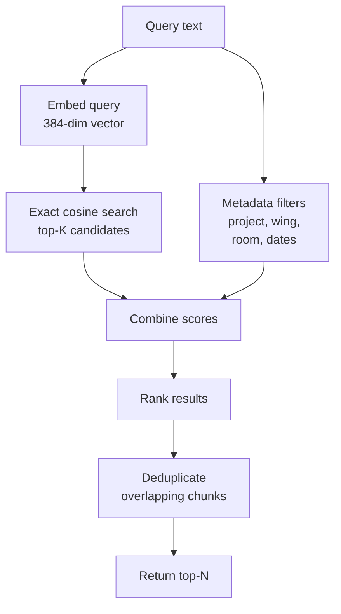
```mermaid
flowchart TD
    Q["Query text"]
    Q --> EMB["Embed query<br/>384-dim vector"]
    Q --> FILT["Metadata filters<br/>project, wing,<br/>room, dates"]

    EMB --> VSRCH["Exact cosine search<br/>top-K candidates"]

    VSRCH --> SCORE["Combine scores"]
    FILT --> SCORE

    SCORE --> RANK["Rank results"]
    RANK --> DEDUP["Deduplicate<br/>overlapping chunks"]
    DEDUP --> OUT["Return top-N"]
```

**Structural boosts (shipped):** each filter that matches multiplies the score by `1 + boost` — wing 0.12, hall 0.24, room 0.34 by default — and matches stack multiplicatively. The values come from the `[search]` config section (`structural_boost_*`) and were not empirically tuned.
Results include verbatim text, source, wing/room/hall, date, score.

At `a32a2d4`, a search that finds nothing returns an empty list, whatever the
reason. A date filter matches each chunk's `filed_at` day. For a transcript chunk that is
the day it was indexed; decision chunks already carry their session note's day
(`internal/capture/decisions.go:157`); iteration chunks carry no date.

**[ADR-014 · v9.2.0]** A search of a project with nothing to search — no session notes, no
iterations, no tracked transcript archives, no local chunks and, on a vault without the
migration marker, no tracked drawers — must be an error naming
`vp index rebuild`. A non-empty project with no hits must still return an empty
list. An incomplete index must still answer, and bootstrap's `index_coverage` must
say how complete it was (§7.8). A date filter over transcript and decision chunks must
match the session date, the UTC day of the session's start, not the date the chunk was
indexed (§7.3; ADR-014 decision 4). **[ADR-014 · HNSW]** For a
project at or above the measured size threshold, the candidate search must be an HNSW cosine
search; below it, brute force. Each project uses exactly one index (ADR-014 decision 6).

---

## 5. Session Lifecycle Flowchart

### 5.1 Full Session Flow

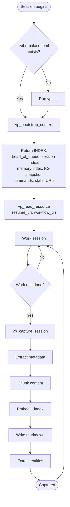
```mermaid
flowchart TD
    START([Session begins])
    START --> DETECT{".vibe-palace.toml<br/>exists?"}
    DETECT -->|No| INIT["Run vp init"]
    DETECT -->|Yes| BOOT["vp_bootstrap_context"]
    INIT --> BOOT

    BOOT --> IDX["Return INDEX:<br/>head_of_queue, session index,<br/>memory index, KG snapshot,<br/>commands, skills, URIs"]
    IDX --> FETCH["vp_read_resource<br/>resume_uri, workflow_uri"]
    FETCH --> WORK["Work session"]
    WORK --> END{"Work unit done?"}
    END -->|No| WORK
    END -->|Yes| CAP["vp_capture_session"]

    CAP --> META["Extract metadata"]
    META --> CHUNK["Chunk content"]
    CHUNK --> EMBED["Embed + index"]
    EMBED --> VAULT["Write markdown"]
    VAULT --> KG["Extract entities"]
    KG --> DONE([Captured])
    DONE --> WORK
```

### 5.2 Context Bootstrap Subflow

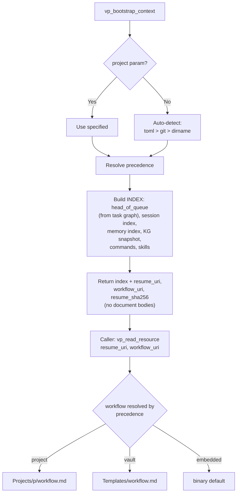
```mermaid
flowchart TD
    CALL["vp_bootstrap_context"]
    CALL --> DET{"project param?"}
    DET -->|Yes| USE["Use specified"]
    DET -->|No| AUTO["Auto-detect:<br/>toml > git > dirname"]
    USE --> RES["Resolve precedence"]
    AUTO --> RES

    RES --> IDX["Build INDEX: head_of_queue<br/>(from task graph), session index,<br/>memory index, KG snapshot,<br/>commands, skills"]
    IDX --> OUT["Return index + resume_uri,<br/>workflow_uri, resume_sha256<br/>(no document bodies)"]
    OUT --> RR["Caller: vp_read_resource<br/>resume_uri, workflow_uri"]
    RR --> WF{"workflow resolved by<br/>precedence"}
    WF -->|project| WFP["Projects/p/workflow.md"]
    WF -->|vault| WFV["Templates/workflow.md"]
    WF -->|embedded| WFE["binary default"]
```

`vp_bootstrap_context` returns an INDEX, never document bodies (§1.9). The resume
and workflow are fetched by the caller with `vp_read_resource` via `resume_uri` and
`workflow_uri`; `resume_sha256` covers the full raw resume for compare-and-set.

### 5.3 Semantic Search Subflow

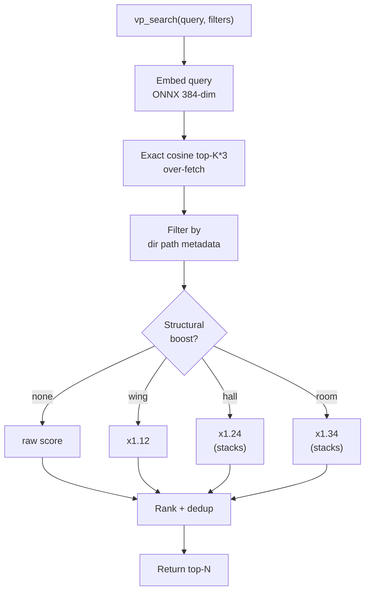
```mermaid
flowchart TD
    Q["vp_search(query, filters)"]
    Q --> EMB["Embed query<br/>ONNX 384-dim"]
    EMB --> VSRCH["Exact cosine top-K*3<br/>over-fetch"]
    VSRCH --> FILT2["Filter by<br/>dir path metadata"]
    FILT2 --> BOOST{"Structural<br/>boost?"}
    BOOST -->|wing| B1["x1.12"]
    BOOST -->|hall| B2["x1.24<br/>(stacks)"]
    BOOST -->|room| B3["x1.34<br/>(stacks)"]
    BOOST -->|none| B0["raw score"]
    B0 --> RANK["Rank + dedup"]
    B1 --> RANK
    B2 --> RANK
    B3 --> RANK
    RANK --> OUT["Return top-N"]
```

**[ADR-014 · v9.2.0]** Before embedding the query, search must check that the project has something
to search (§4.3) and must return an error naming `vp index rebuild` when it does not. **[ADR-014 ·
HNSW]** For a project at or above the measured size threshold, the over-fetch must be an HNSW
search; below it, brute force.

### 5.4 Task Management Subflow

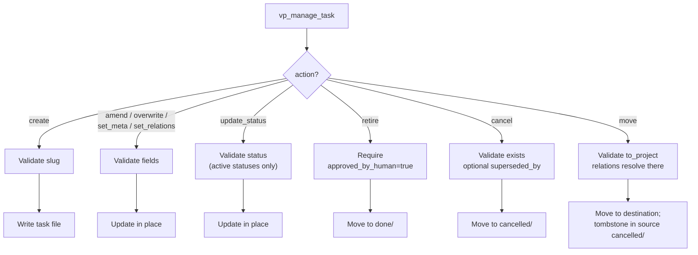
```mermaid
flowchart TD
    A["vp_manage_task"] --> S{"action?"}

    S -->|create| C["Validate slug"]
    C --> CW["Write task file"]

    S -->|"amend / overwrite /<br/>set_meta / set_relations"| E["Validate fields"]
    E --> EW["Update in place"]

    S -->|update_status| U["Validate status<br/>(active statuses only)"]
    U --> UW["Update in place"]

    S -->|retire| R["Require<br/>approved_by_human=true"]
    R --> RM["Move to done/"]

    S -->|cancel| X["Validate exists<br/>optional superseded_by"]
    X --> XM["Move to cancelled/"]

    S -->|move| M["Validate to_project<br/>relations resolve there"]
    M --> MM["Move to destination;<br/>tombstone in source cancelled/"]
```

The `action` enum is `create`, `amend`, `overwrite`, `set_meta`, `update_status`,
`set_relations`, `retire`, `cancel` and `move`. No action appends an iteration.

---

## 6. MCP Tool Surface

**The groupings below are the design. The surface itself is DERIVED — this
document does not enumerate it.**

```sh
jq -r '.tools[].name' internal/mcp/tool_surface.golden.json   # the surface
vp_manual                                                     # per-tool detail
```

The golden is generated from the live registry and `internal/tools/register_test.go`
enforces the pair, so it cannot drift from what ships. A table here can, and did:
when this section was measured at the 2026-08-15 split it named 59 tools against
a shipped 69, and the enumerations were kept anyway. The counters went with the
tables. **This is §1.11 applied to this document** — the registry enforces
itself, so the prose that restated it was not a second control, only a second
answer.

Read the subsections for what each GROUP is for and why the boundaries fall
where they do. That is the part a generated file cannot tell you.

### 6.1 Context Tools (from VibeVault, enhanced)

Session-start restoration and precedence-resolved reads: what is true for this
project right now. **Precedence is the group's boundary** — every read here
resolves through the §1.3 hierarchy (project > vault > embedded), so a caller
never has to know which tier answered. §1.9 governs the shape: session start
returns an INDEX plus what is relevant to the work ahead, and bulk bodies are
fetched by URI on demand rather than pushed.

### 6.2 Session Tools (from VibeVault, model-agnostic)

Recording and querying the session history — captures, iteration narratives,
per-project rollups, and the friction and effectiveness instruments derived from
them. Carried over from VibeVault and generalized so that any MCP host can
record a session, not only the one whose hook format the capture path grew up
in; that generalization is what §1.5 asks for, and host parity is measured
against it rather than assumed.

### 6.3 Search Tools (from MemPalace, new)

Retrieval across stored content, semantic and structural. Cross-project read
access (§1.4) lives here — it is the one place the project scope is
deliberately widened, and it is read-only. **[ADR-014 · v9.2.0]** Search must read only
the host's own index. An answer drawn from an incomplete index is still an answer,
and the coverage instrument must say how complete it was; a project with nothing to
search must be an error, never `[]`. Cross-project search must skip such projects,
reporting them through the coverage instrument, rather than fail as a whole.

### 6.4 Task Tools (from VibeVault)

The task graph: the vault's record of planned, active, and retired work, and the
source `head_of_queue` is derived from. **Mutation is one tool with an action
enum, not a family of verbs**, because each header field has exactly one writer;
where two actions can write one field, a reader and a writer eventually disagree
about which value is real. The doctrine's Task Management section owns that
table and the rules that go with it.

### 6.5 Knowledge Graph Tools (from MemPalace, new)

Temporal triples — subject/predicate/object facts carrying validity intervals,
so a fact can end without being erased. Separate from search because a KG answer
is derived from explicit assertions and their timestamps, never from similarity:
the two groups answer different questions and must not be reconciled into one.

**[ADR-014 · v9.2.0]** Records must come in two origins. **Authored** facts (`vp_kg_add`, and
`vp_kg_invalidate`'s overlays) stay tracked in the vault. **Extracted** triples, which the
index derives from transcript archives, must be compiled per host like the search index. A
query must answer from both; where a tracked
record and a local one share a key, the tracked one wins (ADR-014 decision 5).

### 6.6 Palace Navigation Tools (from MemPalace, new)

The spatial metaphor over stored content — wings, rooms, drawers, and the
tunnels between them. Read-only structural traversal. **[ADR-014 · v9.2.0]** Navigation must
read classification metadata from the host's index. A rebuild re-runs the
classifier, so a room assignment made by `vp audit rooms --apply` survives only
until the next rebuild (ADR-014 decision 9). The boundary against
search is that **navigation follows declared structure while search ranks**; a
traversal returns what is actually connected, not what is merely similar.

### 6.7 System Tools

The binary and the vault as artifacts rather than as content: initialization,
git sync and status, health, diagnostics, index maintenance (**[ADR-014 · v9.2.0]** the
explicit `vp index rebuild` and `vp index status`), and the surface
compatibility preflight. These are the tools a command template runs before it
trusts anything else.

### 6.8 Vault File CRUD Tools (write/wrap surface)

Generic, schema-agnostic file access over vault-relative paths. This group
exists to close the MCP-First gap (§1.1): an agent completes an entire wrap
without shelling out to a filesystem, on a host that has no shell at all. Paths
are always vault-relative and the server resolves them — a caller never computes
one.

Raw write bypasses schema validation, so it is the fallback and never the
default: typed writers first (tasks, iteration narratives, commit ingest,
memory), raw write only for files that have no typed writer. Task paths are
refused outright at the `vaultfs` layer rather than in the MCP tool, so the CLI
is covered by the same guard — a guard only an agent can trip is not a guard.

### 6.9 Commit Lifecycle Tools

Moving a commit message out of the project repo and into the vault's permanent
history. A group of one, kept separate because it is the only surface that
**crosses the boundary between the project's git repo and the vault** — the two
have different lifetimes, different remotes, and can be written by different
identities.

### 6.10 Resume Surgical-Edit Tools — REMOVED

> **Withdrawn.**

Six typed editors for `resume.md`'s `## Open Threads` and `### Carried forward`
sections (`vp_thread_insert`/`_replace`/`_remove`,
`vp_carried_add`/`_remove`/`_promote_to_task`) were implemented and have since
been **deleted**. No command template ever named them, so no agent could reach
them; and `vp_thread_insert` with `position: "top"` against a bullet-shaped
`## Open Threads` silently reparented the whole section body under a new
`### slug` block, which a later `vp_thread_remove` would then delete wholesale —
a two-call silent data-loss path. Structure-aware resume editing, if it returns,
needs a design that cannot corrupt a section it failed to parse.

Edit `resume.md` through `vp_update_resume` (compare-and-set on
`expected_sha256`) or `vp_vault_edit`.

### 6.11 Wrap-State Tools

Wrap readiness and bookkeeping driven from anchors under `.vibe-palace/` (see
ADR 002 and its 2026-08-29 amendment): which iteration this is, what changed
since the last anchor, and whether the preconditions for a wrap hold. The group
exists so that a wrap's readiness is **derived from a recorded stamp rather than
recalled by the agent running it**.

The anchors are **host-local and never committed** — `.vibe-palace/` is
gitignored, shared with the capture sentinels and the ADR-005 enrichment queue.
The reference point is the `anchor_sha` the stamp records, not a commit that
touched a tracked file.

### 6.12 Learnings Tools (cross-project, read-only)

Vault-wide cross-project "learnings" — curated lessons stored as
flat-frontmatter markdown under `Knowledge/learnings/`, shared across every
project rather than project-scoped. Ported from VibeVault, and **read-only by
design**: learnings are authored out-of-band, so there is no create path here.

### 6.13 Vault Lifecycle Tools

Moving whole projects into, out of, and between vaults, and binding a host to the
vault a project lives in: `vp_vault_copy`, `vp_vault_project_delete`,
`vp_vault_split`, `vp_vault_merge` and `vp_config_bind`. `vp_vault_copy` and
`vp_vault_project_delete` exist so that a project's arrival and departure are each one
recorded, published change rather than file operations an agent composes (ADR-013):
every departure made by these tools (and by `vp_vault_split`'s purge) leaves a tracked
record under `Audits/departures/`, and writes into a departed project are refused.
`vp_vault_split` and `vp_vault_merge` are the older pair: multi-step
plan/apply/verify(/purge) calls that write another vault by host path; whether copy +
delete supersedes them is undecided (ADR-013, Open questions). The first two
and `vp_config_bind` have CLI twins (`vp vault copy`, `vp vault project delete`,
`vp config bind`); `vp_vault_split` and `vp_vault_merge` have no CLI verb. See
[ADR-013](adr/013-vault-project-lifecycle-and-departure-records.md) for the decision
and [VAULT-LIFECYCLE.md](VAULT-LIFECYCLE.md) for the copy / delete / bind / clone procedures.

---

## 7. Storage Schema

### 7.1 Design Philosophy: Filesystem-Native, Git-Mergeable

Vibe-Palace stores all persistent data as human-readable files organized by
project-first directory structure. There is no database. The filesystem layout
**is** the schema — directory paths encode the relationships that a database
would express with tables and indexes.

**Why not SQLite:**
- SQLite is a binary blob that git cannot diff, blame, or three-way merge
- Multi-machine sync requires conflict-free replication or last-write-wins —
  neither is acceptable for knowledge data
- Half the proposed tables would duplicate data that already exists as files
  (sessions, tasks, config)
- The actual query workload (metadata filtering on small datasets, semantic
  search over a vector index each host builds) does not require a database engine
- Human readability matters — `cat`, `grep`, `jq` should work on all stored data

**What git taught us:** Git manages billions of objects across millions of
repositories using nothing but POSIX filesystem semantics and hash references.
What it handles badly is the derived bulk a search index needs. At `a32a2d4` capture
tracks every transcript chunk as a drawer and every extracted triple as a file, and
tidy commits them. One transcript backfill on a copy of a real vault wrote room
files of 223 MiB, and a full backfill projected millions of triple files.

**[ADR-014 · v9.2.0]** **The vault is the source; the index is the compiled binary.** The vault
must keep what people and agents author, and nothing it can recompute. Its authored
artifacts — session notes, iterations, transcripts and authored facts — are the source
code of a project's knowledge. Each host must compile them
into its search index (§7.8), which must be:
- **Derived** — rebuilt from tracked artifacts + the ONNX model
- **Host-local** — under the ignored `palace/.local/`, never committed
- **Fingerprinted** — a recipe change discards and rebuilds it; the vault never changes

### 7.2 Vault Directory Layout

**[ADR-014 · v9.2.0]** The `palace/` part of this tree is the target layout. At `a32a2d4` every room
under `drawers/` is tracked (`palace/{project}/drawers/{wing}/{room}/drawers.jsonl`),
`kg/` also holds extracted entities and triples, and `palace/.local/index/` does not
exist. `iteration-summaries/`, `.surface` and the `.vibe-palace/` files are tracked today
as shown.

```
vault/
├── palace/
│   ├── {project}/                     ← project-first for human navigation
│   │   ├── kg/
│   │   │   ├── entities.jsonl         ← authored entities
│   │   │   └── triples/
│   │   │       └── {subj}--{pred}--{obj}.json  ← authored triples (§7.4)
│   │   │
│   │   ├── iteration-summaries/       ← LLM summaries; derived but tracked
│   │   ├── .surface                   ← writer surface stamp (ADR-010)
│   │   └── .local/                    ← machine-local, untracked but NOT ignored (below)
│   │       └── imported-sessions.jsonl ← vibe-vault migration ledger
│   │
│   └── .local/                        ← vault-wide, gitignored
│       ├── index/{project}/           ← compiled search index (§7.8)
│       ├── index/.generation/{project} ← [v9.2.0] the store's change counter (§7.8)
│       ├── embed-cache/               ← per-chunk vectors
│       │   └── {project}/{chunk-id}.vec
│       ├── models/                    ← downloaded ONNX model (§1.6)
│       ├── locks/                     ← [v9.2.0] index run and commit locks, index-run.holder
│       └── vp.log                     ← log file
│
├── Projects/                          ← unchanged from VibeVault
│   └── {project}/
│       ├── resume.md
│       ├── workflow.md                (project override, optional)
│       ├── iterations.md
│       ├── commit-log.md, commit-log.anchor
│       ├── tasks/
│       │   ├── {slug}.md
│       │   ├── done/
│       │   └── cancelled/
│       ├── commands/                  (project-level commands)
│       │   ├── {name}.md             (project scope)
│       │   └── {wing}/
│       │       ├── .wing/{name}.md   (wing scope)
│       │       └── {room}/{name}.md  (room scope)
│       ├── skills/                    (project-level skills)
│       │   └── (same layout as commands/)
│       ├── sessions/
│       │   └── YYYY-MM-DD-<writer>-NN.md  (legacy: YYYY-MM-DD-NN.md)
│       ├── transcripts/               (archived raw transcripts, ADR-001)
│       ├── memory/                    (MCP-native memory, ADR-004)
│       └── knowledge.md
│
├── Templates/                         (vault-level template overrides)
│   ├── workflow.md
│   ├── resume.md
│   ├── commands/
│   └── skills/
│
├── Knowledge/
│   └── learnings/                     (cross-project learnings, §6.12)
│
├── Audits/                            (vault audit reports, baseline.json)
│   └── departures/{slug}.json         (departure records, §3.1)
│
├── .vibe-palace/
│   ├── vault.toml                     (vault manifest: data format; [v9.2.0] migration marker)
│   └── remotes.toml                   (published remotes)
├── .vp-locks/                         (advisory lock sidecars, machine-local)
└── .git/                              (vault git repo)
```

The retired `Projects/{project}/config.toml` (§7.7) and a cross-project index file
are not part of the layout. The per-project `palace/{project}/.local/` is not gitignored:
at `a32a2d4` the canonical vault set ignores only the vault-wide `palace/.local/`
(`internal/storage/git.go:28-45`), so the vibe-vault ledger under it shows as untracked.

**Key design decisions:**

- **Project-first under `palace/`:** `ls palace/` shows all projects, and one
  project's palace data sits under one directory with no orphans across sibling
  directories. Remove a project with `vp vault project delete <project>...
  (--moved-to <url> | --discard)`, which also writes its departure record (§3.1);
  do not `rm -rf` it.

- **`palace/` is separate from `Projects/`:** Palace data (drawers, KG) is
  structured for machine consumption. Project context (sessions, tasks,
  iterations) is structured for human + AI consumption. They coexist in the
  same git-managed vault but serve different purposes. **[ADR-014 · v9.2.0]** What stays
  tracked under `palace/` must be authored knowledge-graph facts, iteration
  summaries and surface stamps; search chunks and extracted triples must be
  compiled per host under `palace/.local/` (§7.8).

- **No tracked `.claude/` directory, no symlinks, no tracked command/skill files in
  the source tree.** Commands and skills are served via MCP tools (canonical:
  `vp_cmd`, `vp_skill`; read-only siblings: `vp_get_command`, `vp_get_skill`). The
  untracked, gitignored shims `vp init` writes (§1.1) only call those tools.

### 7.3 Search Chunks (Host-Local)

> **Design-era detail — the code is authoritative.** §7.3–7.11 began as the April 2026 storage design; §7.5 and §7.7 are updated to v8.2.0. Which sections of this PRD ADR-014 supersedes is stated once, completely, in ADR-014's "What this ADR supersedes in the PRD"; the sections it names carry its target behaviour here, tagged as in the preamble. Elsewhere, where they disagree with `internal/storage/` (paths in `paths.go`), the code wins.

**[ADR-014 · v9.2.0]** This section is target behaviour from end to end. **At `a32a2d4`**, a drawer
is a tracked JSONL line in `palace/{project}/drawers/{wing}/{room}/drawers.jsonl`, one file per
room; capture appends every transcript chunk there, and the search index is rebuilt from those
files.

A **drawer** is one verbatim text chunk in a host's search index: the unit a search
returns. Drawers must be **compiled**, not stored: each host must derive them from the
vault's tracked artifacts (§7.8) and keep them under the ignored `palace/.local/`. On a
migrated vault no drawer is tracked; a vault without the migration marker keeps its tracked
drawers as the glide path (§7.8).

**Path (host-local):** `palace/.local/index/{project}/chunks.jsonl`

**Chunk record:**

```json
{
  "id": "3f9a1c0e7b2d4a6f8e1c5b7d9a2f4e6c",
  "wing": "wing_recmeet",
  "hall": "facts",
  "room": "audio-pipeline",
  "content": "We decided to cap the audio buffer at 120 minutes...",
  "source_type": "session",
  "source_ref": "2026-03-15-02",
  "chunk_index": 0,
  "filed_at": "2026-03-15T14:23:00Z"
}
```

| Field | Description |
|-------|-------------|
| `id` | Deterministic: a content hash of at least 128 bits, so equal ids mean equal content. It hashes the content alone; wing and room are excluded, so an id survives reclassification and a project rename. *(shipped)* At `a32a2d4` a drawer id is the first 8 hex chars of md5(wing+content), 32 bits (`internal/storage/drawers.go:62-67`); legacy tracked drawers keep those ids. The change is covered by `chunks.fingerprint` (§7.8; ADR-014 decision 7) |
| `wing`, `hall`, `room` | Classification metadata from the palace classifier (`internal/palace`). Filters and boosts read these fields |
| `content` | Verbatim text (never summarized) |
| `source_type` | Origin, with the values the code uses today: `session` (transcript; `internal/capture/indexer.go:94`), `decision` (`internal/storage/drawers.go:52`), `iteration` and `iteration_raw` (`internal/search/iterations.go:22-23`), `session-note` and `session-note-summary` (`internal/search/notes.go:34-35`), and `mempalace` (`internal/migrate/mempalace.go:206`) |
| `source_ref` | The tracked artifact the chunk came from; for a chunk with several owners, the earliest live owner's (below) |
| `chunk_index` | Position within the source (0-based) |
| `filed_at` | ISO 8601 timestamp. It must be the source session's date, so a rebuild reproduces it |

**Where chunks must come from.** Every chunk must be derived from something tracked:

| Source (tracked) | Chunks |
|---|---|
| `Projects/{p}/sessions/*.md` | note chunks, and decision chunks from the `decisions:` frontmatter, on every build |
| `Projects/{p}/iterations.md` | iteration entries |
| `Projects/{p}/transcripts/*.jsonl.zst` | transcript chunks and extracted triples, through the pending-archive ingester or an explicit rebuild (§4.2, §7.8) |
| tracked drawers | only while the vault carries no migration marker: the glide path (§7.8) |

**The index is built from archives only.** Capture (`vp_capture_session`) must not index
the transcript text it is given; that parameter only creates an archive on a host without
a hook. A session that never gets an archive is searchable through its note, not its
transcript.

**Content without an archive is dropped from search.** At `a32a2d4` the vault tracks
23,632 transcript drawers and 41,364 extracted triples whose session has no archive (most
of the 2026-05-12 vibevault import, but also later sessions). The migration removes them
with every other derived record. It first tags its parent commit
`pre-authored-only-<date>` and pushes the tag, so every byte stays recoverable with
`git show`. Importers (`vp migrate vibevault`, `vp migrate mempalace`) must write archives,
or index into the host-local store; never tracked derived files. An import that indexes only
locally (mempalace) is single-host, and nothing can regenerate it, because it has no
archive: a `chunks.fingerprint` mismatch marks the project `stale`, and the next
`vp index rebuild` discards the import with the rest of the project's chunks. The importer
must say so in its output and in `doc/MIGRATION.md`; the remedy is to re-run the import
after that rebuild (ADR-014 decision 4).

**Rooms are metadata, not directories.** Wing, hall and room must be fields on a chunk.
Changing the room keywords must change the index fingerprint (§7.8), and the next
rebuild must reclassify every chunk. A room assignment made by hand
(`vp audit rooms --apply`) is therefore lost at the next rebuild. Curation lives in
the room keywords, not in moved records.

**Dates must be session dates.** A rebuild must date every transcript chunk's `filed_at`, every
extracted triple's `extracted_at`, every extracted entity's `created_at`, and the `valid_from` of
temporal relationship triples from the source session, not from the clock. Rebuilds of the same
archive are then deterministic. *(shipped)* Decision and note chunks already carry their note's
date; iteration chunks carry none. The session date must be the **UTC** day of the session's start:
the timestamp of the first transcript record that carries one, as the archive's adapter reads it, so
two hosts date the same archive identically. Only for a transcript with no timestamped record must
it fall back to the manifest's `captured_at` (`internal/archive/manifest.go:42`). `captured_at`
alone is not the session date: it is when the archive was made, and `vp archive create` passes no
time (`cmd/vp/cmd_archive.go:93-102`), so an old transcript archived today would be dated today. The
linked session note is not used, because the hook links it after archiving and the link can fail;
nor is the archive filename's date prefix, which is the archiving day as a local calendar day
(`internal/archive/archive.go:165-166`) (ADR-014 decision 4).

An importer that writes an archive for an old session must write the session's original
record timestamps when the source has them. Otherwise (the vibevault importer, whose notes
carry a session-level `date:` and no per-record timestamps) it must pass the session's day
at **12:00 UTC** as `archive.CreateOptions.Now`, never the clock
(`internal/archive/archive.go:139-141`), so `captured_at` is `<day>T12:00:00Z` and the
fallback reads that day on every host. Noon, not midnight: `archive.Create` takes the
filename's day from the same `Now` in the process-local zone (`archive.go:165-166`, through
`CalendarDay`, `internal/storage/clock.go:43-45`). At midnight UTC every host west of UTC
would name the file for the previous day, so a re-import on another host would miss
`Create`'s idempotence skip (`archive.go:194-205`) and add a second tracked archive of the
same session; noon keeps the day in every zone within ±11 h of UTC without changing
`archive.Create`. One helper, `index.SessionDate`, owned by
`importers-write-the-frozen-tracked-corpus` so that it sits upstream of every caller, serves
the pending-archive ingester and the rebuild driver. The decision-chunk writer must not call it:
decision chunks take the start day the ledger records, and never read an archive (below).

Decision chunks must take the session start day that the ledger records for the session named by the
note's `archive_session_id` (each ledger entry records its session's UTC start day). They must never
read an archive. Until that session is ledgered on this host, or when the note names no session,
they take the note's own day (`internal/storage/sessions.go:50`). When the session is ledgered
later, the next build re-dates them: a decision chunk's date is fixed only once its session is
ledgered. *(shipped)* At `a32a2d4` decision chunks always take the note's local day
(`internal/capture/decisions.go:157`).

A chunk or KG record owned by several sources must take its date **and its `source_ref`** from the
live owner with the **earliest** UTC start day; a tie goes to the owner with the smallest owner key
(an archive's `source_sha256`, or a batch id). Neither then depends on the order in which the owners
were ingested, so a rebuild reproduces them. Whenever ownership changes, for example when a
supersede removes an owner, both must be recomputed from the owners that remain (ADR-014
decision 4).

Date filters over transcript and decision chunks then match the session date, the day the session
happened, not the day it was indexed: a backfilled May session is found under May. `as_of` queries
and timeline order on regenerated temporal triples follow the same date.

### 7.4 Knowledge Graph Storage

**Entities path:** `palace/{project}/kg/entities.jsonl`

One JSONL file per project containing all entities. **[ADR-014 · v9.2.0]** It must hold authored
entities only; entities extracted from transcript archives must live in the host's index.

```json
{
  "id": "kai",
  "name": "Kai",
  "type": "person",
  "properties": {"role": "backend engineer", "tenure_start": "2023-04-01"},
  "created_at": "2026-01-15T10:00:00Z"
}
```

**Triples path:** `palace/{project}/kg/triples/{enc(subject)}--{enc(predicate)}--{enc(object)}.json`

One file per triple, in one flat directory. The filename is derived from the
relationship for O(1) lookup; the raw subject, predicate and object are kept in
the JSON body, so the filename does not need to be reversible.

At `a32a2d4` the directory holds every triple: those `vp_kg_add` writes and those
capture extracts from transcripts.

**[ADR-014 · v9.2.0]** The directory must hold only **authored** facts: those `vp_kg_add` writes,
and the overlays `vp_kg_invalidate` writes for extracted triples.

**[ADR-014 · v9.2.0]** Triples extracted from transcript archives must be compiled into each host's
index and never written here. The migration drops every extracted triple from the tracked
tree, including those whose session has no archive; they stay in history at the migration's
`pre-authored-only-<date>` tag.

**[ADR-014 · v9.2.0]** Every new record must carry an `origin` field, `authored` or `extracted`. The
migration classifies older records once, by their shape, keeps and stamps the authored ones,
and drops the extracted ones. An extracted triple carries `source_session` and
`extracted_at`. One exception (X5): an extracted triple whose `valid_to` is set is a pre-migration
invalidation edit, so it classifies as authored and stays tracked. That holds for any extracted
triple, a mempalace one included.

**[ADR-014 · v9.2.0]** Mempalace triples are extracted. The mempalace importer must write its
triples and entities only to the host-local KG, with `origin: extracted` and its import batch as
owner (§4.2). It must never write `kg/triples/`, and a mempalace triple is never classified as
authored, except through a pre-migration invalidation edit (X5, above) (ADR-014 decision 5).

**[ADR-014 · v9.2.0]** A query must answer from the tracked authored records and the host's
extracted set together; where both hold the same key, the tracked record wins. `vp_kg_add`'s
create-once check must refuse with "already exists" when the path holds a tracked **authored**
record; when it holds a tracked **extracted** record, possible only before the migration, it must
overwrite it as authored; a host-local extracted copy never blocks it (ADR-014 decision 5).
The `origin` field, the classifiers, the local extracted-KG store's format, the authored overlay
and the readers' union belong to `authored-and-extracted-knowledge-graph-records`.

**[ADR-014 · v9.2.0]** An authored triple, with the `origin` field:

```json
{
  "subject": "kai",
  "predicate": "works_on",
  "object": "orion",
  "valid_from": "2025-06-01",
  "confidence": 1.0,
  "origin": "authored"
}
```

| Query | Filesystem operation |
|-------|---------------------|
| All triples for entity "kai" | `glob("palace/*/kg/triples/kai_f844ad62--*")` + `glob("palace/*/kg/triples/*--*--kai_f844ad62.json")` |
| Specific relationship | `read("palace/{project}/kg/triples/kai_f844ad62--works_on_91571575--orion_a9256178.json")` |
| All relationships of type | `glob("palace/*/kg/triples/*--works_on_91571575--*.json")` |
| Invalidate a fact | Set `valid_to` on the tracked file. **[ADR-014 · v9.2.0]** An authored file is set in place; an extracted triple gets a tracked authored overlay at its path |
| History of a fact | `git log` on that triple's file |

**Why one file per triple:**

- Triples are updated individually (invalidation sets `valid_to`)
- Git tracks history per file — you get full audit trail of when facts were
  created, modified, and invalidated
- Glob patterns provide all the query capability needed
- File count: at `a32a2d4` every extracted triple is a tracked file — 59,902 in the
  live vault, and millions projected after a full backfill. **[ADR-014 · v9.2.0]** Only
  authored triples may be tracked, so the count stays bounded

**Filename encoding rules** (`encodeTripleComponent` in `internal/storage/paths.go`):

- Each component is `slug(raw) + "_" + first 8 hex chars of sha256(raw)`.
- `slug` lowercases, maps every rune outside `[a-z0-9._-]` to `_`, collapses runs
  of `_`, `-` and `.`, and trims them from the ends. The result has no path
  separator, no `:`, no `..` and no `--`.
- The hash suffix makes the name injective: two raw strings that slug identically
  still get different filenames.
- Delimiter is `--`. Example: `kai_f844ad62--works_on_91571575--orion_a9256178.json`.
- Older vaults are converted with `vp migrate kg-filenames` (plan-only by default,
  `--yes` to apply).

### 7.5 Session Storage

Sessions continue to be stored as markdown files with YAML frontmatter, exactly
as VibeVault does today:

**Path:** `Projects/{project}/sessions/YYYY-MM-DD-<writer>-NN.md`, where `<writer>` is the
writing host's fingerprint; notes written before fingerprinting keep the legacy
`YYYY-MM-DD-NN.md` form and stay readable (`SessionRelPath`, `internal/storage/paths.go`).

No change from current VibeVault format. The session markdown files are
human-readable, git-tracked, and already proven across 686+ sessions.

The session frontmatter serves as the "session index" — to list or filter
sessions, parse the YAML frontmatter from matching files. For performance, a
machine-local cache can be built on startup (gitignored, in `.local/`).

### 7.6 Task Storage

Tasks continue to be stored as markdown files:

**Path:** `Projects/{project}/tasks/{slug}.md`
**Done:** `Projects/{project}/tasks/done/{slug}.md`
**Cancelled:** `Projects/{project}/tasks/cancelled/{slug}.md`

No change from current VibeVault format.

### 7.7 Configuration Storage

Configuration continues to use TOML files in the existing precedence chain:

- **Embedded defaults:** compiled into the binary
- **Host-level:** `~/.config/vibe-palace/config.toml`
- **Project-level, host-local:** `~/.config/vibe-palace/projects/{project}.toml`
  — the only per-project tier, and it carries the `palace.scoring` subtree only

The vault's `Projects/{project}/config.toml` was a per-project tier until
v7.2.0. It is retired: nothing reads or writes it, and `vaultfs` refuses to
create it.

No database table needed.

### 7.8 Search Index (Host-Local, Compiled from the Vault)

**[ADR-014 · v9.2.0]** This section is target behaviour for v9.2.0. Passages tagged **[ADR-014 ·
HNSW]** are target behaviour for the HNSW children, and passages marked *(shipped)* describe code
that ships today.

**The migration marker** is a key in the tracked `.vibe-palace/vault.toml`, written by the
one-shot migration, by its empty-vault path and by `vp vault init` on a fresh vault
(ADR-014 decision 11). Every behaviour this section ties to "the marker" keys on that key
alone.
- **Only `vp vault init` creates a vault born migrated.** It must write the marker, the
  ignore lines (§7.9) and the vault-level stamp `Audits/.surface` at `MCPSurfaceVersion`
  (`internal/surface/version.go:346`), never a literal 9: the constant stays 8 until the
  migration child bumps it, and the gate takes the maximum stamp, so a literal 9 would make a
  vault created from `main` in between refuse the binary that created it. From v9.2.0 the
  constant is 9. At `a32a2d4`, `vp vault init` (`InitVault`,
  `internal/storage/vault_init.go:108`) writes no `.surface` stamp. The marker must be
  written in `InitVault` itself, never in the shared scaffold.
- *(shipped)* `reconcile.ScaffoldNewVault` has one caller, `InitVault`
  (`internal/storage/vault_init.go`). The split destination scaffold it had at `a32a2d4` is gone
  (`split-and-merge-exclude-derived-palace-paths`): a split copies into an existing, migrated
  vault that a v9 `vp vault init` made, and refuses any other destination (below). The marker
  never goes in the shared scaffold. `vp init`, `vp config sync` and onboarding use
  the vault reconciler directly, and a vault they create also starts unmigrated, without marker
  or lines.
- **Split, copy and merge need two migrated vaults.** The destination must already be a
  migrated vault: one created by a v9 `vp vault init`, which writes the marker, or one the
  migration has run on; the quantum vault takes the empty-vault path.
  `split-and-merge-exclude-derived-palace-paths` must never write the marker into a destination,
  and must refuse a destination without it. *(shipped)* At `a32a2d4` a split refuses a
  destination that already exists (`internal/tools/vault_split_apply.go:210-216`).
  `split-and-merge-exclude-derived-palace-paths` must add splitting into an existing migrated
  vault, so that a split still has a destination it can accept. Copying or merging a project
  from a vault without the marker into one that carries it must be refused too: its tracked
  drawers would land as tracked files under ignored paths. Migrate the source first. Together
  these are the two-marker refusal: every pairing but migrated into migrated is refused, before
  any write. So from that child's merge until a vault is migrated, every split, copy and merge
  on it refuses. The refusal is owned by `split-and-merge-exclude-derived-palace-paths`
  (ADR-014 decision 11).

**The migration** (ADR-014 decision 11 is authoritative; this is a summary). Behind its
preconditions it makes one revertible commit per vault: tag and push the parent commit
`pre-authored-only-<date>`; classify and stamp the authored KG records; **delete**, not
move, every derived drawer and every extracted triple and entity line, from the git index
and the working tree; write the marker; add the derived-path ignore lines (§7.9) through the
gated reconciler, which emits them only on a vault that carries the marker; write the surface-9
`.surface` stamp; commit once, so the marker and the lines land in the one commit. Nothing
derived is moved into the host-local store ("Delete, not move", ADR-014 decision 11): every host
rebuilds its index from archives, and the tag holds the old bytes.

A vault that is **empty** takes the **empty-vault path**, such as the empty quantum vault.
"Empty" means no tracked `palace/` content and no `.surface` stamp in any stamp directory,
both at HEAD **and** at every remote tip. The path skips the surface floor check and the
classify and delete steps, but **keeps** the ancestor check: every remote tip must be an
ancestor of HEAD. It writes the marker, the ignore lines and a vault-level surface-9 stamp at
`Audits/.surface`, and the vault is not re-initialised (ADR-014 decision 11).

**At `a32a2d4`**:
- there is no persisted index: the exact brute-force `VectorIndex`
  (`internal/search/vector_index.go`) is rebuilt in memory on a project's first search,
  from its tracked drawers, notes and iterations;
- the only persisted binary artifact is the embedding cache;
- the ingest ledger is `palace/{project}/ingested-archives.jsonl`.

Decision record: [ADR-014](adr/014-search-index-compiled-per-host-from-vault-artifacts.md).

Each host must compile its own search index from the vault's tracked artifacts, the
way a build compiles a binary from source. The index must never be tracked, pushed,
or read by another host. Routine index work must never depend on an LLM.

**Layout** (all under the ignored `palace/.local/`):

```
palace/.local/index/{project}/chunks.jsonl       chunk text and metadata (§7.3)
palace/.local/index/{project}/kg/                extracted triples and entities (§7.4)
palace/.local/index/{project}/ledger.jsonl       per session or import batch: live source,
                                                 chunk count, UTC start day, failures,
                                                 generation; the baseline set
palace/.local/index/{project}/chunks.fingerprint indexer, chunker, room keywords, extractor
palace/.local/index/{project}/completeness.json  what is built, and the persistent stale flag
palace/.local/index/{project}/hnsw.idx           [HNSW] graph and its graph fingerprint (library
                                                 version, dims, M, EfSearch), in one
                                                 checksummed envelope
palace/.local/index/.generation/{project}        the store's change counter; outside {project}/,
                                                 so a discard never resets it
palace/.local/embed-cache/{project}/             per-chunk embedding vectors, written atomically
palace/.local/locks/                             index run and commit locks, per host per vault (§4.2)
```

- **The ledger** is keyed by session and records each session's live archive, its
  `source_sha256`, chunk count and UTC start day, a failure count keyed by `source_sha256`,
  and a generation number (§4.2). A mempalace import batch is ledgered under its import batch
  id with its chunk count and start day (`start_day_source: "import"`); it is not a session
  (§4.2).
- **The baseline is a set, not a time** (ADR-014 decision 2). When a host's ledger is created, it
  must record the `source_sha256` of every tracked archive present at that moment, leaving out the
  archive named by the trigger that created the ledger (the one the hook or `vp_capture_session`
  just created). That set is the historical backlog: automatic triggers ingest every pending archive
  that is not in the set (§4.2), and no clock or date is involved. Copy, merge and import must add
  the archives they bring in to the set explicitly, on the host that runs the command, and only when
  that host already has a ledger for the project; a ledger created later records them anyway. Other
  hosts receive them by pull, outside their own sets, and ingest them automatically within each
  run's budget. Copy and merge add them after the copy is published or the merge's copy loop ends
  (`split-and-merge-exclude-derived-palace-paths`), and a failed addition warns and never fails the
  command; import adds the archives a vibevault import writes
  (`importers-write-the-frozen-tracked-corpus`). The set and its API belong to
  `host-local-index-store-ledger-and-fingerprint`. A completed `vp index rebuild` empties it. The
  set lives in the ledger file and survives every rewrite of it; a discard of the ledger recreates
  it with a fresh set; deleting a legacy ledger does not touch the new one.
- **`completeness.json`** must record, per project, each tier built with the count of
  sources it was built from; the `chunks.fingerprint` and the embed-cache fingerprint it was
  built under; and the `stale` flag with its reason. It must not record the graph fingerprint,
  whose one copy is inside `hnsw.idx` (below). "Built" means recorded there, never inferred from
  an in-memory index or from a file being present, so a fresh process reads the same coverage as
  the one that built the tiers. `completeness.json` belongs to
  `search-index-completeness-and-build-serialization` (ADR-014 decision 2).

**The index.**
- Each project must use exactly one index, chosen by its chunk count. There is no dual
  query.
- v9.2.0 may ship with the exact brute-force index for every project, reading the
  host-local chunk store.
- **[ADR-014 · HNSW]** A project at or above a chunk-count threshold must use
  `github.com/coder/hnsw`, pinned at `36cab6028fed` (Decision D5), behind a thin
  wrapper. Below the threshold it keeps brute force, which HNSW does not beat at small
  sizes. The threshold must have hysteresis: a project switches to HNSW at the threshold,
  and back to brute force only below a lower bound, so a project near the threshold does not
  flip between processes and rebuild a graph each time. The switch must lose no write: writes
  made while a project converts from brute force to HNSW are caught up by the ledger-driven
  incremental pass before the switch completes (`hnsw-graph-file-envelope-and-warm-start`)
  (ADR-014 decision 6). The wrapper must:
  - hold a read-write lock;
  - tombstone deletions, and rebuild above a threshold;
  - implement upsert as a tombstone plus a new internal key;
  - validate every input before the library sees it;
  - import only into a fresh graph, from its own checksummed, fsynced envelope.
- *(shipped)* Distance is cosine. Embeddings are L2-normalized, so cosine ranks as
  Euclidean distance would.
- **[ADR-014 · HNSW]** The size threshold, its lower bound, `M` and `EfSearch` must be chosen from
  recall and latency measured on real MiniLM vectors from a real project at ≥ 50k chunks. The
  measurement must read neither quantum project, `qa-metabuild-system` or `orchestrator`
  (ADR-014 decision 7).
  - The library has no separate construction parameter; insertion uses `EfSearch`.
  - Both parameters belong to the graph fingerprint, never to the MCP surface or the
    data format.
- **[ADR-014 · HNSW]** The exact brute-force index is also the exactness oracle in tests.

**Fingerprints.** `chunks.fingerprint` belongs to
`index-fingerprints-project-lifecycle-and-migration-marker`, the embed-cache fingerprint's handling
to `search-index-completeness-and-build-serialization`, and the graph fingerprint to
`hnsw-graph-file-envelope-and-warm-start` (ADR-014 decision 3).
- `chunks.fingerprint` must record what decides the index's contents: the indexer
  version, the chunker settings, a hash of the effective room keywords, and the
  extractor version, and it covers the chunk id scheme (§7.3). A mismatch marks the project
  `stale`; the next `vp index rebuild` discards that project's chunks, extracted KG and
  ledger (and, **[ADR-014 · HNSW]**, the graph).
- **[ADR-014 · HNSW]** The graph fingerprint records how the graph is built. It is recorded in
  exactly one place, inside `hnsw.idx`'s checksummed envelope: not in a sidecar and not in
  `completeness.json`, so the graph and the record of how it was built are always replaced
  together (`hnsw-graph-file-envelope-and-warm-start`).
  A mismatch must rebuild only the graph, with no embedding: the next run of the ingester or of
  `vp index rebuild` replaces `hnsw.idx`, built from the cached vectors and the local chunks. It
  is not a `stale` reason: `stale` is set only when vectors are missing, and then for the
  missing-vector reason. A corrupt `hnsw.idx` (a bad checksum, or a structure that fails the
  load-time walk) must be deleted under the index commit lock (`Tx.DeleteGraph`); the project
  answers from brute force until a converting process writes a new file. That is not a store
  discard and sets no `stale`.
  - The ingester and the rebuild driver are upstream of
    `hnsw-graph-file-envelope-and-warm-start`, so they reach the graph through a seam:
    `pending-archive-ingester-and-per-archive-commit-step` declares `ingest.GraphHealer`, which
    returns `ingest.HealResult{Rebuilt, Deleted, Reason}`; the HNSW child implements it; the
    ingester and `explicit-resumable-index-rebuild-with-disk-watchdog` call it at the end of a
    run. Until the HNSW child lands it is nil, and they skip the call.
- An embedder change is caught by the embed cache's own fingerprint. *(shipped)* At
  `a32a2d4` a mismatch removes every vector of the old regime at once
  (`internal/search/cache.go:203-218`). The embed cache must never discard on its own: a
  mismatch sets `stale`, and until `vp index rebuild` discards the old vectors the project's
  cache reads as all misses and refuses `Put`. *(shipped)* At `a32a2d4` that fingerprint
  records the model, the behaviour version and `max_seq_len`
  (`internal/embedder/fingerprint.go:30-31`), not the backend; Phase 11 adds the backend.
- A mismatch means **present and different**. A **missing** fingerprint means "not built"
  (coverage `unbuilt`), never a mismatch and never `stale`. *(shipped)* At `a32a2d4` the
  embed cache treats a missing sidecar as a mismatch (`internal/search/cache.go:184-202`);
  the index must not (ADR-014 decision 3). An embed-cache directory with no sidecar and no
  vectors is not built, and the first build writes the sidecar. One with vectors but no
  sidecar cannot be attributed to a regime, so it counts as a mismatch: the project is
  marked `stale` for a fingerprint reason, its cache reads as all misses, and the next
  `vp index rebuild` removes those vectors and writes the sidecar.
- A `chunks.fingerprint` or embed-cache mismatch found on the search path or by the ingester must
  set the persistent `stale` flag, with a fingerprint reason; a graph fingerprint mismatch does not
  (above). The search path then embeds only what the tier table below allows, and never a
  chunk-store vector or an archive. The ingester must not run on a project that is `stale` for a
  fingerprint reason. Only `vp index rebuild` discards, and only what the mismatched fingerprint
  covers: a `chunks.fingerprint` mismatch discards that project's chunks, extracted KG, ledger and
  graph; a graph fingerprint mismatch replaces only the graph, from cached vectors, and the ingester
  may do it too, so changing `EfSearch` discards no chunks and embeds nothing; an embed-cache
  mismatch, or vectors with no sidecar, leaves chunks and ledger alone, and the rebuild removes the
  old vectors and re-embeds. The rebuild takes the index commit lock once for the discard, then once
  per archive's commit step, embeds outside the lock, and on completion clears `stale` (ADR-014
  decisions 3, 8).
- The `stale` flag must record its reason. A fingerprint reason, a `chunks.fingerprint` or
  embed-cache mismatch, is cleared only by a completed `vp index rebuild`. A missing-vector reason
  (an embed-cache miss on a chunk of a ledgered archive) is cleared by the ingester's repair pass
  once no such miss remains, or by a completed rebuild (ADR-014 decision 3).
- No fingerprint may ever gate a vault write.

**What may be built on the search path.**

| Tier | Built on the search path? |
|---|---|
| session notes (with decision chunks from their frontmatter, persisted in the store) and iterations | yes |
| host-local chunks of ledgered sources (archives and import batches) | yes, embed-cache hits only; a miss marks the project `stale` (missing-vector reason) and waits for the ingester's repair or an explicit rebuild |
| the glide-path lazy embed and the notes embed | embedded outside the index commit lock, committed in batches under it |
| tracked drawers (the glide path) | yes, only while the vault carries no migration marker |
| transcript archives not yet in the ledger | no: the pending-archive ingester (§4.2), or `vp index rebuild` |

- **The glide path** serves every v9 host on any vault without the migration marker: before
  the migration, and after a revert. On such a vault it keeps today's lazy embed of tracked
  drawers, as at `a32a2d4`, including after an embedder change. This is a stated, temporary
  exception to "no lazy full-transcript embed on search", keyed on the marker's absence
  (ADR-014 decision 7, operator decision 4). Coverage on the glide path reads `legacy`.
- **Unmigrated vaults.** The pending-archive ingester must run whether or not the vault
  carries the marker, because v9 capture writes no drawers. Search on a vault without the
  marker must read both the tracked drawers and the host-local chunks, deduplicated by a wide
  content hash: a host-local chunk id is that hash (§7.3), and the legacy 32-bit drawer id is
  never used to match (ADR-014 decision 7).
- **A search must never embed a transcript archive.** Archives must enter the index only
  through the pending-archive ingester (§4.2; ADR-014 decision 7), or through the
  explicit, resumable `vp index rebuild` (`vp_refresh_index` is its MCP twin).
- **Serialisation and freshness.** Per-project builds and inserts must be serialised within a
  process and, through the per-project index commit lock (§4.2), across processes. Before each
  search a running engine must read the store's change counter,
  `palace/.local/index/.generation/{project}`, owned by
  `host-local-index-store-ledger-and-fingerprint`. It is read without a lock, and every commit
  that wrote anything writes it atomically. It holds two numbers: `gen`, which every such commit
  bumps, and `epoch`, which changes on every commit that did more than append (a supersede, a
  discard, a delete, a relabel, a torn-line truncation and a reap). **[ADR-014 · HNSW]** A graph
  write or delete (`hnsw.idx` replaced or removed) must bump `gen` only; a discard that deletes the
  graph changes `epoch` as a discard. It lives outside
  `index/{project}/`, so a discard never resets it, and a missing counter is created with a random
  `epoch`. The ledger cannot serve: the counter moves on writes the ledger never sees (decision
  chunks, mempalace batches, relabels, `completeness.json`). When only `gen` grew, the engine loads
  what was appended; any other change forces a full reload of that project. The ledger's per-session
  generation stays, for per-session readers such as coverage and the repair pass. Readers must
  tolerate a torn trailing JSONL line, and a writer must truncate it, under the index commit lock,
  before it appends. The embed cache must be written under the index commit lock, atomically;
  *(shipped)* at `a32a2d4` `Put` writes in place (`internal/search/cache.go:121`) and the
  fingerprint sidecar uses one fixed `.tmp` name (`internal/search/cache.go:220`).
- **The rebuild driver.** `vp index rebuild` holds the index run lock and shares the ingester's
  per-archive commit step. It embeds outside the index commit lock, and takes that lock once
  for a discard and once per archive's commit step. It ingests the baseline set as well as
  pending archives, and on completion empties the baseline set and clears `stale`. Its
  rescan before release also covers other projects of the vault with pending archives
  (ADR-014 decision 7).
  - **A completed rebuild** is a run in which every live archive of the project, the baseline
    set included, was attempted; each is either ledgered with its live `source_sha256`, or
    carries a failure record from this run; no local-tier miss remains among ledgered chunks;
    and embedding ran. An archive that keeps failing therefore cannot block completion for ever.
    It stays visible: its session is not ledgered, the project reads `partial`, and coverage
    names it as failed. `--no-embed`, `--max-archives` and `--dry-run` never complete a rebuild,
    so they leave `stale` set. The proof is defined by
    `search-index-completeness-and-build-serialization`.
  - It must record each archive in the ledger once that archive's vectors, chunks and KG
    records are durable, so a stopped rebuild resumes.
  - It must check free space and free inodes before and during the run, and stop,
    resumably, below its floors.
- **The orphan reaper** must keep every vector of every tier an explicit rebuild would
  build. It must run under the index commit lock and re-read the store's id set there.
- **Completeness** must be read from `completeness.json`, the ledger and the fingerprints,
  never inferred from a file being present.

**Coverage must be reported, never implied.** Bootstrap must carry `index_coverage` per
project, and `vp index status` and `vp_index_status` must report the same:

| State | Meaning |
|---|---|
| `absent` | the project is **truly empty** (§4.3: no session notes, no iterations, no tracked transcript archives, no local chunks and, on a vault without the marker, no tracked drawers), and nothing else |
| `stale` | the persistent `stale` flag is set, with its reason: a `chunks.fingerprint` or embed-cache mismatch ("present and different"), which only a completed `vp index rebuild` clears; or an embed-cache miss on a chunk of a ledgered source, which the ingester's repair pass or a rebuild clears |
| `legacy` | the vault carries no migration marker, and tracked drawers exist |
| `unbuilt` | the project has content, but `completeness.json` records no built tier on this host, for example a fresh clone before its first search. A missing fingerprint lands here, never in `stale` |
| `notes` | notes and iterations are built, and the project has no archive with a live session |
| `partial` | the project has archives with live sessions, and n of the m sessions are in the ledger with their live archive's `source_sha256`, with n < m. This includes n = 0, a pending supersede, and a live baseline archive not yet ingested |
| `current` | the project has archives, and every live session is in the ledger with its live archive's `source_sha256` |

The states are tested in table order, and the first that matches wins (ADR-014 decision 8).
So `stale` always surfaces; a glide-path project reads `legacy`, not `notes`; a
notes-only project reads `notes`, never `current`; and a project with archives not yet
ingested reads `partial`, never `notes`.
- `m` counts sessions with a live (not superseded) archive, not archive files, so a session
  archived on two days counts once.
- **`legacy` outranks `unbuilt` deliberately.** On a vault without the marker, search answers
  from the tracked drawers, which need no local build, so a fresh clone of an unmigrated vault
  reads `legacy`; its reason carries "not built yet on this host" and the ingester's progress.
- **Every state carries a reason.** For `partial`, the reason names, separately, the **pending**
  archives (outside the baseline set, not yet reached within the budget) and the **backlog** (the
  baseline set, which only `vp index rebuild` clears), and the **failed** archives (those automatic
  runs skip after N failures, which only `vp index rebuild` retries).
- `absent` means truly empty only; "not built yet on this host" is `unbuilt`.

**Embedding cache.** *(shipped, except where tagged)* `palace/.local/embed-cache/{project}/{id}.vec`
holds pre-computed vectors, invalidated by the embedder fingerprint. A rebuild re-embeds
only the chunks the cache misses.
- Note and iteration cache ids are positional at `a32a2d4` (`internal/search/notes.go:54-56`;
  `internal/search/iterations.go:29-31`, `:39-41`), so an edited note keeps its old vector.
- **[ADR-014 · v9.2.0]** Those ids must gain a content hash, so the cache is keyed by content.
  Because the same text and model give the same vector, the cache is then a pure optimization, never
  authoritative.

The cache lives under the vault-wide `palace/.local/`, not inside `palace/{project}/`.
A gitignored cache inside a synced project directory survives a pulled deletion of that
project, and leaves a directory behind on every host that ever embedded it (the
2026-09-10 embed-cache relocation; see ARCHITECTURE "Embed Cache"). The index directory
must sit beside it for the same reason, and must follow it through a project's lifecycle.
**[ADR-014 · v9.2.0]** `vp vault project delete` must purge `palace/.local/index/{project}/` with
the project's trees, beside the embed cache it purges today (`collectDeleteTrees`,
`internal/storage/lifecycle_delete.go:436`). The lifecycle rename must hold the index run lock,
with kind `lifecycle`, and `palace/.local/index/{to}/` must not exist. It then renames
`palace/.local/index/{project}/` beside the embed cache (`slugCacheRel`,
`internal/storage/project_slug_migration.go:2301`) and rewrites each chunk's `wing` under the
index commit lock; chunk ids exclude the wing (§7.3), so no id changes. In both, the change
counter `palace/.local/index/.generation/{project}` is never deleted; its `epoch` changes, as
for a reap. These host-local counterparts belong to
`index-fingerprints-project-lifecycle-and-migration-marker`.

**A new host.** After `vp vault clone`, the first search of a project must index its notes and
iterations, plus, on a vault without the marker, its tracked drawers (the glide path). The archives
present when the host's ledger is created form its baseline set, the historical backlog: transcript
coverage of them waits on `vp index rebuild`, and on a migrated vault coverage reads `partial` until
then. Afterwards the pending-archive ingester (§4.2) keeps up with new, pulled and inline archives,
every pending archive outside the baseline set, without a manual rebuild (ADR-014 decisions 2, 7).

**Cross-project search** must query each project's index in turn. It must skip projects
with nothing to search, reporting them only through the coverage instrument. There is
no combined index file.

### 7.9 The .local Convention

Machine-specific derived artifacts live under `palace/.local/`. At `a32a2d4` the
vault's canonical `.gitignore` set (`CanonicalGitignorePatterns`,
`internal/storage/git.go:28-45`) carries `palace/.local/` and no drawer lines, so every
drawer file is tracked.

**[ADR-014 · v9.2.0]** Two lines must be added to a vault's `.gitignore` **only once the vault
carries the migration marker** (§7.8):

```
palace/*/drawers/
palace/*/ingested-archives.jsonl
```

- **Who writes them.** The migration commit writes them, so does the migration's empty-vault path,
  and so does `vp vault init` on a fresh vault, which is born migrated and also writes the
  vault-level stamp `Audits/.surface` at `MCPSurfaceVersion`, never a literal 9 (§7.8; ADR-014
  decision 11). Only `vp vault init` creates a vault born migrated, writing the marker in
  `InitVault`, never in the shared scaffold. A vault that `vp init`, `vp config sync` or onboarding
  create through the vault reconciler starts unmigrated; a split, copy or merge therefore
  refuses a destination without the marker (§7.8), and a split no longer scaffolds a destination
  at all: it copies into an existing `vp vault init` vault. The reconciler must emit them only on a marked
  vault, so neither an unmigrated vault nor a reverted one ever receives them.
- **What they cover.** The first covers every drawer file an older binary may still
  create. The second covers a legacy ingest ledger.
- **`palace/*/kg/` is deliberately not ignored.** Authored records live there, and the MCP
  surface gate keeps older binaries from writing extracted triples into it (ADR-014
  decision 10).

This convention means:
- `git status` never shows machine-local data
- `git pull` never conflicts on binary files
- Each host builds its own caches from the shared tracked sources
- **[ADR-014 · v9.2.0]** Deleting `palace/.local/index/` must always be safe: the next search must
  reindex notes and iterations, and `vp index rebuild` must restore transcript coverage
  from the archives

### 7.10 Git Mergeability Analysis

**[ADR-014 · v9.2.0]** The table lists the tracked types under ADR-014. At `a32a2d4`, every drawer
JSONL file and every extracted triple is also tracked. Drawers are appended lines in one
file per room, so two hosts appending to the same room can conflict as entity lines do
(below); extracted triples are one file each.

| Data type | Format | Git merge behavior |
|-----------|--------|-------------------|
| KG entity JSONL (authored) | Append-only lines in one file | Can conflict — two hosts appending to the end of the same file collide (below) |
| KG triple JSON (authored) | One file per triple | Clean merge — different triples are different files |
| Session markdown | One file per session | Clean merge — different sessions are different files |
| Transcript archive | One file per session, immutable | Clean merge — different sessions are different files |
| Task markdown | One file per task | Possible conflict if two machines edit same task |
| Config TOML | Key-value pairs | Possible conflict if two machines edit same key |
| Search index, chunks, extracted KG | Host-local (gitignored) | No conflict — never tracked |
| Embed cache | Binary (gitignored) | No conflict — never tracked |

**Conflict scenarios and resolution:**

- **Same task edited on two machines:** Standard git three-way merge on markdown.
  Usually resolves automatically (different sections edited). Manual resolution
  if same lines changed — acceptable, since task edits are rare concurrent events.

- **Authored entities appended on two machines:** Both append to the end of
  `palace/{project}/kg/entities.jsonl`, and git reports a conflict on that file rather
  than merging the two lines. Vault sync's reconcile then aborts the merge and keeps the
  new commit local for that remote (`mergeFetchedTip`, `internal/storage/vaultsync.go:1260`).
  Resolve by keeping both lines, then sync again.

- **Same triple invalidated on two machines:** Both set `valid_to` — if to
  different dates, git shows a conflict on one JSON file. Trivial to resolve
  (pick the earlier date).

### 7.11 Comparison: Filesystem vs. Database

| Capability | Database (SQLite) | Filesystem (this design) |
|-----------|-------------------|--------------------------|
| Complex JOINs | Yes | No — not needed |
| Atomic transactions | Yes | No — acceptable for this workload |
| COUNT/SUM aggregation | Yes | glob + count — slightly slower |
| Arbitrary SQL queries | Yes | No — our queries are simple |
| Git mergeability | No (binary blob) | Yes (text files) |
| Human readability | No (requires tooling) | Yes (cat, grep, jq) |
| Multi-machine sync | Problematic | Native git three-way merge |
| History / blame | None | Full git history per file |
| Debugging | Requires sqlite3 CLI | cat, less, jq |
| Backup | Copy binary file | Already in git |
| Branch / experiment | Not possible | Branch knowledge, merge back |
| Delete a project | Multi-table DELETE | `vp vault project delete <project> (--moved-to <url> \| --discard)` (writes a departure record, §3.1) |

---

## 8. Precedence System

### 8.1 Resolution Algorithm

```go
func (r *PrecedenceResolver) Resolve(resource string, project string) string {
    // 1. Check project-level override
    if content, ok := r.projectOverride(project, resource); ok {
        return content
    }
    // 2. Check vault template
    if content, ok := r.vaultTemplate(resource); ok {
        return content
    }
    // 3. Return embedded default
    return r.embeddedDefault(resource)
}
```

### 8.2 Resources Subject to Precedence

| Resource | Embedded Default | Vault Override | Project Override |
|----------|-----------------|----------------|------------------|
| workflow.md | Yes (compiled in) | Templates/workflow.md | Projects/{p}/workflow.md |
| resume.md template | Yes | Templates/resume.md | Projects/{p}/resume.md |
| commands/* | Yes | Templates/commands/* | Projects/{p}/commands/* |
| skills/* | Yes | Templates/skills/* | Projects/{p}/skills/* |
| config values | Yes (code defaults) | Global config.toml | `~/.config/vibe-palace/projects/{p}.toml` (host-local, `palace.scoring` only; the vault's Projects/{p}/config.toml is retired as of v7.2.0) |

### 8.3 Precedence for First-Time Projects

When a project is initialized for the first time:

1. `.vibe-palace.toml` is created in the source tree (only file that touches it)
2. `Projects/{project}/` directory is created in the vault
3. `resume.md` is expanded from the highest-precedence template (embedded or vault)
4. `iterations.md` is initialized with metadata frontmatter
5. No workflow.md, commands/, or skills/ are written — they will be resolved at
   runtime via precedence (embedded defaults serve until overridden)

This means a new project has **zero vault template files by default**. Everything
comes from embedded defaults until the user explicitly overrides something.

### 8.4 Command and Skill Graduation Lifecycle

Commands **and skills** are first-class resources under the precedence
system and follow the same natural promotion path through the tiers:

1. **Project-local** (`source: "project"`): Created in
   `{vault}/Projects/{proj}/commands/{name}.md` or
   `{vault}/Projects/{proj}/skills/{name}/SKILL.md`. Only available for
   that project. This is where new commands and skills are born —
   developed, tested, and iterated in the context of a single project.

2. **Vault template** (`source: "vault"`): Promoted to
   `{vault}/Templates/commands/{name}.md` or
   `{vault}/Templates/skills/{name}/SKILL.md`. Available to all
   projects (unless overridden at project level). Resources graduate
   here when they prove useful across multiple projects.

3. **Embedded default** (`source: "embedded"`): Compiled into the
   binary in `internal/templates/templates/commands/{name}.md` or
   `internal/templates/templates/skills/{name}/`. Ships with every
   vibe-palace installation. Resources graduate here when they are
   universally useful.

The `source` field in `vp_cmd` / `vp_skill` discovery mode and in the
`vp_bootstrap_context` response makes the lifecycle visible for both
surfaces. Users can see which project-local commands *and* skills are
candidates for graduation. Promotion is manual: copy the file (or
directory, for skills) from the project tier to the vault Templates
directory, or submit a PR to add it to embedded defaults.

Skills have an additional wrinkle: the resolution unit is per-file
within the skill directory. A project may shadow a skill's `SKILL.md`
(the persona entry point) while inheriting every `references/*.md`
from the vault or embedded tier. That makes partial promotion natural —
a project can iterate on persona language without forking the
reference corpus.

### 8.5 Portable Command Execution

Commands and skills must be executable from any MCP client, not just Claude
Code's slash command convention. The `vp_cmd` and `vp_skill` tools provide
LLM-agnostic execution framing that works with any model:

- **`vp_cmd`** returns command content wrapped in explicit execution framing
  (`=== EXECUTE COMMAND: {name} ===`) with instructions to follow each step.
  The framing uses universally-recognized delimiters and explicit "perform,
  don't summarize" phrasing that works across Claude, GPT, Gemini, Llama, etc.

- **`vp_skill`** returns skill content with behavioral framing
  (`=== ACTIVATE SKILL: {name} ===`) instructing the AI to internalize and
  apply the guidelines during the session.

- Both tools support **discovery mode**: called with no name, they return a
  formatted list of available commands/skills with sources and brief
  descriptions. This replaces IDE-specific autocomplete with protocol-level
  discoverability.

- **`vp_get_command`** and **`vp_get_skill`** remain as read-only inspection
  tools (returning JSON with name, content, source metadata). `vp_cmd` and
  `vp_skill` are the execution-oriented counterparts.

---

## Phase 11: Pluggable Embedding Backends

> **Status: PLANNED**

**Goal:** Allow users to swap the default pure-Go ONNX embedder for
higher-quality models served by external backends (Ollama, llama.cpp, or
future providers) while preserving the zero-dependency default. The `Embedder`
interface already abstracts the embedding contract (`internal/search` — the code
is the contract) — this phase adds concrete alternative implementations and the
configuration to select them.

**Motivation:** The default `all-MiniLM-L6-v2` (384-dim, MTEB ~49) is adequate
for high-intent personal queries, but models like EmbeddingGemma (768-dim,
MTEB ~70) and nomic-embed-text-v1.5 (768-dim, MTEB ~62) offer meaningfully
better retrieval quality. These larger models cannot run in the pure-Go ONNX
backend but are readily available through Ollama. Users who already run Ollama
(or a compatible server) should be able to opt in without recompiling.

**Design constraints:**
- The default must remain zero-dependency: `hugot` pure-Go ONNX, no external
  services required, single binary
- Alternative backends are opt-in via configuration, never required
- Switching backends triggers a full re-index (different dimensions/model =
  incompatible vectors); `vp check` must detect and warn about mismatches
- The `Embedder` interface contract (Embed, EmbedBatch, Dimensions, Close)
  does not change — backends implement it
- The vector index (exact brute force at `a32a2d4`; **[ADR-014 · HNSW]** brute force below a
  measured size threshold, HNSW at or above it), hybrid search, and MCP tools are backend-agnostic
  by design (they depend on the interface, not the implementation)

### Task 11.1: Ollama Embedding Backend

**Deliverable:** `internal/embedder/ollama.go`

- Implements the `Embedder` interface using Ollama's `/api/embed` REST endpoint
- Configuration via `[embedder]` section in TOML:
  ```toml
  [embedder]
  backend = "ollama"           # "onnx" (default) | "ollama"
  model = "embeddinggemma"     # any Ollama-supported embedding model
  ollama_url = "http://localhost:11434"  # default Ollama endpoint
  ```
- Auto-detects Ollama availability at startup; falls back to ONNX with a
  warning if configured backend is unreachable
- Queries model metadata (`/api/show`) to determine embedding dimensions
  dynamically — no hardcoded dimension assumptions
- Batch embedding via concurrent requests (Ollama's embed endpoint handles
  one text at a time as of 2026-Q2; batch by parallelism)

**Acceptance criteria:**
- Ollama backend produces valid embeddings that work with the vector index, whichever index the
  project uses (brute force; **[ADR-014 · HNSW]** or HNSW at or above the size threshold)
- `vp check` validates backend availability and model compatibility
- Graceful degradation: if Ollama is down, error messages guide the user
- Switching `backend` in config and running `vp index rebuild` (**[ADR-014 · v9.2.0]**) rebuilds
  cleanly
- 80%+ test coverage (mock HTTP server for Ollama API)

### Task 11.2: Backend Selection & Re-index Safety

**Deliverable:** Changes to `internal/embedder/`, `internal/storage/config.go`,
`cmd/vp/`

- Factory function: `NewEmbedder(cfg Config) (Embedder, error)` dispatches to
  ONNX or Ollama based on `cfg.EmbedderBackend`
- The embed-cache fingerprint must record which backend produced the vectors, so a
  backend change invalidates them. At `a32a2d4` it records the model, the behaviour
  version and `max_seq_len` (`internal/embedder/fingerprint.go:30-31`), not the backend;
  this task adds it.
  **[ADR-014 · v9.2.0]** The chunk fingerprint (§7.8) must record the recipe, and the next build
  must re-embed. **[ADR-014 · HNSW]** The graph fingerprint must record the library version,
  the vector dimensions, `M` and `EfSearch`; a mismatch rebuilds only the graph, with no
  embedding, from the cached vectors and the local chunks, and never sets `stale` (ADR-014
  decision 3).
- **[ADR-014 · v9.2.0]** On a mismatch, search must embed only what the tier table allows
  (§7.8; ADR-014 decisions 3 and 7): notes and iterations, host-local chunks from embed-cache
  hits only, and, on a vault without the migration marker, the tracked drawers of the glide
  path, whose lazy embed is the stated temporary exception keyed on the marker's absence.
  Coverage must read `stale`, with a fingerprint reason, until a completed `vp index rebuild`;
  the ingester does not run on the project meanwhile, and transcript archives wait on that
  rebuild
- No separate `vp reindex` verb: **[ADR-014 · v9.2.0]** `vp index rebuild` must rebuild the
  index from vault artifacts using the configured backend
- `vp check` reports: backend type, model name, dimensions, index
  backend/model, and whether they match

**Acceptance criteria:**
- Switching backends without re-indexing never produces wrong results. **[ADR-014 · v9.2.0]** Search
  answers only from what the tier table lets it re-embed, never from a vector of the old
  backend. Coverage reads `stale`, which is tested second in the coverage table (§7.8), so it
  surfaces on every project that is not truly empty, until a completed `vp index rebuild`
  clears it
- `vp index rebuild` (**[ADR-014 · v9.2.0]**) rebuilds the index end-to-end with the configured
  backend
- Index metadata survives restarts and is gitignored (machine-local)

### Task 11.3: Additional Backend Support (Future)

**Not scheduled.** Placeholder for potential future backends:
- **llama.cpp server** — similar REST pattern to Ollama, different API shape
- **Remote API** — OpenAI-compatible `/v1/embeddings` endpoint for hosted
  models (requires network, opt-in only)
- **Custom ONNX models** — user-supplied ONNX files loaded by hugot (larger
  models that the user has converted themselves)

These would follow the same pattern: implement `Embedder`, add a config
variant, ensure re-index safety.

---

## Cross-Cutting Concerns

> **Design-era detail — the code is authoritative.** The sample config below predates the current schema; `internal/storage/config.go`, `internal/storage/config/defaults.toml` (defaults) and `internal/storage/config/template.toml` (the seeded file) define the real keys.

### Error Handling

All errors are structured with:
- Error code (for programmatic handling)
- Human-readable message
- Source context (which operation failed)

MCP errors use JSON-RPC error codes. HTTP errors use standard status codes.
CLI errors print to stderr and exit with appropriate code.

### Logging

- Structured logging to `<vault>/palace/.local/vp.log` (machine-local, gitignored)
- Log levels: debug, info, warn, error
- Request/response logging for MCP and HTTP (debug level)
- Performance timing for search queries and embedding operations

### Configuration

Global config at `~/.config/vibe-palace/config.toml`:

```toml
vault_path = "~/obsidian/VibePalace"
http_port = 7423
log_level = "info"

[domains]
work = "~/work"
personal = "~/personal"
opensource = "~/opensource"

[embedder]
model = "all-MiniLM-L6-v2"
max_sequence_length = 256
batch_size = 32

[search]
default_limit = 10
# Boost values are initial proposals, not empirically derived.
# Must be tuned against MemPalace benchmark scores before production use.
structural_boost_wing = 0.12
structural_boost_hall = 0.24
structural_boost_room = 0.34

[archive]
compress = true
dormant_days = 90
# Transcript-ledger format and provenance reasoning: see doc/adr/001-transcript-archive.md
# sign_mode = ""          # "", "gpg", or "ssh"
# sign_key = ""
# sign_namespace = "vibe-palace-archive"
# allowed_signers = ""
# signer_identity = ""

# Room classification scoring overrides (Phase 12):
# [palace.scoring]
# min_score = 0.5
# [palace.scoring.rooms.testing]
# high = ["integration test", "e2e test"]
# medium = ["spec"]
# low = ["check"]

# LLM endpoint for offline classification tuning (Phase 12):
# [palace.llm]
# endpoint = "https://api.x.ai/v1"
# model = "grok-3-mini"
# api_key_env = "XAI_API_KEY"
# max_tokens = 4096
```

### Security

- All file access validated against vault path (no path traversal)
- `vp mcp serve` binds 127.0.0.1 by default (`--addr` can widen it), is read-only unless `--allow-writes`, and requires a bearer token when the variable named by `--bearer-token-env` (default `VP_MCP_BEARER_TOKEN`) is set; unset, it runs unauthenticated and warns
- No secrets stored in vault files (API keys via environment variables only)
- Session transcripts may contain sensitive content — vault directory should
  have appropriate file permissions

### Concurrency

- JSONL append with flock for concurrent write safety
- Vector index protected by RWMutex (concurrent reads, exclusive writes)
- ONNX embedder calls are serialized by the embedder's own mutex (hugot pure-Go backend; no ONNX Runtime)
- Session capture is asynchronous — MCP returns immediately, indexing runs in background

---

## Validation Framework

> **Design-era detail — the code is authoritative.** This is phase-era process prose; `doc/TESTING.md` is the test inventory and the Makefile targets (`make help`) are the gates.

### Per-Task Validation

After each task is implemented, a validation task is spawned that checks:

1. **Test Coverage:** Run `go test -coverprofile=coverage.out ./...` and verify
   that the package under test has >= 80% coverage. Report exact percentage.

2. **Code Quality:**
   - `go vet ./...` — no warnings
   - `golangci-lint run` — no errors (with standard config)
   - No `TODO` or `FIXME` in committed code without a linked task
   - No hardcoded paths or credentials
   - Error returns are always checked

3. **Interface Compliance:** For MCP tools, verify:
   - Tool schema matches specification in this document
   - Required parameters are enforced
   - Optional parameters have documented defaults
   - Return format matches specification

4. **Integration Testing:** Where applicable:
   - Storage tasks: round-trip test (insert → query → verify)
   - MCP tasks: full request/response cycle over mock stdio
   - Search tasks: insert known content → search → verify ranking
   - Session tasks: capture → index → search for captured content

### Phase Gate Validation

Before moving to the next phase, verify:

1. All tasks in current phase pass validation
2. Integration tests pass between current phase's components
3. No regressions in previously-completed phases (`go test ./...` all green)
4. Binary builds successfully for at least one platform

### Benchmark Validation (Phase 4+)

Once semantic search is operational:

1. Import MemPalace's LongMemEval test data
2. Run retrieval accuracy benchmark
3. Verify R@5 >= 95% (allowing margin for embedding model differences)
4. If below threshold, investigate and document before proceeding

---

## Appendix A: Glossary

| Term | Definition |
|------|-----------|
| **Drawer** | A verbatim text chunk stored in the palace, the atomic unit a search returns. **[ADR-014 · v9.2.0]** Compiled into each host's index from vault artifacts; on a migrated vault no drawer is tracked (§7.3) |
| **Wing** | Top-level organizational scope — typically a person or project |
| **Hall** | Memory type classification: facts, events, discoveries, preferences, advice |
| **Room** | Topic-level grouping within a wing (e.g., "auth-migration", "ci-pipeline") |
| **Tunnel** | A room that appears in two or more wings, creating cross-domain connections |
| **AAAK** | Autonomous Adaptive Associative Knowledge — a lossy structured compression format. **PARKED: implemented but not wired into any production path; no code produces or consumes an AAAK digest today.** |
| **Triple** | A subject-predicate-object fact in the knowledge graph, with temporal validity. **[ADR-014 · v9.2.0]** Authored (tracked in the vault) or extracted (compiled per host from archives) |
| **Session** | A captured work unit with metadata, transcript, and semantic index |
| **Precedence** | The resolution order: project override > vault template > embedded default |
| **Vault** | The git-managed directory containing all persistent context data |

## Appendix B: File Inventory

### Source Tree (what Vibe-Palace creates in a project repo)

```
project-root/
├── .vibe-palace.toml          # Project identity (the only tracked file)
├── .gitignore                 # vp init adds its ignore lines here
├── AGENTS.md                  # gitignored: managed bootstrap block
├── .claude/                   # gitignored: vpc-*/vps-* shims, unless the user-global plugin serves them
├── .vibe-palace/              # gitignored: wrap-state anchors, capture sentinels
└── .git/hooks/post-commit     # installed by vp init
```

One tracked file. The rest is host-local and gitignored (§1.1); everything else
is served via MCP.

### Vault Tree (managed by Vibe-Palace)

```
vault/
├── Projects/
│   └── {project}/
│       ├── resume.md              # Project state (editable)
│       ├── workflow.md            # Project-specific override (optional)
│       ├── iterations.md          # Append-only archive
│       ├── commands/              # Project-specific commands (optional)
│       │   ├── {name}.md         # Project scope
│       │   └── {wing}/
│       │       ├── .wing/{name}.md   # Wing scope
│       │       └── {room}/{name}.md  # Room scope
│       ├── skills/                # Project-specific skills (optional)
│       │   └── (same layout as commands/)
│       ├── tasks/
│       │   ├── {slug}.md
│       │   ├── done/
│       │   └── cancelled/
│       ├── sessions/
│       │   └── YYYY-MM-DD-<writer>-NN.md
│       └── knowledge.md
├── Templates/                     # Vault-level overrides
│   ├── workflow.md
│   ├── resume.md
│   ├── commands/
│   └── skills/
├── palace/
│   ├── {project}/                 # drawers (JSONL), KG (JSON), iteration-summaries/, .surface, .local/ (untracked, not ignored); [v9.2.0] on a migrated vault: authored KG, iteration-summaries/ and .surface only
│   └── .local/                    # vault-wide, gitignored
│       ├── index/                 # [v9.2.0] compiled search index, per project, and
│       │                          #   .generation/, the store's change counter
│       └── models/                # downloaded ONNX model files
├── Knowledge/learnings/
├── Audits/departures/
├── .vibe-palace/vault.toml
└── .git/
```

### Binary Contents (compiled in)

```
internal/templates/templates/      # find internal/templates/templates -maxdepth 2
├── doctrine.md                    # served from the binary (ADR-008)
├── enrichment.md
├── resume.md
├── workflow.md
├── commands/                      # embedded commands: ls internal/templates/templates/commands
└── skills/                        # embedded skills, one directory each
```

Note: The ONNX model, its tokenizer and `vocab.txt` are **not** embedded in the
binary. They are downloaded on first use and cached under
`palace/.local/models/` (see Decisions Register, Section C.1).

---

## Appendix C: Decisions Register

The dependency and platform choices below are **final and still binding** — they
are why the binary is shaped the way it is, and they are the one part of the
former Implementation Supplement that specifies rather than narrates.

> **Split 2026-08-15.** C.2 (Project Skeleton), C.3 (Interface Contracts), C.4
> (Task Dependency DAG), C.5 (Integration Test Contracts), C.6 (Test Fixtures),
> C.7 (Inline Template Content) and C.8 (MCP Protocol Reference) were cut. Each
> had been superseded by the thing it described: the code is the interface
> contract, `doc/TESTING.md` is the test inventory, `mcp-go` owns the protocol,
> and **C.7's template copy was actively wrong** — it still carried the doctrine
> that ADR-008 moved into the binary, making it a third copy of content with one
> source of truth. Recover any of it from git history.

---

### C.1 Decisions Register

Every deferred choice is resolved here. Subagents MUST NOT revisit these
decisions — they are final.

| # | Decision | Options Considered | Choice | Rationale |
|---|----------|-------------------|--------|-----------|
| D1 | Go module path | `github.com/suykerbuyk/vibe-palace` | `github.com/suykerbuyk/vibe-palace` | Matches GitHub account and project name |
| D2 | Minimum Go version | 1.21, 1.23, 1.25 | **1.25.0** | Required by `mark3labs/mcp-go` (our MCP library). The minimum is set by our dependencies, not by the developer's machine. `go.mod` declares `go 1.25.0`. |
| D3 | ONNX model delivery | Embed in binary (~90 MB) vs download on first run | **Download on first run** | Keeps the ~90 MB model out of the binary. Model cached under `{vault}/palace/.local/models/` in a directory named after the model (default `sentence-transformers_all-MiniLM-L6-v2/`, holding `model.onnx`, `tokenizer.json`, `vocab.txt`). Downloaded from HuggingFace. No checksum: a cached snapshot counts as complete when `tokenizer.json` and a non-empty `.onnx` are present, and a load failure discards the copy and re-downloads once (`internal/embedder/onnx.go`). `vp check` loads the embedder. |
| D4 | Embedding library | hugot pure-Go backend, hugot+ORT, ollama sidecar | **hugot with pure Go backend** (`knights-analytics/hugot`) | **Validated via spike** (`doc/spike-hugot-pure-go-embedding.md`, 2026-04-07): single embed 66ms, batch-32 290ms (9ms/item amortized), 17MB stripped binary, no CGO. 10K-drawer reindex projected at ~90s (a 2026-04 spike projection for the brute-force index over tracked drawers, not a measurement of ADR-014's index). Pure-Go backend produces correct 384-dim L2-normalized embeddings. All go thresholds passed. License: Apache-2.0. |
| D5 | HNSW library | `coder/hnsw`, `fogfish/hnsw`, brute-force with vek | **`coder/hnsw`, pinned at `36cab6028fed`, behind a thin wrapper, for projects above a measured size** (**[ADR-014 · HNSW]**: target, not shipped) | Pure Go, no CGO. CC0 license. Supports incremental insertion and export/import persistence. The three upstream recall fixes (`c8a3b11` heap, `bc94177` replenish, `36cab60` search bounded by `efSearch`) merged 2026-06-22; no tagged release contains them, and `c8a3b11` alone measured recall@10 0.024. At that commit the library has no lock, its deletes leave dangling edges, a re-added key panics and Import does not validate, so a wrapper must supply locking, tombstones, upsert, input validation and a checksummed envelope. It does not build for windows/amd64 (`coder/hnsw@36cab60 encode.go:304` → `renameio.TempFile`, used only by `SavedGraph`), so an upstream PR is sent and, until it merges, a `go.mod` `replace` points at a minimal vendored copy without `SavedGraph`, a bounded, temporary exception to "no fork"; acceptance includes a `CGO_ENABLED=0` cross-build of every goreleaser target. HNSW does not beat brute force below about 20k vectors, so each project uses exactly one index chosen by chunk count, with hysteresis (HNSW at the threshold, back to brute force only below a lower bound); the threshold, its lower bound, `M` and `EfSearch` are chosen by measurement on real MiniLM vectors at ≥ 50k chunks. **Shipped at `a32a2d4`: the exact brute-force index**, which remains the small-project index and the test oracle. |
| D6 | MCP library | `mark3labs/mcp-go`, `modelcontextprotocol/go-sdk`, hand-rolled | **`mark3labs/mcp-go`** | MIT license. 8,500 stars. Handles full JSON-RPC protocol, stdio transport, tool registration with fluent JSON Schema builders. Go 1.23. The official `go-sdk` requires Go 1.25. |
| D7 | MCP protocol version | 2024-11-05, 2025-03-26 | **2025-03-26** | Latest stable spec. `mcp-go` supports it. Matches VibeVault's upper protocol bound. |
| D8 | HTTP transport | stdlib `net/http`, chi, echo, gin | **MCP Streamable HTTP via `mcp-go`** | There is no REST API. `vp mcp serve` serves the same MCP tools over Streamable HTTP: bearer-authenticated (token from `VP_MCP_BEARER_TOKEN` by default; unauthenticated with a warning when unset), read-only unless `--allow-writes`, bound to 127.0.0.1:7423 unless `--addr`/`--port` say otherwise. |
| D9 | File locking strategy | flock (POSIX), lockfile (create/delete) | **flock (POSIX advisory locks)** | Atomic, no stale lockfiles on crash. Go's `syscall.Flock()`. Cross-platform: works on Linux and macOS. On Windows, use `LockFileEx` via `golang.org/x/sys/windows`. |
| D10 | TOML library | `BurntSushi/toml`, `pelletier/go-toml` | **`BurntSushi/toml`** | De facto standard. MIT license. Zero dependencies. Stable. |
| D11 | YAML frontmatter parsing | `go-yaml/yaml`, custom parser | **`go-yaml/yaml` v3** | Session markdown files use YAML frontmatter. yaml.v3 is the standard choice. MIT license. |
| D12 | CLI framework | cobra, urfave/cli, stdlib `flag` | **In-house `internal/cli`** (declarative `FlagDef`/`Command`, parsed into `FlagValues`) | Zero dependencies, and one command definition feeds `--help`, man pages and the golden tests. The stdlib `flag` package is not used for CLI parsing. `vp --help` lists the commands. Avoids cobra's transitive deps. |
| D13 | Man page generation | Hand-written roff, cobra doc generation, build-time codegen from help structs | **Build-time codegen from help structs** | Man pages are generated from the same structured help metadata used by `--help` (`internal/cli/manpage.go`), via `make man` (`VP_GEN_MAN=1 go test -run TestGenerateManPages ./cmd/vp/`). There is no `cmd/gen-man`. Single source of truth — no manual authoring, no drift. Zero new dependencies. |

**Dependency summary (design-era):**

> **Design-era detail — the code is authoritative.** This block is the April 2026 plan; `go.mod` is the dependency list (no `coder/hnsw` or `viterin/vek` ships at `a32a2d4`).

```
require (
    github.com/coder/hnsw         v0.x.x   // HNSW vector index (CC0)
    github.com/viterin/vek         v0.x.x   // SIMD vector ops (MIT, transitive via hnsw)
    github.com/mark3labs/mcp-go    v0.x.x   // MCP server (MIT)
    github.com/knights-analytics/hugot v0.x.x // Embeddings (Apache-2.0)
    github.com/BurntSushi/toml     v1.x.x   // TOML parsing (MIT)
    gopkg.in/yaml.v3               v3.x.x   // YAML frontmatter (MIT)
    golang.org/x/sys               v0.x.x   // Windows flock (BSD)
)
```

---
